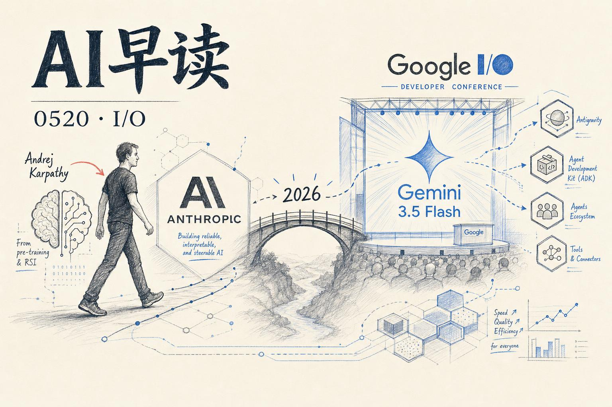

今天的 AI 圈有两个大事件撞在同一天——Andrej Karpathy 加入 Anthropic 和 Google I/O 2026 发布 Gemini 3.5 Flash。再加上 Claude Managed Agents 上线 Cloudflare、AWS 推出 Programmatic Tool Calling，今天的内容密度不低。

## Andrej Karpathy 加入 Anthropic：回到预训练前沿

Karpathy——OpenAI 创始成员、前 Tesla Autopilot 负责人、全网最受欢迎的 AI 讲师——在 5 月 19 日宣布加入 Anthropic。他在 X 上写道：「我认为 LLM 前沿的下几年将会格外有决定性意义，我很兴奋能重返 R&D。」

据 TechCrunch 和 Axios 报道，他将在 Nick Joseph 的领导下专注于预训练——具体来说，是用 Claude 来加速预训练研究。这个方向一旦实现自主，就是业内常说的「递归自我改进（RSI）」。Anthropic 联合创始人 Jack Clark 在 5 月 4 日的新闻通讯中预判：「基于所有公开信息，我谨慎认为，到 2028 年底，无人参与的 AI R&D——即一个能自主构建继任者的 AI 系统——有 60% 以上的概率会发生。」

Karpathy 的加入路线是 OpenAI → Tesla → OpenAI → Anthropic，每一步都有清晰的研究逻辑驱动。这个选择也让业界对 Anthropic 的预训练路线图有了更多想象空间。

链接：[Andrej Karpathy Joins Anthropic: What Happens Next](https://www.thealgorithmicbridge.com/p/andrej-karpathy-joins-anthropic-what)

## Google I/O 2026：Gemini 3.5 Flash 登场

Google I/O 2026 上发布了 Gemini 3.5 系列的首个模型——3.5 Flash。Google 的定位很清晰：「前沿智能 + 行动能力」。3.5 Flash 在 Agent 和代码能力上超越了此前的 Gemini 3.1 Pro，在 Terminal-Bench 2.1（76.2%）、GDPval-AA（1656 Elo）和 MCP Atlas（83.6%）上均取得显著领先。多模态理解方面 CharXiv Reasoning 得分 84.2%。输出速度达到 289 tokens/s，比其它前沿模型快 4 倍。

更重要的是它与 Antigravity 的配合。3.5 Flash 配合更新后的 Antigravity harness，可以部署协作子代理来处理大规模复杂任务——Keynote 上演示了一个真实案例：用两个代理协作，在 6 小时内完成了从合成 AlphaZero 论文到编码完整可玩游戏的全流程。Google 现场还演示了代理从零构建一个完整操作系统的场景。

Koray Kavukcuoglu（DeepMind CTO）在发布会前向媒体透露：「3.5 Flash 在几乎所有基准上都超过了我们的最新前沿模型 3.1 Pro」，并提到还有一个优化版本在同等质量下快 12 倍。

3.5 Flash 已向全球数十亿用户开放，覆盖 Gemini App、Google Search AI Mode、Google Antigravity、Google AI Studio 以及 Gemini Enterprise Agent Platform。3.5 Pro 已在内部使用，预计下月对外发布。

链接：[Gemini 3.5: frontier intelligence with action](https://deepmind.google/blog/gemini-3-5-frontier-intelligence-with-action/)

## Google I/O 对 Agent 开发者的意义

Google Cloud 在 I/O 上同步更新了 Agent 开发工具链，核心是 Antigravity 2.0 和 Managed Agents API。他们将 Agent 开发分为四个层级：Agent Studio（低代码/无代码）、Agent Engine（配置驱动）、Antigravity SDK（代码优先）、Antigravity API（完全控制）。四层之间通过 A2A 协议互通，低层级构建的 Agent 可以在高层级中作为子代理调用。

对开发者来说，这意味着你可以从可视化拖拽开始，一路深入到自定义 API 调用，而不需要在中途重写整个系统。

链接：[What Google I/O '26 means for developing agents on Google Cloud](https://cloud.google.com/blog/topics/developers-practitioners/io26-news-for-agent-developers-on-google-cloud/)

## Claude Managed Agents 上线 Cloudflare

Cloudflare 和 Anthropic 联合推出了 Claude Managed Agents 的 Cloudflare 集成。开发者可以在 Claude 平台上运行 Agent 循环，同时用 Cloudflare 的 Sandboxes、Browser Run 和 Dynamic Workers 来执行代码、安全连接和运行自定义工具。

这个集成的核心价值在于安全性和可观测性——所有 Agent 流量都通过可定制的代理运行，可以安全注入凭证、防止数据外泄、记录 Agent 与外部系统的每一次交互。开箱即用的 GitHub 模板已经包含了微 VM 沙箱、私有服务连接、浏览器会话录制和人机回环等功能。

链接：[Announcing Claude Managed Agents on Cloudflare](https://blog.cloudflare.com/claude-managed-agents/)

## AWS 推出 Programmatic Tool Calling

Amazon Bedrock 发布了 Programmatic Tool Calling（PTC），一种改变 LLM 工具调用模式的方法。传统工具调用中，每次工具调用都需要一次完整的模型往返——调用、等待结果、推理、调用下一个——造成累积性延迟和 token 消耗。

PTC 的做法是让模型写 Python 代码来编排多个工具调用，代码在沙箱执行环境中运行，可以包含循环、条件分支、过滤和聚合逻辑。模型只采样一次生成代码，执行环境处理所有工具调用后，只把最终结果返回给模型上下文。这对于多步骤数据处理、精确数值计算和隐私敏感场景尤其有效。

AWS 提供了三种实现路径：自托管 Docker 沙箱（ECS）、Bedrock AgentCore Code Interpreter 托管方案，以及 Anthropic SDK 兼容代理方案。

链接：[Implementing programmatic tool calling on Amazon Bedrock](https://aws.amazon.com/blogs/machine-learning/implementing-programmatic-tool-calling-on-amazon-bedrock/)

## OpenAI 升级内容溯源体系

OpenAI 在内容溯源方面做了三件事：全面遵循 C2PA 标准使溯源信号更容易被其他平台识别、与 Google 合作在图片中嵌入跨平台 SynthID 水印、以及公开预览了一个图片来源验证工具。这些措施覆盖 DALL·E 3、ImageGen 和 Sora 生成的媒体内容。

链接：[Advancing content provenance for a safer, more transparent AI ecosystem](https://openai.com/index/advancing-content-provenance)

## 其他值得关注的条目

- **Vercel 上线 Gemini 3.5 Flash on AI Gateway**——开发者可以直接通过 Vercel 的 AI Gateway 调用 Gemini 3.5 Flash。链接：[Gemini 3.5 Flash on AI Gateway](https://vercel.com/changelog/gemini-3-5-flash-on-ai-gateway)
- **KPMG 全面集成 Claude**——KPMG 将 Anthropic Claude 嵌入核心业务和工作流，覆盖超过 27.6 万名员工。链接：[KPMG integrates Claude across its core business](https://www.anthropic.com/news/anthropic-kpmg)
- **Martin Fowler：Coding Agent 的可维护性传感器**——一篇关于如何衡量和追踪编码 Agent 系统健康度的实践指南。链接：[Maintainability sensors for coding agents](https://martinfowler.com/articles/sensors-for-coding-agents)
- **Pragmatic Engineer：AI 对软件工程师的影响（第二部分）**——2026 年关键趋势分析。链接：[AI's impact on software engineers in 2026](https://newsletter.pragmaticengineer.com/p/ai-impact-on-soft)
- **Together AI 发布编码 Agent 基准测试**——大规模推理基准中的编码 Agent 性能对比。链接：[Benchmarking inference at scale: coding agents](https://www.together.ai/blog/coding-agent-benchmarks)

---

*来源：VerySmallWoods Research Feed — 2026-05-19 UTC*
