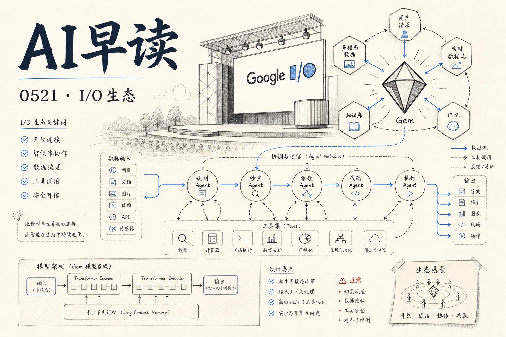

Google I/O 2026 的余波今天全面抵达 feed - 从 `Gemini 3.5 Flash` 正式上线，到 `Agent Executor`、`Agent Sandbox`、`Agent Substrate` 三件套同时开源，Google 一口气把从模型到运行时再到基础设施的整条智能体栈铺到了开发者面前。与此同时，OpenAI 放出了一个里程碑式的成果：一个通用推理模型自主证明了离散几何中悬置近 80 年的 Erdős 单位距离猜想。

## Gemini 3.5 Flash 正式上线

Google 在今天宣布 `Gemini 3.5 Flash` 进入 GA，覆盖 Gemini 应用、Search AI Mode、Gemini API、AI Studio、Antigravity、Android Studio 全线产品。这一代 Flash 模型拥有 1M token 上下文、65k 最大输出、四档思考级别（minimal / low / medium / high）以及跨轮次的「思想保留」机制。

链接：[AINews Google I/O 2026: Gemini 3.5 Flash, Omni (NanoBanana for Video), Spark (background agents), and Antigravity 2.0](https://www.latent.space/p/ainews-google-io-2026-gemini-35-flash)

Google 称 3.5 Flash 在 Terminal-Bench 2.1、GDPval-AA 和 MCP Atlas 上全面超越上一代 3.1 Pro。独立评测机构 Artificial Analysis 报告其 Intelligence Index 得分 55（较 3 Flash 的 46 提升 9 分），输出速度超过 280 tok/s，MMMU-Pro 达到 84%，GDPval-AA Elo 1656。定价为 $1.50 / $9.00 每百万输入/输出 token - 相比 3 Flash 贵了 5.5 倍，但按性能看仍处于性价比高位。

值得一提的是 3.5 Flash 同时推出了 Gemini Omni 系列。Omni Flash 可以接收文本、图片、视频、音频输入后直接输出视频编辑和生成结果，目前优先在 Gemini/Flow 中面向付费用户开放，Shorts/Create 本周开始向免费用户推送，API 版本将在未来几周跟进。Google 还公布了两个惊人数字：旗下 Gemini 应用月活已达 9 亿 +，整个平台每月处理 token 量达到 3.2  quadrillion（较去年同期 480T 增长了 7 倍）。

## Google 的智能体基建三件套

比模型发布更值得关注的是 Google 同一天开源的三套智能体基础设施。

### Agent Executor：分布式 Agent 运行时

`Agent Executor` 是 Google 开源的 agent 运行时标准，核心能力包括持久化执行（断点续跑）、安全沙箱隔离、会话一致性、连接恢复和轨迹分支。

链接：[Introducing Agent Executor, Google's distributed Agent Runtime](https://cloud.google.com/blog/products/ai-machine-learning/agent-executor-googles-distributed-agent-runtime)

它的定位是弥合不同部署模型之间的缝隙 - 支持 Antigravity 2.0、Deep Research、Managed Agents、以及基于 LangChain/ADK/A2A 协议构建的自定义 agent。企业可以把它跑在自己的基础设施上，避免被单一供应商锁定。其 GitHub 仓库 `google/ax` 已开放预览。

### Agent Sandbox on GKE：正式 GA

去年 KubeCon 上亮相的 `GKE Agent Sandbox` 在今天正式进入 GA，不到 5 个月时间 sandbox 用量增长了 16 倍。

链接：[Bringing you Agent Sandbox on GKE and Agent Substrate](https://cloud.google.com/blog/products/containers-kubernetes/bringing-you-agent-sandbox-on-gke-and-agent-substrate)

核心亮点包括 Pod Snapshots（空闲 agent 挂起并在数秒内恢复）、预热池实现单集群每秒 300 个 sandbox 分配（90% 在 200ms 内完成）、以及 gVisor 和 Kata Containers 的安全隔离。Google 声称在 Axion 处理器上运行比同类云厂商性价比高 30%。

### Agent Substrate：超大规模 agent 的调度层

`Agent Substrate` 是一个全新的开源项目，专门解决 agent 数量达到数亿级别时 Kubernetes 控制平面的瓶颈问题。传统 Kubernetes 擅长处理数千个长运行服务，而 Agent Substrate 针对百万级亚秒级工具调用场景做了重新设计。

链接：[Bringing you Agent Sandbox on GKE and Agent Substrate](https://cloud.google.com/blog/products/containers-kubernetes/bringing-you-agent-sandbox-on-gke-and-agent-substrate)

它把 Agent Sandbox 的安全运行时和快照能力与一个更精简的控制平面结合，绕过 Kubernetes 的调度瓶颈。核心创新包括把数据局部性引入调度器核心，让 agent 状态和调度协同工作以削减每一毫秒延迟。

## OpenAI 模型首次自主证明离散几何猜想

OpenAI 公布了一个内部通用推理模型自主解决了 Erdős 单位距离问题的消息。这是 AI 首次自主攻克一个悬而未决的核心数学猜想。

链接：[An OpenAI model has disproved a central conjecture in discrete geometry](https://openai.com/index/model-disproves-discrete-geometry-conjecture)

问题本身看似简单：平面上放 `n` 个点，相距恰好为 1 的点对最多能有多少个？Erdős 在 1946 年提出这个问题后，学界一直认为方格的构造几乎是最优的。OpenAI 的模型不仅推翻了这一假设，还给出了一个无限族构造，证明存在固定的 δ > 0 使得 `n^(1+δ)` 对单位距离成为可能（普林斯顿的 Will Sawin 已进一步将 δ 精确到 0.014）。

更值得关注的不是答案本身，而是找到答案的方式。这个证明来自一个通用推理模型，不是专门为数学训练的，也没有针对单位距离问题做针对性准备。Fields 奖得主 Tim Gowers 在评述中称其为「AI 数学的里程碑」。数论学家 Arul Shankar 的评价更大胆：「这篇论文证明当前 AI 模型已不仅限于做人力的帮手 - 它们能够产生原创的巧妙想法，并坚持到底将其实现。」

## 端侧 LLM 基准测试与多模态评估器

Google 同时升级了 `AI Edge Portal`，新增对超过 120 款 Android 设备的端侧 LLM 基准测试能力。开发者可以远程衡量初始化时间、预填充速度、解码速度和峰值内存占用等指标，并通过集成 Model Explorer 可视化模型图来定位性能瓶颈。

链接：[Benchmark and optimize LLMs on-device with AI Edge Portal](https://cloud.google.com/blog/products/ai-machine-learning/benchmark-llms-on-device-with-ai-edge-portal)

另一边，AWS 发布了基于 MLLM-as-a-judge 的多模态评估器，用于 Strands Evals 中的图文任务评估。这套方案用多模态大模型自动评估图文生成任务的质量，为 eval pipeline 提供了一个新的自动化方向。

链接：[Multimodal evaluators: MLLM-as-a-judge for image-to-text tasks in Strands Evals](https://aws.amazon.com/blogs/machine-learning/multimodal-evaluators-mllm-as-a-judge-for-image-to-text-tasks-in-strands-evals/)

---

*来源：VerySmallWoods Research Feed — 2026-05-20 UTC*
