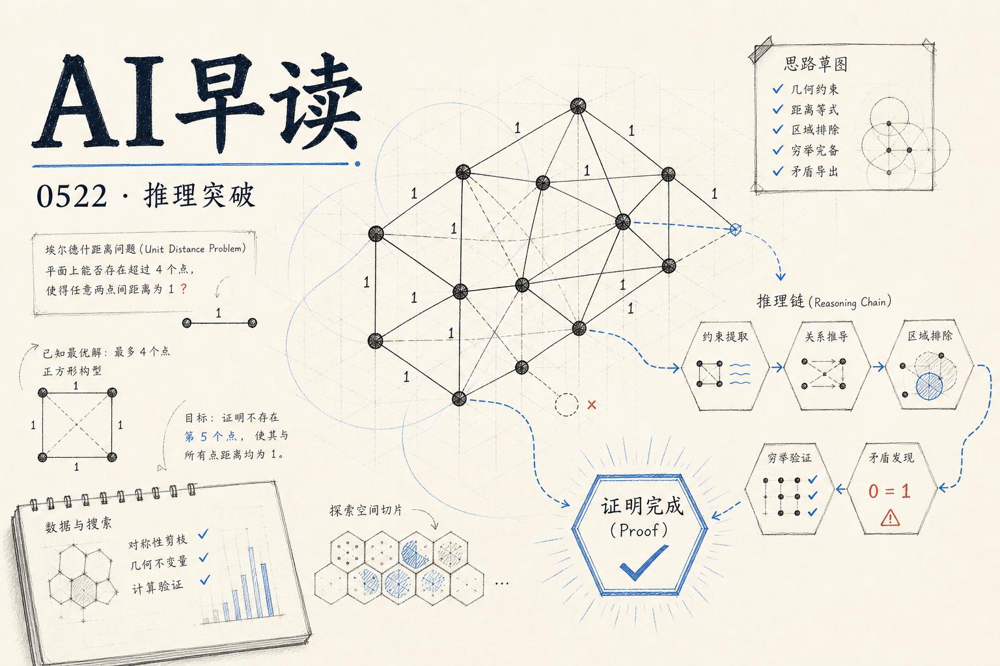

今天的 AI 圈有两股并行但同样重要的浪潮：一边是 OpenAI 的推理模型做出了一桩实打实的数学突破——用不到 $1000 的计算成本推翻了一个存在了 80 年的数学猜想；另一边，AWS 一口气发布了至少 7 篇关于 Bedrock AgentCore 的技术博客，覆盖从上下文窗口突破到 MCP 集成的方方面面。这两件事放在一起看，恰好勾勒出当前阶段的 AI 图景——推理能力在快速进化，同时智能体的基础设施也在加速定型。

## OpenAI 推理模型推翻 Erdős 猜想

OpenAI 宣布其内部推理模型成功推翻了 **Erdős 平面单位距离问题**中的一个长期假设。这个由数学家 Paul Erdős 在 1946 年提出的问题，困扰了学界整整 80 年。更值得关注的是，这是一个通用推理模型，不是 AlphaProof 那种领域专用系统。模型输出了一份约 125 页的推理链条，其中甚至出现了一个被社区称为“第 39 页时刻”的关键转折点。

链接：[OpenAI GPT-next disproves 80 year old Erdős planar unit distance problem for under $1000](https://www.latent.space/p/ainews-openai-gpt-next-disproves)

菲尔兹奖得主 Timothy Gowers 称这是“AI 解决著名开放数学问题的第一个真正清晰的例子”。OpenAI 强调该模型尚未达到极限，且最终将面向公众使用。多位观察者将这一成果视为 **inference-time scaling 范式**的最新证据——推理阶段的计算投入正在推动前沿进展，而不是单纯靠增加参数量。

## AWS Bedrock AgentCore 批量化发布

AWS ML Blog 在同一天密集发布了至少 6 篇与 Bedrock AgentCore 相关的技术文章，覆盖场景之广令人印象深刻。

链接：[Break the context window barrier with Amazon Bedrock AgentCore](https://aws.amazon.com/blogs/machine-learning/break-the-context-window-barrier-with-amazon-bedrock-agentcore/)

其中最具技术深度的一篇介绍了**递归语言模型（RLM）**方法：利用 AgentCore 的 Code Interpreter 作为持久工作内存，通过子模型调用逐段分析超长文档，从而突破任何单一模型的上下文窗口限制。这在金融分析、法律审查等需要处理数百万字符的场景下尤为实用。

另一篇展示了如何将 **AWS API MCP Server** 与 Amazon Quick 集成，让 SRE 和 DevOps 工程师通过自然语言直接编排 AWS 服务，不再需要在控制台、CLI 和多个仪表盘之间频繁切换。

链接：[Integrating AWS API MCP Server with Amazon Quick using Amazon Bedrock AgentCore Runtime](https://aws.amazon.com/blogs/machine-learning/integrating-aws-api-mcp-server-with-amazon-quick-suite-using-amazon-bedrock-agentcore-runtime/)

此外还有多租户 Agent 架构、基于 NLP 的仪表盘自动化 Agent、AI 招聘助手、以及放射科工作流优化等方向。MCP 协议在 AWS 生态中的深入集成，说明**工具调用接口标准化**正在成为云厂商的共识方向。

## Amazon SageMaker 推出 OpenAI 兼容 API

SageMaker AI 正式支持 OpenAI 兼容的 API 端点。如果你使用 OpenAI SDK、LangChain 或 Strands Agents，现在只需修改 endpoint URL 就能将模型调用切换到 SageMaker 上的自有端点。Bearer token 认证代替了 SigV4 签名流程，流式推理也一并支持。

链接：[Announcing OpenAI-compatible API support for Amazon SageMaker AI endpoints](https://aws.amazon.com/blogs/machine-learning/announcing-openai-compatible-api-support-for-amazon-sagemaker-ai-endpoints/)

这意味着企业可以在自己的 GPU 实例上运行 Llama、Mistral 等模型，同时使用标准 OpenAI 客户端调用，不需要维护多套 API 客户端或自定义路由逻辑。对注重数据合规的团队来说，这是一个值得关注的变化。

## Datasette Agent 发布

Simon Willison 宣布了 **Datasette Agent** 的第一个版本，这是他多年耕耘的 LLM 工具库与 Datasette 数据库平台的最终融合。Agent 能够理解自然语言问题、生成 SQL 查询并返回结果，还可以通过插件系统扩展图表生成（基于 Observable Plot）、图片生成（基于 ChatGPT Images 2.0）和沙箱代码执行（基于 Fly Sprites）。

链接：[Datasette Agent](https://simonwillison.net/2026/May/21/datasette-agent/#atom-everything)

值得留意的是，Willison 提到 Claude Code 和 OpenAI Codex 在编写这些插件时表现优异——只需指向 datasette-agent 仓库作为参考，就能自动生成功能完整的插件。这本身就是**用 AI Agent 构建 AI Agent**的一个实例。

## Cloudflare CASB 集成 Claude Compliance API

Cloudflare 将其 CASB（云访问安全代理）扩展到支持 Anthropic 的 Claude Compliance API。安全团队现在可以直接在 Cloudflare 仪表盘中监控 Claude Enterprise 的使用情况，无需安装任何端点代理。

链接：[Announcing Claude Compliance API support with Cloudflare CASB](https://blog.cloudflare.com/casb-anthropic-integration/)

这是企业 AI 治理拼图中的一块重要拼图。AI 工具与传统 SaaS 的区别在于它们既读取数据又生成数据，而且通过 API 和 Agent 框架深度嵌入工作流。Cloudflare 的策略是在同一个平台上覆盖 AI Gateway、DLP、Access 和 CASB 四个层面，让流量无需在多个厂商之间来回跳转。

## Microsoft 推出 MagenticLite 与 Fara1.5

Microsoft Research AI Frontiers 发布了 **MagenticLite**，一个为小模型优化的 Agent 应用。它与两个专用模型协同工作：MagenticBrain 负责规划、编码和任务委派，Fara1.5 负责浏览器操作。Fara1.5 在 9B 参数规模下取得了小模型计算机使用领域的 SOTA，在网页导航任务上相比 Fara-7B 近乎翻倍。

链接：[MagenticLite, MagenticBrain, Fara1.5: An agentic experience optimized for small models](https://www.microsoft.com/en-us/research/blog/magenticlite-magenticbrain-fara1-5-an-agentic-experience-optimized-for-small-models/)

核心思路是 Agent 的能力取决于**工具编排和行动质量**，而非模型的知识储备。三个组件代码设计、互相配合，让小模型也能完成复杂的 Agent 任务。这暗示了一条不同于“越大越好”的演进路径。

## Railway: The Agent-Native Cloud

Latent Space 发布了对 Railway 创始人 Jake Cooper 的深度访谈。Railway 从 2020 年起步，最初与 AI 毫无关系，如今已成为一个 35 人团队服务 300 万用户的 **Agent 原生云平台**。Jake 的核心观点：Agent 需要的基础设施与人类开发者截然不同——版本控制、可观测性、计算、存储和编排需要在 1000 倍的规模上重新设计。

链接：[Railway: The Agent-Native Cloud - Jake Cooper](https://www.latent.space/p/railway)

Railway 自建裸金属数据中心，服务器本身因 RAM 价格上涨反而增值，硬件投资在 3 个月内回本。他们还在探索**生产环境分支（Production Fork）**的概念——让 Agent 可以在真实环境的快照中安全地测试和调试。

## 其他值得关注的消息

**Cohere Command A+ Apache 2.0 开源**：218B MoE / 25B active 参数，多语言多模态，可在 2×H100 W4A4 上运行。vLLM 首日即支持。Artificial Analysis 将其智能水平定位在 Claude 4.5 Haiku 附近。

**Modular LLM 推理路由 Part 2**：深入介绍了路由层数据结构的实现——用 HostBitmap（位图）在微秒级别查询每个 Pod 缓存了哪些 block，支撑数百 Pod、每秒数千次请求的实时路由。

链接：[Why LLM Inference Needs a New Kind of Router - Part 2](https://www.modular.com/blog/why-llm-inference-needs-a-new-kind-of-router-part-2)

**SpaceX S-1 披露与 Anthropic 的协议**：Anthropic 将向 SpaceX 支付每月 $12.5 亿美元，租用 COLOSSUS 和 COLOSSUS II 的计算容量，合同期至 2029 年 5 月。这是一个相当惊人的数字——仅这一份合约就暗示了前沿 AI 模型的训练和推理对算力的需求远超出公开讨论的规模。

链接：[Quoting SpaceX S-1](https://simonwillison.net/2026/May/20/spacex-s1/#atom-everything)

---

*来源：VerySmallWoods Research Feed — 2026-05-21 UTC*
