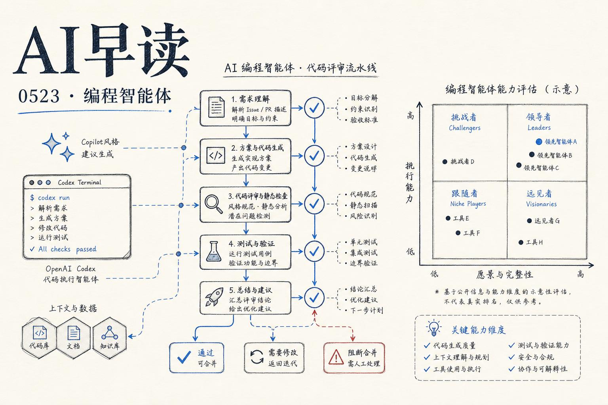

今天的 feed 被几个互相关联的信号贯穿：Gartner 第一次为 AI 编程智能体画了一张魔力象限，Tomasz Tunguz 注意到软件界面正在从固定的东西变成按需生成的东西，Dharma AI 用一个 3B 参数的 OCR 模型证明专用化可以打败通用规模。三件事放在一起看，指向同一个趋势——编程这件事本身，以及它背后的软件生产范式，正在被 AI 重新定义。底层逻辑的转变可能比任何单一产品的发布都更重要。

## Gartner 首个编程智能体魔力象限：标准化框架落地

Gartner 发布了第一份《企业级 AI 编程智能体魔力象限》。和每个新分类诞生时一样，这份报告会定义接下来几年企业怎么买、供应商怎么定位、什么算好。OpenAI Codex 和 GitHub Copilot 双双被列为 Leader，两个产品在同一张图上有了官方坐标。

链接：[OpenAI named a Leader in enterprise coding agents by Gartner](https://openai.com/index/gartner-2026-agentic-coding-leader)

Gartner 连续三年把 GitHub Copilot 放在 Leader 象限，今年是第一次纳入 Codex。真正的信号不在象限位置本身，而在背后的数据：OpenAI 披露 Codex 周活跃用户已达 400 万，Cisco 用它构建 AI Defense 安全平台的主体开发，交付周期从几个季度压缩到几周。Cisco 的 SVP DJ Sampath 提及的核心词不是「代码生成」，而是「agentic system 在企业中作为 infrastructure layer 运行」——这意味着编程智能体正在从工具升级到平台层。

GitHub 的数据则从另一个维度印证了市场的膨胀——14 万组织正在使用 Copilot，比一年前翻了三倍，年增长率超过 100%。更值得关注的是，大部分用户已经在使用多个 AI 模型，而不是绑死一家供应商。Copilot CLI 的月活接近翻倍。这两个数据的交汇点指向一个判断：编程辅助的采用漏斗已经从顶端推开，下一阶段的竞争不再是谁能补全代码，而是谁能管理好整个软件开发生命周期的 agent 编排。

链接：[GitHub recognized as a Leader in Gartner Magic Quadrant for Enterprise AI Coding Agents](https://github.blog/ai-and-ml/github-copilot/github-recognized-as-a-leader-in-the-gartner-magic-quadrant-for-enterprise-ai-coding-agents-for-the-third-year-in-a-row/)

## 可塑界面：当 UI 变成动态生成的中间产物

Tomasz Tunguz 发表了一篇题为《Plastic User Interfaces》的文章，提出了一个既简单又深刻的观察：Salesforce 已经 headless 了 —— 销售人员可以在 AI 对话里直接更新 deal sheet，不再需要登录 salesforce.com。这个模式的背后是 MCP 协议在 SaaS 领域快速扩散的结果。

链接：[Plastic User Interfaces](https://www.tomtunguz.com/plastic-user-interfaces/)

但文章后半段更有意思。Claude Code 的 Thariq Shihipar 透露他开始在 Claude Code 中使用 HTML 而非 Markdown 作为输出格式——因为他需要更丰富的可视化、颜色、图表，而且输出结果需要能够直接分享。这个选择背后是一个更根本的变化：AI 可以动态生成用户界面，每次按需定制一个。出差路上生成音频摘要，审稿时生成交互式 web app，预算规划时生成带图表的表格。

Tunguz 的结论值得反复读：headless 不是砍掉界面，而是让界面变得可塑（plastic）。软件系统的价值正在从固定 UI 向「动态 UI 管理能力」转移——知道什么时候生成界面、什么时候保留、什么时候丢弃，以及如何保证生成的界面是正确的。在一个 AI 可以随时造出新的交互界面的世界里，界面本身不再是软件的终点，而变成了一种按需产生的中间产物。

## 专用性胜过规模：一个反直觉的实证

Dharma AI 发表了一篇值得认真对待的研究：《Specialization Beats Scale》。这个标题本身就是对过去几年「越大越好」叙事的一次直接挑战。

链接：[Specialization Beats Scale: A Strategic Variable Most AI Procurement Decisions Overlook](https://huggingface.co/blog/Dharma-AI/specialization-beats-scale)

他们的实验路径很清晰：构建了一个结构化的 OCR 模型 DharmaOCR，仅有 30 亿参数，不基于 GPT-4 或 Claude 级别的基座，而是在小模型上做系统的微调。结果令人意外——这个 3B 模型在所有商业前沿 API（包括 GPT-4o、Claude 3.5 等）上胜出，而推理成本仅为其约五十分之一。

这并不是一个孤立的轶事。它有一个可复现的论文和完整的 benchmark 支撑。此前大家默认「越大越好」是因为前沿模型在通用指标上的确全面领先。但 Dharma 的实验说明了一个关键变量：当训练分布与部署任务足够接近时，参数规模不再是决定性因素。买模型不只是选容量，还需要考虑对齐成本。对于做 AI procurement 的企业来说，这个结论相当反直觉——但它建立了新的评估维度。

## SynthID 走出 Google 围墙

Google DeepMind 宣布 SynthID 正在向更多合作伙伴开放。这个不可感知的 AI 内容水印方案此前只集成在 Gemini 和 Imagen 中，现在开始向外推广。AI 内容水印在治理领域一直处于「大家都在谈，但没人真在大规模用」的状态——SynthID 的扩张可能是它从研究项目走向行业标准的第一步。

链接：[SynthID watermark expanding to more partners](https://www.youtube.com/shorts/EF1BFaNZN9U)

## 两则值得延伸阅读的讨论

Cerebras 的 Sarah Chieng 在 AI Engineer 上提出了一个有趣的悖论——快速模型需要慢速开发者。当硬件推理速度足够快时，思考的瓶颈从计算转移到了人。这意味着开发者工具的设计逻辑可能需要重新审视：不是帮人写得更快，而是帮人思考得更深。

链接：[Fast Models Need Slow Developers — Sarah Chieng, Cerebras](https://www.youtube.com/watch?v=TeGsFFNqRLA)

Stratechery 这期的焦点是数据中心建设与地方反对之间的博弈。核心观点很锋利：反对数据中心的民意并不是 misinformation 问题，而是利益补偿问题。当建设带来的收益主要流向企业和电网运营商，而噪音、水资源、土地成本由当地社区承担时，反对是理性的。解决方案不是更好的公关，而是更好的利益分配机制。

链接：[The Data Center Veto — Stratechery](https://stratechery.com/2026/the-data-center-veto/)

---

*来源：VerySmallWoods Research Feed — 2026-05-22 UTC*
