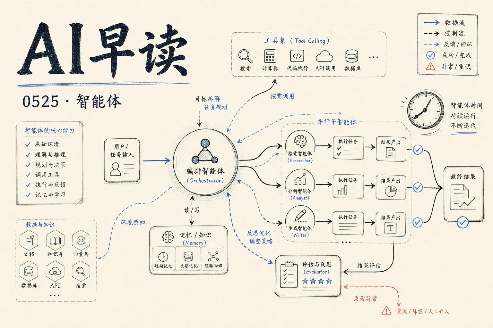

## DeepMind 的智能体规模化实践

Google DeepMind 的 KP Sawhney 与 Ian Ballantyne 在一期深度对谈中分享了他们运行大规模智能体系统的实战经验。这不是又一篇纸上谈兵的架构讨论 —— 两位工程师直接来自 DeepMind 的生产环境，讲的是他们在真实系统中遇到的取舍、瓶颈和应对方案。

对话的核心命题是：当智能体从单个实验跑通走向大规模部署时，什么会最先断裂？他们的答案是：编排层。单个智能体可以靠 prompt 工程勉强工作，但一旦涉及数十个智能体协同、共享上下文、竞争资源，编排就变成了系统工程问题。DeepMind 的做法是将智能体拆解为可组合的模块 —— 每个模块负责一个原子能力（信息检索、代码执行、结果验证），通过一个轻量级调度器协调它们的工作流，而不是用一个巨型 agent 包揽所有事。

链接：[How Google DeepMind Runs Agents at Scale — KP Sawhney & Ian Ballantyne, Google DeepMind](https://www.youtube.com/watch?v=7gujZrJ9L5I)

## 异构智能的下一个范式

Adrian Bertagnoli 在另一场分享中提出了一个更大胆的命题 —— 未来的智能不会来自单一模型，而是来自异构智能的协作。他所定义的「异构」不仅指不同模型之间的差异，还包括人类、传统软件系统和 AI 智能体在同一个工作流中的混合编排。

Callosum 的实践路径是将每个参与节点抽象为标准化的输入输出接口，让不同能力（符号推理、神经网络、数据库查询、人工审批）可以像搭积木一样组合。这与 DeepMind 的模块化思路不谋而合 —— 只不过 Callosum 把范围从「纯 AI 智能体」扩展到了「人类+传统系统+AI」的混合生态。

链接：[Scaling the Next Paradigm of Heterogeneous Intelligence — Adrian Bertagnoli, Callosum](https://www.youtube.com/watch?v=WRBNDpUhsJQ)

## FOMAT —— 智能体时代的焦虑症

Michael Richman 提出了一个精准的概念：FOMAT（Fear of Missing Agent Time）。当整个行业都在押注智能体，团队之间的焦虑感在蔓延 —— 你的竞争对手用上了 agent，你的技术栈还没接入；别人的 agent 已经在跑自动化流程，你还在手动调 prompt。

Richman 的观察是，这种焦虑本身比「错过智能体」更危险。它驱动团队做两件错事：一是过早投入复杂编排，在基础设施不成熟时强行上线；二是在工具链上过度分散 —— 这个月 LangChain，下个月 CrewAI，再下个月又换 Semantic Kernel。他的建议很务实：先把手上的手工流程跑稳，再去想自动化。智能体的核心是可靠，不是快。

链接：[Let's Talk About FOMAT: Fear of Missing Agent Time — Michael Richman, Cmd+Ctrl](https://www.youtube.com/watch?v=W-SX_srBa3Y)

## 当 AI 帮你写 Issue

Armin Ronacher（Flask、Jinja2 的作者，也是新项目 Pi 的开发者）发了一条令人深思的吐槽：现在最让人沮丧的开源维护模式，是用户提交的 issue 被 AI 重写过。问题描述本身来自人类的真实观察，但经过某个 clanker「润色」后 —— 结论变得自信但错误、根因分析变成猜测、简化复现步骤变成了不完整的假代码、实现的建议引向错误的函数、错误分类列了一长串但哪个都可能不对。

Ronacher 的诉求很简单：Issue 应该被压缩回人类真正观察到的东西 —— 我跑了什么命令、我期望发生什么、实际发生了什么、错误日志在哪里。这不是反 AI，而是对「AI 中介」的清醒认知 —— 当信息经过一次不可控的语言模型处理，准确率的损失比大多数人意识到的要大得多。

链接：[A quote from Armin Ronacher](https://simonwillison.net/2026/May/24/armin-ronacher/#atom-everything)

## 快讯

- **Microsoft 发布 Webwright** —— 一个终端原生的 web agent 框架，在 Odysseys 基准上达到 60.1%，远超 GPT-5.4 基线的 33.5%。
- **Claude Code 发现 AI 缩放算法** —— 研究人员让 Claude Code 自主探索缩放定律，找到了人类可能不会设计出的新算法路径。
- **DeepSeek 永久降价 75%** —— 旗舰模型大幅调价，推理成本竞争进入新阶段。
- **约束衰减** —— 新论文揭示 LLM 智能体在后端代码生成中的脆弱性，约束条件会随推理步骤增长而逐渐衰减。
- **AI 芯片成本结构变化** —— 记忆体已占 AI 芯片组件成本的近三分之二，计算单元不再是最贵的部分。
- **Hassabis vs LeCun** —— DeepMind 的 Hassabis 认为人类处在「奇点的山脚」，而 LeCun 表示当前 AI 根本不具备智能。

---

*来源：VerySmallWoods Research Feed — 2026-05-24 UTC*
