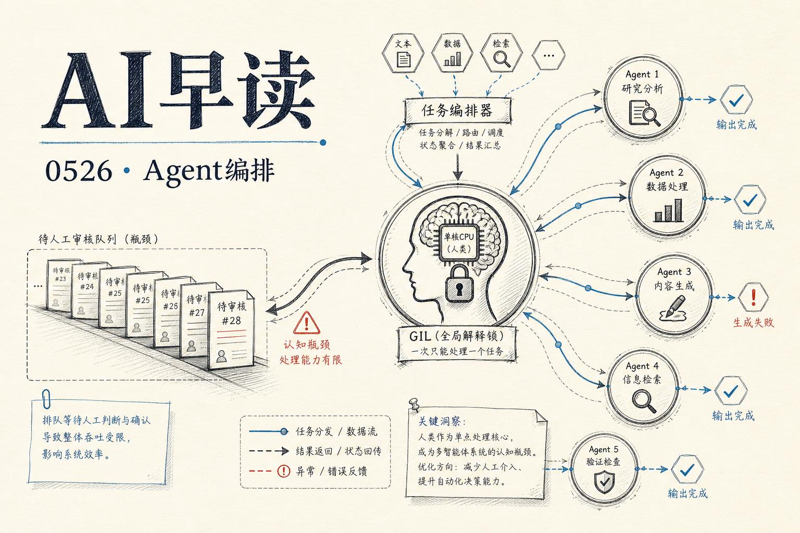

今天值得关注的话题集中在 AI Agent 的编排层面——当一个开发者同时运行多个 agent 时，真正的瓶颈在哪里？以及我们如何准确讨论 agent 体系里那些被混用的术语。

## 你才是编排税

Addy Osmani 在 Google I/O 的 panel 上延续了他上个月提出的一个观察：启动 agent 的成本极低（敲几个键而已），但收掉 agent 的回报成本非常高——每条输出都要有人来判断是否正确，是否和其他 agent 改过的东西冲突。这个人就是你，而你只有一个。

他用一个很贴切的比喻来勾画这个不对称：Python 有 GIL（全局解释器锁），你可以开任意多条线程，但同一时刻只有一条能执行字节码。**你就是你那些 AI agent 的 GIL。** 所有 agent 都可以并行跑，但当它们需要真正的架构理解或解决合并冲突时，这个工作必须获取那把锁。锁在你手里，只有一把。

这个观察背后是 Amdahl 定律——你能获得的并行加速上限，由系统里不能并行的串行部分决定。在 agent 开发里，这个串行部分就是判断力。开 8 个 agent 不会让你的判断时间变成 1/8，只会让排队等你判断的 backlog 变得更长。优化非瓶颈部分不会提高吞吐量，你只是在瓶颈前面堆了更多没完成的工作。

他说了一句我一直回想的线：`"I never felt more productive with my tools, but I am also more tired than I ever been."` 这两半都是真的，而且根因相同。疲劳就是你的串行处理器以 100% 负载运转却没有任何余量的结果。每检查一个 agent 就是一次 context switch——把大脑清空、从冷启动重载另一个上下文。CPU 做这件事几微秒，你做好几分钟，而且永远无法完美重载。5 个 agent 不是 1 份工作做 5 遍，而是 5 次冷启动和一个后台线程持续焦虑"我该检查哪个了"。

链接：[The Orchestration Tax is You](https://addyosmani.com/blog/orchestration-tax/)

## Agent 术语的澄清

Hugging Face 发了一篇很及时的词汇表文章。Agent 领域发展太快，很多概念被模糊使用——说得人以为自己说清楚了，听的人以为自己听懂了，其实两边用的可能不是一个意思。

文章锚定了一个关键区分：**Model、Scaffolding、Harness、Agent 是四层东西。** Model 就是 LLM——文本进文本出，没有记忆，没有循环。Scaffolding 是定义行为的层——system prompt、工具描述、输出格式，它塑造模型"怎么看世界"。Harness 是执行层——调用模型、处理工具调用、决定什么时候停。Agent 是 model + harness 的组合。

一个具体的例子：Claude Code、Codex、Cursor 这些产品，底层的 model 可能是同一个，但 harness 的不同选择让体验完全不一样。Hugging Face 还引了 Addy Osmani 那篇 `Agent Harness Engineering` 和 OpenAI 关于 Codex 的文章来展开 harness 的工程含义。对这些概念做一次明确的区分，能避免团队讨论时「你觉得我在说模型，我觉得你在说框架」的尴尬。

链接：[Harness, Scaffold, and the AI Agent Terms Worth Getting Right](https://huggingface.co/blog/agent-glossary/)

## Agentic Evaluations at Scale

Google DeepMind 的 Nicholas Kang 和 Michael Aaron 在 AI Engineer 活动上分享了大规模 agent 评估的实践经验。评估不像传统 ML 测试——agent 行为有分支、有循环、有外部依赖，跑一遍可能涉及十几个 step，而且每一步的输出都直接影响后续路径。

他们介绍了在 DeepMind 内部如何构建评估框架来应对这种复杂性：固定场景集、追踪 agent 的执行轨迹、在关键决策点做条件判断。评估不能只看最终结果对不对，还要看过程——agent 走了最优路径还是绕了一大圈才到正确答案。这个话题和上面 Addy Osmani 的观点正好呼应：如果你不知道 agent 的内部评估表现，你连「编排税」具体交了多少都算不清楚。

链接：[Agentic Evaluations at Scale, For Everybody — Nicholas Kang & Michael Aaron, Google DeepMind](https://www.youtube.com/watch?v=Ubwb6NzegyA)

## 边界自主与工程机会

另一场 AI Engineer 的分享探讨了 bounded autonomy——有边界的自主性。Angus J. McLean 和 Oliver 试图在"完全自由意志"和"完全确定性"之间划出一条实用的线：agent 的自主范围应该有明确边界，边界之内它可以自由决策，边界之外必须上升到人类。这听起来像一句废话，但真正落地的难点在于——谁定义边界？用硬编码规则还是用另一个 model？边界被打破时怎么优雅降级而不让任务全丢？

这恰恰和 Harness Engineering 紧密相连：harness 的职责之一就是定义和执行这些边界。从 senior 工程师的角度看，IndyDevDan 在他同天上线的视频里直接说，agentic engineering 目前是 senior 工程师最大的职业机会——这不只是写 prompt，而是设计整个 agent 系统的基础设施层。

链接：[Bounded Autonomy: Between Free Will and Determinism](https://www.youtube.com/watch?v=t4359sKBu4w)
链接：[Top #1 Opportunity for Senior Engineers: Agentic Engineering](https://www.youtube.com/watch?v=2KcITKKJikA)

## Datasette 的可扩展 Jump 菜单

Simon Willison 发布了 datasette 1.0a30，主要新功能是一个可扩展的 Jump 菜单——按 `/` 弹出模态面板，可以搜索数据库、表、视图、预置查询，甚至能通过插件添加自定义条目。新的 `jump_items_sql()` 插件钩子允许插件用 SQL 查询动态添加自己的菜单项，而 `makeJumpSections()` JavaScript 钩子则让插件可以控制菜单打开时的初始内容。

datasette-agent 插件已经利用这个钩子添加了一个启动新 agent session 的入口——把 agent 控制和数据浏览放在同一个界面。这是一个挺聪明的集成思路：数据工具本身变成一个 agent 操作平台。

链接：[datasette 1.0a30 — Jump to menu](https://simonwillison.net/2026/May/24/datasette/)

---

*来源：VerySmallWoods Research Feed — 2026-05-25 UTC*
