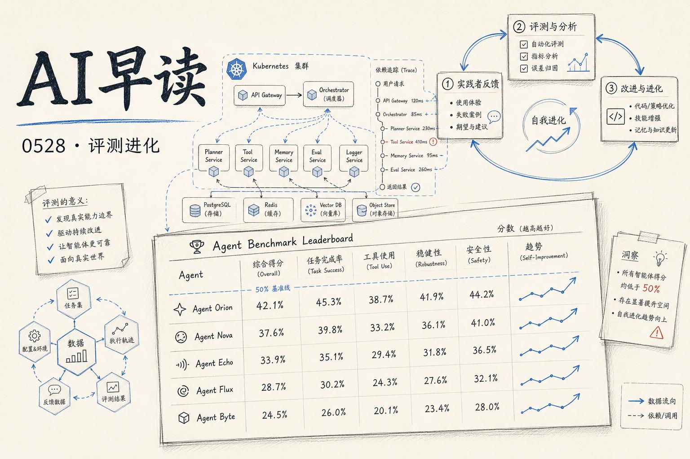

## 企业 IT 任务的智能体评测：没有一个模型及格

Artificial Analysis 与 IBM 联合发布了 ITBench-AA，这是首个针对**企业级 IT 智能体任务**的基准测试，从 SRE（站点可靠性工程）场景开始。结果相当直白——所有前沿模型得分均低于 50%。

ITBench-AA 设计了 59 个 Kubernetes 事故响应任务，模型需要读取日志、追踪依赖、定位根因实体。Claude Opus 4.7 以 47% 居首，GPT-5.5 (xhigh) 46%，Qwen3.7 Max 42%。Claude 仅比 GPT-5.5 高出一个百分点，差距非常微弱。

一个反直觉的发现：**长的推理轨迹并不等于更高的准确率**。GPT-5.5 平均 31 轮就拿到 46%，而 Gemini 3.1 Pro Preview 平均用 83 轮却只有 30%。那些喜欢"过度调查"的模型往往会挖出上游的故障注入机制或共现症状，当成假阳性提交，反而被扣分。

评分方法也很严格——采用 recall-gated precision，只要漏掉任何一个真实根因，该次就得零分。这比传统上只看"是否找到核心问题"的评测要苛刻得多。

开源模型这边，GLM-5.1 (Reasoning) 达到 40%，与 Gemini 3.5 Flash (high) 持平但成本更低——每任务 $1.23 vs $1.70。Gemma 4 31B (Reasoning) 以 $0.14/任务拿到 37%，性价比非常突出。Claude Opus 4.7 虽然第一但也是最贵的，每任务 $5.38。

链接：[ITBench-AA: Frontier Models Score Below 50% on the First Benchmark for Agentic Enterprise IT Tasks](https://huggingface.co/blog/ibm-research/itbench-aa)

## Codex 驱动的自我进化：税务智能体的实战经验

OpenAI 与 Thrive Holdings 联合开发了 Tax AI，为 Crete 旗下 30 多家会计事务所处理 1040 和 1041 税表。这个系统在三个月内完成了从"四分之一返回准确率 75%"到"86% 达到 75%"的跃升，背后是一套**自改进循环**。

关键设计理念很有意思：不靠工程师逐一手动修复生产问题，而是让系统自己从实践者的修正中学习。整个循环围绕三个支柱构建——贴近实践者（让真正干活的人决定系统学什么）、产品埋点创造证据（记录从源文件到最终提交的完整路径）、Codex 驱动的改进循环（将问题转化为评测目标，自动定位根因并提交修复）。

以出租房产税表为例：系统漏填了"fair rental days"字段，实践者修正了这个值。产品层捕获了差异，将同类失败分组归并，形成一个有针对性的评测集。Codex 拿到这个评测集后，自行检查源代码、提取 schema、映射逻辑，提出修复方案，跑回归评测，最终提交 PR。整个过程中工程师只需要做最后审核。

目前 Tax AI 在处理了 7000 份税表后，为实践者节省了约三分之一的准备时间，提交准确率达 97%，吞吐量提升约 50%。更重要的是——**系统本身在变好**，而不是停在部署时的水平等工程师来修。

链接：[Building self-improving tax agents with Codex](https://openai.com/index/building-self-improving-tax-agents-with-codex)

## Warp 的开源智能体开发：GPT-5.5 是主力模型

Warp 这个以现代终端起家的产品，最近通过 GPT-5.5 实现了大规模的智能体驱动开发。他们提出的"Open Agentic Development"模式——人定目标、监督结果，智能体负责规划、写代码、测试、开 PR——正在 Warp 内部成为主流。

数据很惊人：Warp 的工程团队中，智能体现在参与了约 90% 的 PR 创建。公司的 ARR 同比翻了 35 倍，企业收入自 2025 年 Q4 以来增长超过 500%。

背后是名为 Oz 的云编排平台，负责跨本地和云环境协调智能体。开发者可以从 Web 界面启动智能体，选择预定义技能和环境，远程监控长时运行的工作流。当智能体积累越来越多状态后，Oz 使用上下文压缩、持久记忆、专用子智能体等技术来维持可靠性——这些都是大规模智能体部署里真正棘手的问题。

GPT-5.5 在其中扮演了多个角色：复杂推理和编码任务的主力、评估管线中的 LLM-as-a-judge。Warp 表示 GPT-5.5 在每个任务上的 token 消耗比 GPT-5.4 少了 30%。

链接：[Warp's big bet on building open source with GPT-5.5](https://openai.com/index/warp)

## 评测博弈的新防线

Alignment Forum 上出现了一个值得关注的提议：用"评测配合性"（Eval Cooperativeness）作为规模化缓解评测博弈的手段。简单说，就是设计评测时不只是让模型"能通过"，而是让模型在尝试博弈时主动暴露其意图。这是一个相对早期但方向正确的思路——随着模型越来越强，静态评测集的可靠性只会越来越差。

同一论坛上还有一篇讨论**AI 研发全自动化**加速效应的文章，作者认为即使不考虑软件奇点，仅靠研发流程自动化就能带来可观的速度提升。

链接：[Eval Cooperativeness May Be a Scalable Mitigation for Eval Gaming](https://www.alignmentforum.org/posts/j8fkk38B8L7hEcGtg/eval-cooperativeness-may-be-a-scalable-mitigation-for-eval)

## 一条线串起来

今天这几篇文章有一条清晰的线索：**智能体的评测正在从"能不能做"走向"能不能在生产中持续做"**。ITBench-AA 展示了已有的前沿模型在真实企业 IT 场景下的天花板；Codex 驱动的 Tax AI 展示了如何用生产反馈闭环让智能体持续改进；Warp 则提供了一个规模化部署的参考架构。三者合在一起，画出了智能体从实验室走向生产环境的完整路径——评测发现短板、反馈驱动进化、架构支撑规模。

链接：[Full automation of AI R&D probably yields a large speed up](https://www.alignmentforum.org/posts/jfwhvd43sbpkGTLyn/full-automation-of-ai-r-and-d-probably-yields-a-large-speed)

---

*来源：VerySmallWoods Research Feed — 2026-05-27 UTC*
