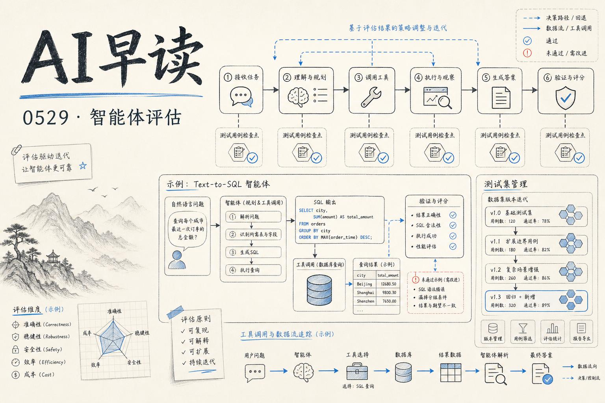

## 从评估到生产：Agent 可靠性的两篇深度指南

AWS 博客连续发布了两篇关于 Agent 评估的重量级文章，恰好指向了同一个核心问题：当 Agent 从 demo 走向生产，你怎么知道它在真实场景里表现如何？

第一篇来自 AWS 与 LangChain 的联合撰文，探讨了用 LangSmith 评估深度 Agent 的五个模式。文章以一个 text-to-SQL Agent 为例，展示了从离线评估到生产监控的完整链路。核心观点很直接：Agent 是非确定性的、多步骤的，一个错误的工具调用会像多米诺骨牌一样影响后续所有结果。他们提出的评估框架包括结构化输出匹配、工具调用验证、中间步骤审查、端到端任务成功率，以及生产环境下的在线追踪。

链接：[Evaluating Deep Agents using LangSmith on AWS](https://aws.amazon.com/blogs/machine-learning/evaluating-deep-agents-using-langsmith-on-aws/)

第二篇则来自 Amazon Bedrock AgentCore 团队，思路更进了一步 - 他们把测试用例当作数据集来管理。你可以为 Agent 编写带输入、预期输出、断言和工具调用序列的测试场景，然后发布成不可变的版本化快照。当生产出问题时，那个失败的 trace 自动成为一个永久测试用例，每次变更都要通过它的检验。有 ground truth 的测试才是有意义的测试。

链接：[Build a test suite that grows with your agent with dataset management in Amazon Bedrock AgentCore](https://aws.amazon.com/blogs/machine-learning/build-a-test-suite-that-grows-with-your-agent-with-dataset-management-in-amazon-bedrock-agentcore/)

这两篇建议一起读。一个是教你设计评估维度和方法论，另一个是教你管理测试用例的生命周期 - 后者在国内语境下经常被忽略。

## 异步 Agent 的时代来了

Latent Space 最新一期的嘉宾是 Cognition 联合创始人 Walden Yan 和 OpenInspect 的 Cole Murray。标题直接点出了主题：异步 Agent 时代。

梳理一下思路：第一代 AI 编程工具（Copilot 的 Tab completion、Cursor 的补全）让开发者更快，但工作流仍然以开发者为中心，人盯着 IDE，接受或拒绝建议，一次一个交互。第二代是本地 Agent（Claude Code、Windsurf、Cursor 的 agent pane），终端越来越多。第三代就是现在的异步 Agent：你可以给 Agent 一个任务、一个仓库、一台机器、一个 shell、一个浏览器、测试、内存和审查循环，然后让它自己去完成后台工作。

最有趣的是 Walden Yan 的转变。一年前他写了那篇著名的 "Don't Build Multi-Agents"（不要构建多 Agent 系统），强调 context engineering 才是关键。但到了今年四月，他开始分享哪些设置 actually work。这个转变本身说明了行业的快速成熟。

链接：[The Age of Async Agents — Cognition's Walden Yan & OpenInspect's Cole Murray](https://www.latent.space/p/cognition)

## Cloudflare 给自己造了一个数据分析 Agent

Cloudflare 这篇博客讲的是他们内部的统一数据平台 Town Lake，以及跑在它上面的 AI 数据 Agent 叫 Skipper。面对每天超过 10 亿事件的数据洪流，分析师曾经需要知道去哪个系统问、用什么凭证、写什么查询语言、以及数据是采样的还是新鲜的。

Skipper 允许任何员工用自然语言提问，几秒内拿到可审计的答案。这不是什么 demo - 这是生产环境每天都在用的内部工具。有趣的是他们特别强调了 "un-sampled data"（未采样数据）：仪表盘用采样就够了，但计费不行。这个区分在设计和架构决策中很关键。

链接：[How we built Cloudflare's data platform and an AI agent on top of it](https://blog.cloudflare.com/our-unified-data-platform/)

## OpenAI 发布前沿治理框架

OpenAI 发布了 Frontier Governance Framework，一个公开的治理文件，解释他们的安全实践如何对齐加州前沿 AI 法案和 EU AI Act 的要求。框架涵盖网络攻击、CBRN（化学、生物、放射性与核）、有害操纵和失控风险等场景的评估与缓解措施。虽然主要是合规层面的工作，但这是业界第一次有前沿实验室把内部的安全框架写成可审计的公开文件。

链接：[OpenAI's Frontier Governance Framework](https://openai.com/index/openai-frontier-governance-framework/)

## 本周动态一览

Anthropic 在今天发布了 Claude Opus 4.8，AWS 和 Vercel 都已支持。同时 Anthropic 完成了 650 亿美元 Series H 融资，估值接近 9650 亿美元，接近万亿市值的 AI 公司正在成为现实。Asana 收购了 no-code Agent 构建平台 Stack AI，这是企业级 Agent 平台加速整合的信号。

---

*来源：VerySmallWoods Research Feed — 2026-05-29 UTC*
