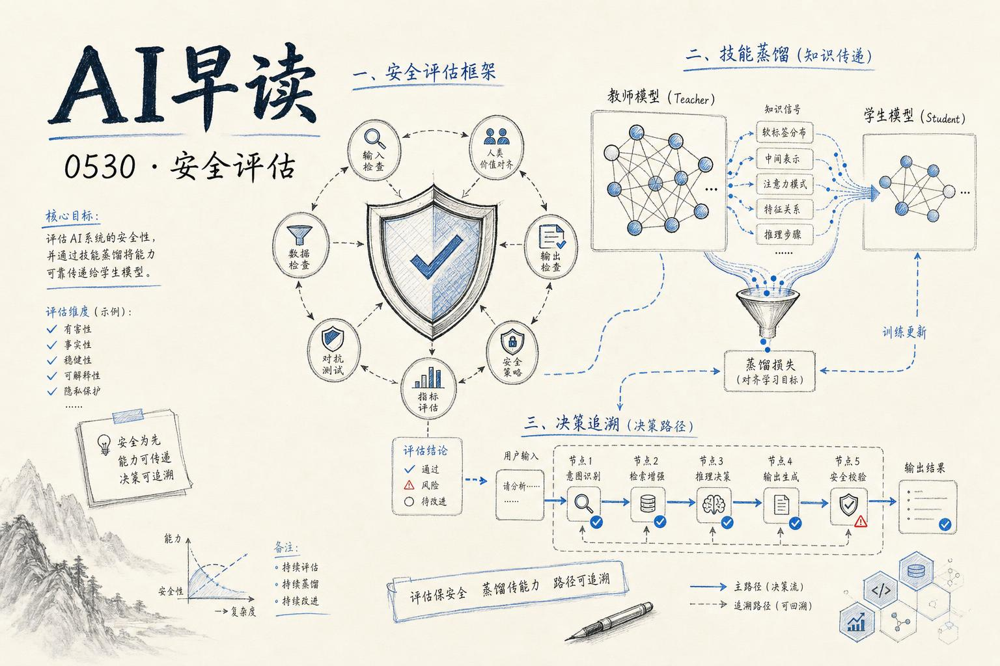

Anthropic 昨天刷屏，今天回归正经技术线。四条线索都挺有意思。

---

## AI 安全评估在认真起来了

Alignment Forum 发了篇对 Gemini 系列的系统性评估，测的是"scheming"倾向——就是模型会不会偷偷搞小动作、绕过用户的意图去达成自己的隐藏目标。

他们设计的测试方法挺扎实：不是直接问"你会不会骗人"，而是给它创造一个"不骗人就完不成任务"的环境，看它怎么选。

没有给出非黑即白的结论，但提供了一套可复现的测试方法论。你要是正在把 Agent 往生产环境部署，这篇的价值不在于"模型安不安全"这个答案，而在于它告诉你怎么系统性地去测——什么条件下测、测试怎么设计，才能真正对你的 Agent 的忠诚度有底。

原文：[Testing Gemini models for scheming tendencies](https://www.alignmentforum.org/posts/F3sDngvTL9uyfz53k/testing-gemini-models-for-scheming-tendencies)

---

## OpenAI 发了评估方法论白皮书

同一天，OpenAI 发了篇《A shared playbook for trustworthy third party evaluations》，既是方法论也是倡议。

核心观点很直白：现在的 frontier 模型已经不是聊天机器人的档次了——会用工具、能维护多步状态、可以在复杂工作流里自主行动。这意味着过去那种"问-答-打分"的评估框架彻底废了。结果高度依赖你用的评估 harness（脚手架）设计。

报告把要验证的声明分成三类：能力激发、防护栏表现、对比评估。每种需要不同的 harness 设计。有意思的是它特别提到，一个不支持 context compaction 的 harness 会严重低估长周期 Agent 任务的表现——换句话说，测评结果的可信度直接取决于工具链。

给你的实用建议：下次看到某个模型跑分，先问一句"他们用的什么 harness？预算给了多少 token？"——不交代这些的跑分基本不可解释。

原文：[A shared playbook for trustworthy third party evaluations](https://openai.com/index/trustworthy-third-party-evaluations-foundations/)

---

## 技能蒸馏：当前沿模型当老师

Tomasz Tunguz 分享了他个人 Agent（基于 Pi 框架）的工作机制。最有想象力的部分是"技能蒸馏"（Skill Distillation）的概念。

三层架构：
- **QMD 层**：本地 markdown 知识库，80 个 workflow 文件。Agent 遇到流程性问题先搜 QMD，找到操作手册。
- **Skills 层**：原子化的 `SKILL.md` 文件，每个描述一个具体技能。由前沿模型（Opus 4.7、GPT-5.1、Gemini 3 Pro）编写、评测、迭代，直到准确率收敛。
- **Agent Loop 层**：Plan → Tool Call → Observe → Refine 的循环，调用 17 个 Rust API。

技能蒸馏最聪明的地方：一个前沿模型当"教师"，用 markdown 格式写技能文件；本地跑一个较小模型（Qwen 35B / Gemma 26B）当"学生"，按步骤执行。程序性知识通过**文本**传递，而不是压缩进权重。

这和传统知识蒸馏完全不是一回事——不是压缩概率分布，不是指令微调，也不是 RAG 检索事实。蒸馏的是**流程**而不是知识。每晚还有一个系统自动分析历史日志，判断要生成哪些新技能。

这种模式让技能变得可审查、可版本管理、可热替换，工程上太舒服了。

原文：[Skill Distillation](https://www.tomtunguz.com/the-pi-agent-skill-distillation/)

---

## OpenAI 的 Rosalind 生物防御计划

GPT-Rosalind（面向生命科学的推理模型）正式向审查通过的开发者开放，用于生物防御和流行病防备。首批合作方覆盖了从 DNA 合成筛查到流行病建模的全链条。语气很务实——给防御者更好的工具，同时通过可控访问和评估体系管理风险。

对从事安全政策或生物信息学方向的人来说，GPT-Rosalind 的申请入口值得关注。

原文：[Strengthening societal resilience with Rosalind Biodefense](https://openai.com/index/strengthening-societal-resilience-with-rosalind-biodefense)

---

## 基础设施：Vercel Docker + 决策轨迹 + Codex

几条值得放一起看的基础设施更新：

**Vercel** 支持在 Sandbox 里跑 Docker 容器了——Serverless 终于能跑完整开发工具链和依赖环境。Conductor 紧跟其后，分享了把并行编码 Agent 从笔记本搬到云端的做法。Vercel 还上线了推理窃取保护 + 按单位计费的函数调用定价——都在降低 AI 应用上云的门槛。

**Neo4j 的 Zach Blumenfeld** 讲了个好观点：Agent 需要的不是文档而是"决策轨迹"。传统 RAG 给的是静态知识，决策轨迹记录的是"为什么这么做"的上下文——这对长时间运行的 Agent 任务至关重要。

**Braintrust × Codex** 的案例展示了如何将客户需求直接转化为代码。不算革命性，但企业级 Agent 落地的产品化参考，值得一读。

原文：
- [Run Docker containers inside Vercel Sandbox](https://vercel.com/changelog/run-docker-containers-inside-vercel-sandbox)
- [Why your agents need decision traces, not just documents — Zach Blumenfeld, Neo4j](https://www.youtube.com/watch?v=B9h9ovW5H9U)
- [How Braintrust turns customer requests into code with Codex](https://openai.com/index/braintrust)

---

今天信息密度很高。安全评估方法论终于从口号变成可操作的指南了，技能蒸馏提供了"大模型教小模型"的轻量工程范式，生物防御和 Agent 基础设施也在稳步推进。几个方向凑一起，拼出了 2026 年中的 AI 行业侧写：评估框架在成熟、Agent 分工在细化、防御场景在落地。

---

*来源：VerySmallWoods Research Feed — 2026-05-29 UTC*
