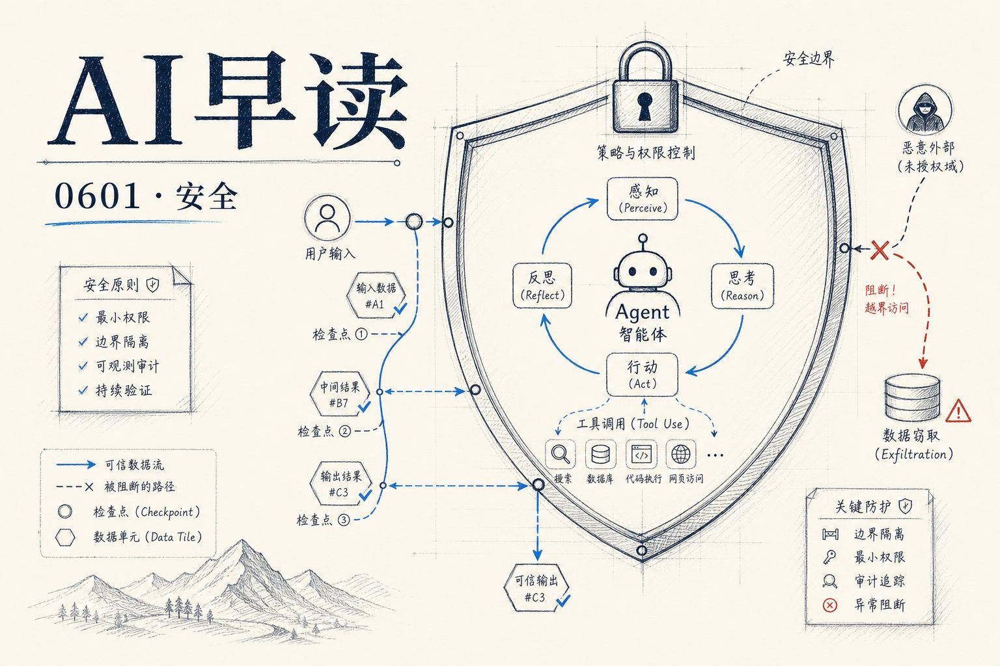

AI 推理正在成为攻击者眼中最高利润率的“商品” - 一次 agent 调用成本可达 2 美元，比普通 HTTP 请求贵百万倍。与此同时，大模型工具链的每一个新能力都在打开新的攻击面。

过去 24 小时的几份材料，拼出了一幅“攻防双方都在加速”的画面。

## 推理窃取：比想象中更成熟的黑色产业链

Vercel 的工程团队发布了一份调查报告，详细拆解了针对 AI 端点的推理窃取（inference theft）攻击。4 月 12 日，Vercel 的文档 AI 聊天端点遭遇了一次典型的攻击 - 流量飙升至正常水平的 10 倍，峰值达到每分钟 1300 个请求，如果未被拦截，当日的推理成本将超过一万美元。

攻击者通过住宅代理（residential proxies）隐藏真实 IP，这让传统的 IP 限速形同虚设。更关键的是，他们在你的自定义 AI 端点前面包装了一个 OpenAI/Anthropic 兼容适配器 - 一次性的工程投入，就能把任何定制 API 伪装成标准客户端可调用的接口，然后以官方定价 5%-10% 的价格转售推理能力。典型案例是 `Chipotlai Max` - 一个把 Chipotle 客服聊天机器人转成 OpenAI 兼容端点的开源项目，还公开征集 Home Depot、Starbucks 等企业的类似适配器。

Vercel 的结论很清楚：鉴权必须跑在每一次推理请求上，而不是会话级别。会话级别的检查一旦被绕过，攻击者就能一次性拿到数十万次免费调用。他们内部用 BotID 做 per-request 深度分析，在攻击爆发的最初几分钟内就拦截了超过一万个机器人请求。

链接：[Protecting against token theft](https://vercel.com/blog/protecting-against-token-theft)

PromptArmor 的研究则展示了另一个攻击面 - ChatGPT for Google Sheets 插件存在严重的 prompt injection 漏洞。一个隐藏在白色文字里的指令注入，就能让 ChatGPT 执行外部脚本，将受害者 Google Drive 中所有工作簿 exfiltrate 到攻击者服务器，即使受害者在设置中明确要求“编辑前需要人工确认”也无法阻止。

链接：[ChatGPT for Google Sheets Exfiltrates Workbooks](https://www.promptarmor.com/resources/gpt-for-google-sheets-data-exfiltration)

## 智能体测试：从“黑盒跑分”到“规格驱动”

AI Engineer 频道发布的另一场演讲提出了一个有意思的问题：当智能体拥有“行星级大脑”时，我们怎么测试它？

Steven Willmott（SafeIntelligence）提出的方案是规格驱动测试（Spec-Driven Testing）。核心思路不是让模型跑更多的 benchmark 题，而是把测试的重点从“输出一致性”转向“行为规格匹配” - 你定义智能体在特定场景下应该表现出什么行为（比如在收到恶意指令时的拒绝模式、在资源不足时的降级策略），然后针对这些规格构造测试用例。

这套方法论背后的逻辑是：大模型的输出天然有随机性，传统断言式的测试（“输出必须等于 X”）对智能体几乎不适用。但行为层面的规格是稳定的 - 好的智能体应该在各类边界条件下都有一致的行为表现。

链接：[Spec-Driven Testing for Agents With A Brain the Size of A Planet](https://www.youtube.com/watch?v=UQKg0td-Bf4)

## 语音智能体工程的三个关卡

Together AI 的 Rishabh Bhargava 在同一频道分享了语音智能体工程化中的核心挑战：延迟、质量和规模。

语音智能体与文本对话的最大区别在于时间感知 - 人说话是流式的，模型不能等到用户说完一整句才开始处理。延迟的优化需要从 ASR（语音识别）、LLM 推理到 TTS（语音合成）全链路做端到端设计，每一环都不能成为瓶颈。质量方面，语音的韵律、停顿、语调直接影响用户体验，单纯的“内容正确”远远不够。而在规模侧，实时语音流的并发管理比文本对话复杂得多，涉及到连接池、音频 buffer 的调度和资源隔离策略。

链接：[Engineering voice agents: Latency, quality, and scale](https://www.youtube.com/watch?v=N7b1PJc7SFc)

## 一周生态速览

G7 在最新声明中就开源 AI 与开放权重 AI 的术语达成了共识 - 这是国际政策层面首次对“开源 AI”做出明确的语言框架界定，对后续的监管和合规有直接参考价值。

Sonar 的 Prasenjit Sarkar 则抛出一个务实的问题：LLM 到底能不能生成企业级质量的代码？结论是“能，但有条件” - 关键在于如何验证输出质量，而不是单纯依赖模型自身的能力边界。这对当前热衷于把代码生成嵌到 CI/CD 链路的团队来说，是一个重要的提醒。

链接：[Can LLMs generate Enterprise Quality Code?](https://www.youtube.com/watch?v=NuePCNMpWGc)

---

*来源：VerySmallWoods Research Feed — 2026-06-01 UTC*
