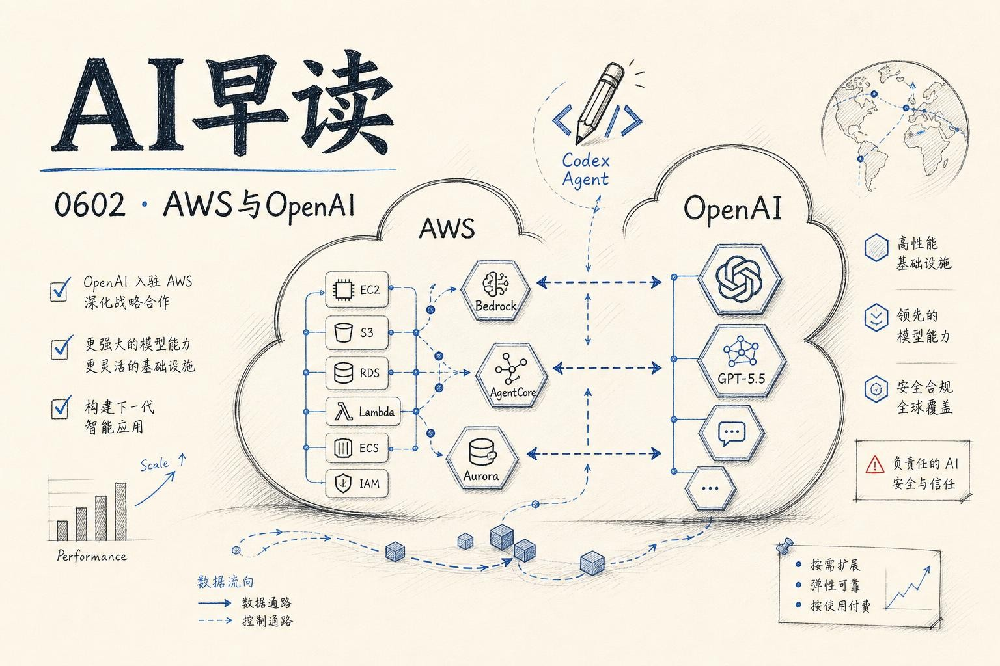

过去 24 小时 AI 圈最引人注目的动态,是 OpenAI 前沿模型正式入驻 AWS Bedrock。与此同时,AWS 围绕 Bedrock AgentCore 密集发布了一组 Agent 基础设施能力,Google 也放出了 Gemini Managed Agents 的完整开发指南。本篇梳理几条值得关注的动态。

## OpenAI 模型登陆 Bedrock

OpenAI 的 GPT-5.5、GPT-5.4 以及 Codex 现已通过 Amazon Bedrock 全面上线。这意味着企业可以在 AWS 的生产环境中直接调用这些模型,并享受 Bedrock 的高性能推理引擎。定价与 OpenAI 第一方一致,而 Codex 的推理走 Bedrock 通道,使用量计入已有的 AWS 承诺消费。

GPT-5.5 是 OpenAI 目前最强大的前沿模型,在多步骤自主任务、大代码库的编写与调试、数据分析等方面提升显著。对于企业来说,最大的价值在于隐去了 procurement、安全审核、合规审批等一系列组织摩擦 - 团队可以在已有的 AWS 环境和管控框架内直接使用 OpenAI 的能力。OpenAI 在同一时间发布的博客中也提到,后续还将通过 AWS 提供 Daybreak(包括 cyber 模型和 Codex Security)等更专业化的能力。

链接:[OpenAI models and Codex on Amazon Bedrock are now generally available](https://aws.amazon.com/blogs/machine-learning/openai-models-and-codex-on-amazon-bedrock-are-now-generally-available/)

链接:[OpenAI frontier models and Codex are now available on AWS](https://openai.com/index/openai-frontier-models-and-codex-are-now-available-on-aws)

## Bedrock AgentCore 扩展 MCP 支持

AWS 为 Bedrock AgentCore Gateway 新增了一批 MCP 支持能力。AgentCore Gateway 作为 MCP 服务器与客户端之间的中间层,负责集中管理凭证、安全连接和可观测性。此次更新加入了对 MCP tool schema 的扩展支持,将 MCP prompts 和 MCP resources 提升为第一类原生对象,同时引入了动态 listing 服务发现、流式会话管理、elicitation 机制(在 Agent 执行中途请求用户补充输入)以及 OAuth 2.0 on-behalf-of token 交换。

在企业场景中,AG 网关可以充当所有 MCP 服务器的单一入口 - 法务部门的合同审查 Agent、财务团队的数据检索 Agent、运维部门的故障响应 Agent 都通过同一个网关做身份认证、策略执行和日志记录。这对需要同时运维数十个 MCP 服务器的组织来说,价值相当直观。

链接:[Extending MCP support for Amazon Bedrock AgentCore Gateway](https://aws.amazon.com/blogs/machine-learning/extending-mcp-support-for-amazon-bedrock-agentcore-gateway-2/)

## AgentOps:把 Agent 装上运营体系

AWS 还发了一篇关于 AgentOps 的深度文章。核心观点是:Agentic AI 的运维挑战与传统软件不同 - Agent 做非确定性决策、成本会意外飙升、非确定性故障几乎无法复现。传统的 DevOps 实践不够用。

文中从四个支柱展开:治理与安全、构建与运维、评估、可观测性。实操层面,AWS 展示了如何用 Bedrock AgentCore 实现 Agent 质量的持续监控、工具调用的审计追踪、以及成本异常的自动告警。这是那种“用之前觉得是锦上添花，用之后发现是必需品”的能力。

链接:[AgentOps: Operationalize agentic AI at scale with Amazon Bedrock AgentCore](https://aws.amazon.com/blogs/machine-learning/agentops-operationalize-agentic-ai-at-scale-with-amazon-bedrock-agentcore/)

## Gemini Managed Agents 开发者指南

Philipp Schmid 写了一篇 Gemini Managed Agents 的实战指南。这是 Google 推出的托管 Agent 服务 - 你只需要调用 Interactions API,Gemini 3.5 Flash 就会在一个隔离的 Linux 沙箱里自动完成推理、代码执行(Python、Node.js、Bash)、包安装、文件管理和网页浏览。

开箱即用的 Antigravity Agent 已经可以处理编码、研究、数据分析等任务,也可以自定义 Agent 配置(指令、技能、数据)。完整的方案包括多轮对话(通过 environment_id 和 previous_interaction_id 实现会话与环境的独立状态管理)、文件挂载(Git 仓库、GCS、inline 三种来源)、流式响应等。最值得关注的是 fork 机制 - 你可以在沙箱中手动搭建环境,然后冻结为可复用的 Agent 镜像,每次调用都会从该镜像 fork 一个干净的实例。

链接:[Gemini Managed Agents: Developer Guide](https://www.philschmid.de/gemini-managed-agents-developer-guide)

## Embeddings 不是魔法:RAG 的预测性失败模式

一篇来自 TDS 的长文,系统的拆了 Embedding 检索的失败边界。作者用四代模型(GloVe-avg、MiniLM、ada-002、3-large)做了大量对比实验,结果很清晰:Embeddings 在同义词和概念近似上表现出色,但在否定、精确编号、内部产品代码这类场景中会稳定失败。而且换更强的 embedding 模型也解决不了 - 问题不在向量空间质量,在于检索目标的语言学特征本身就不适合用语义相似度来匹配。

文章的核心主张是:企业级 RAG 的可靠性提升,更多来自上层的专家关键字和文档结构过滤,而不是在弱检索之上堆 reranker。这篇文章是 Enterprise Document Intelligence 系列的一部分,如果做企业级搜索,值得整个系列都刷一遍。

链接:[Embeddings Aren't Magic: The Predictable Failure Modes of RAG Retrieval](https://towardsdatascience.com/embeddings-arent-magic-the-predictable-failure-modes-of-rag-retrieval-enterprise-document-intelligence-vol-1-2/)

## Import AI 459:AI 经济的真实规模

Jack Clark 的 Import AI 第 459 期报道了一篇来自 UVA、Anthropic 和加拿大央行的论文,试图回答一个很多人隐约感觉到但难以量化的疑问:AI 对经济的真实贡献到底有多大?

论文的核心发现很惊人 - 以质量调整后的口径计算,美国 AI 经济在 2024 年和 2025 年分别增长了约 2290% 和 2271%......名义上的 AI GDP 在 2025 年约为 2500 亿美元,但质量调整后的实际增速约每年 2600%。论文提出三个建议:建立 AI 卫星账户来独立追踪、统计机构应与企业合作生成更好的原始数据、政策制定者应将 AI 产能指标纳入中期经济预测。

Jack Clark 用了一个《大白鲨》的比喻:你看经济数据觉得一切正常,但真正在水面下的是那个庞大的 AI 经济 - 而我们才刚刚开始意识到它的存在。

链接:[Import AI 459: AI oversight is difficult; scaling laws for protein folding models; and pricing the extinction risk of AI systems](https://importai.substack.com/p/import-ai-459-ai-oversight-is-difficult)

---

*来源:VerySmallWoods Research Feed - 2026-06-01 UTC*
