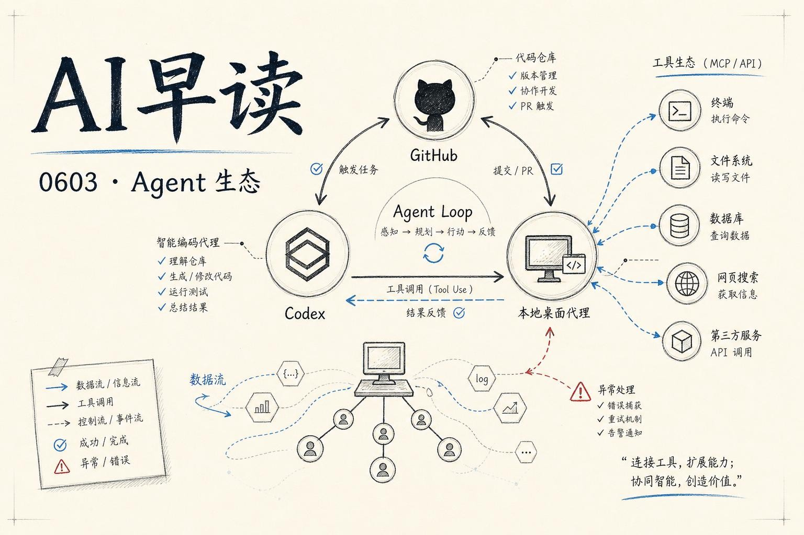

今天 AI 圈的核心叙事只有一个字：Agent。微软 Build 2026 上 GitHub 连发数款产品，从 Copilot 桌面应用到底层基础设施，把 agent-native 开发从概念推到了可用状态。同时 H Company 发布了 Holo3.1，把 computer use agent 的能力搬到了本地消费级硬件上。另一边，a16z 提出了一个有趣的观点 - 视觉 AI 的下一个前沿不再是像素，而是代码。

## GitHub 的 Agent 原生时刻

微软 Build 2026 上，GitHub 交出了一份 Agent 时代的关键答卷。新的 `Copilot app` 发布了桌面版，不仅仅是又一个 AI 编程助手，而是一个 agent-native 的控制中心。一个界面上可以同时看到多个 agent 在跑：一个在生产环境查 bug，另一个在处理 backlog issue，第三个在根据 review feedback 改代码。每个 agent 都有自己的 git worktree 隔离环境，互不干扰。

链接：[GitHub Copilot app: The agent-native desktop experience](https://github.blog/news-insights/product-news/github-copilot-app-the-agent-native-desktop-experience/)

同期 Latent Space 对 GitHub COO Kyle Daigle 的采访披露了更底层的数字：GitHub 上的 commit 量已经达到每月 14 亿，比去年同期翻倍 - 这背后 AI agent 贡献了 1400% 的增长。CI/CD 系统被推到了极限，GitHub Actions 的分钟数从 2023 年的每周 5 亿爬升到了现在的每周 20 亿。

链接：[GitHub's plan for Agents — Kyle Daigle, GitHub](https://www.latent.space/p/github)

Kyle 也谈到了一些有意思的细节。GitHub 内部已经开始用 WorkIQ 和 MCP 协议打通 Slack、Teams、邮件，让 agent 能访问整个公司的上下文。他个人有一个“星期六 15 个 agent”的例行流程 - 让一群 agent 并行梳理过去一周的运营数据，然后自动生成为高管准备的简报。代码生成只占 Copilot 价值的一小部分，真正的增量在于 agent 如何渗透进软件开发的每一个环节。

## 本地 Agent 的转折点：Holo3.1

如果 GitHub Copilot 是云端的 agent 图景，Holo3.1 则点亮了本地 agent 这条路。H Company 在三月份发布 Holo3 之后，这次发布的 3.1 版本第一次加入了量化权重支持：FP8、Q4 GGUF 和 NVFP4。在 DGX Spark 上，NVFP4 的 token 吞吐量是 BF16 的 1.74 倍，端到端 step time 从 6.8 秒降到了 3.3 秒。

链接：[Holo3.1: Fast & Local Computer Use Agents](https://huggingface.co/blog/Hcompany/holo31)

更重要的是 mobile 场景的突破。Holo3.1 在 AndroidWorld 上的得分从 67% 跃升到了 79.3%，这是 computer use agent 在移动端首次达到可用级别的精度。再加上 0.8B 的超轻量版本，在手机上跑一个 agent 不再是空想。

## 基础设施层的基建竞赛

Agent 的火爆正在倒逼基础设施全面升级。AWS 发了一篇详细的教程，展示如何用 Bedrock AgentCore Gateway 配合 OAuth 认证来保护 MCP 服务器 - 这看起来是细枝末节，但考虑到 agent 越来越多地要去调用企业内部的工具和数据，这一层安全机制是生产落地的前提。

链接：[Building a secure auth code flow setup using AgentCore Gateway with MCP clients](https://aws.amazon.com/blogs/machine-learning/building-a-secure-auth-code-flow-setup-using-agentcore-gateway-with-mcp-clients/)

模型侧，Together AI 发布了 MiniMax M3 的服务优化方案。M3 支持 1M token 上下文和原生多模态，它的 MiniMax Sparse Attention 机制在 prefilling 阶段实现了 9 倍加速，decoding 阶段更是达到了 15 倍。Together 团队在 KV-block-major 稀疏注意力、paged MSA decode 等底层做了大量工程优化，最终在不同并发场景下提升了 81–125% 的吞吐量。

链接：[Serving MiniMax-M3 for efficient inference](https://www.together.ai/blog/serving-minimax-m3-for-efficient-inference-unlocking-1m-token-context-and-multimodality-without-regrets)

## 视觉 AI 的下一条路：生成代码，而非像素

a16z 的一篇观点文章提出了一个值得深思的转向 - 对于很多视觉任务，生成像素不如生成代码。SVG 文件、HTML/CSS 布局、React 组件、Blender 脚本......这些可编辑、可复用的结构化产物，比一张静态的图片要灵活得多。设计师可以修改路径、调整渐变、更换字体 - 一切都在程序的层面完成，而不是对着像素反复 inpainting。

链接：[The Next Frontier of Visual AI Is Code](https://www.a16z.news/p/the-next-frontier-of-visual-ai-is)

这个判断和 Agent 浪潮是呼应的：当模型学会了生成可编辑的逻辑构件，而不是一次性输出，AI 就从“工具”变成了“协作者”。

---

*来源：VerySmallWoods Research Feed - 2026-06-02 UTC*
