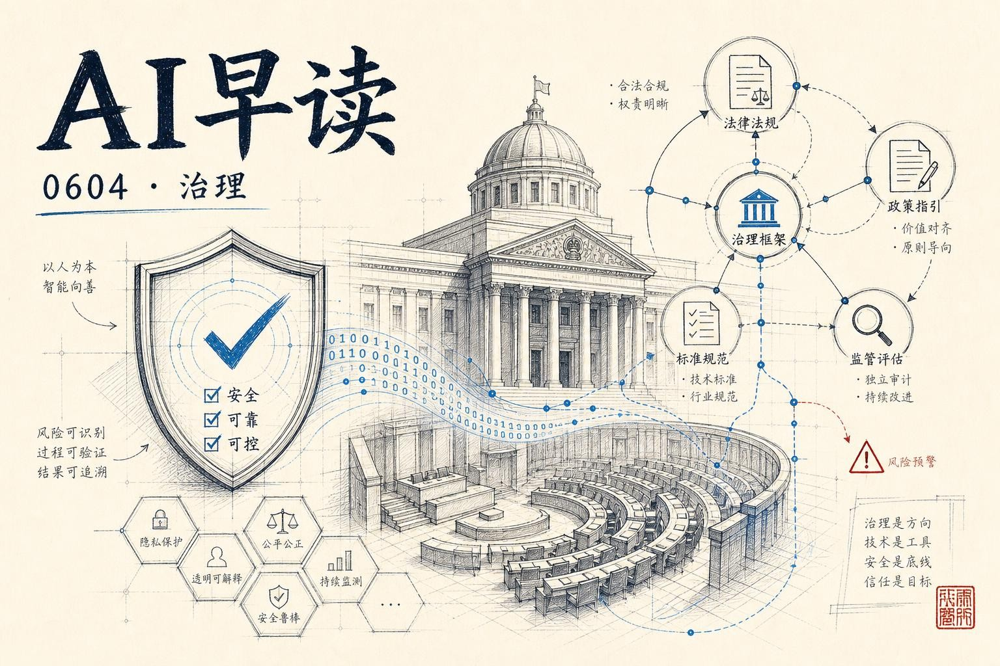

OpenAI 在同一天内接连发布了两份重磅政策文件：“公共政策议程”和“前沿AI民主治理蓝图”，罕见地在 AI 治理议题上摆出了全面、系统的姿态。我会结合 Axiom Math 的验证 AI 进展、AWS 的 Agent 工具调用优化、DPO 在 OCR 场景的应用，把过去 24 小时最重要的几件事串起来。

## OpenAI 的治理牌局

6 月 3 日，OpenAI 发布了“公共政策议程”和“前沿AI民主治理蓝图”两份文件。前者是其首次系统阐述政策立场，后者则是一份面向美国联邦政府的具体制度设计提案。

链接：[OpenAI public policy agenda](https://openai.com/index/public-policy-agenda)

公共政策议程覆盖安全、青少年保护、网络安全、经济影响、知识产权、政府 AI 应用等六大议题。在安全议题上，OpenAI 明确表态支持加州 SB 53、纽约 RAISE Act、伊利诺伊州 SB 315 等州级前沿安全法案，并呼吁国会建立统一的联邦框架，以 CAISI 为核心机构，建立独立评估生态，同时特别提出要监测“递归自我改进”的进展。

链接：[A blueprint for democratic governance of frontier AI](https://openai.com/index/frontier-safety-blueprint)

民主治理蓝图进一步将安全治理具象化：三步走策略 - 建立国家框架、强化 CAISI、推进政府范围的韧性计划。OpenAI 称这是“抓住时机的关键节点”，白宫同日也签署了关于“促进先进AI创新与安全”的行政令。两份文件结合来看，OpenAI 正在从技术公司向治理参与者的角色转型。

## Axiom：验证AI的飞跃

Latent Space 对 Axiom Math CEO Carina Hong 的深度访谈揭示了一个关键数据：Axiom 在 Verina codegen 基准上达到 99%（187/189）的证明率。作为对比，OpenAI o3 在该基准上的成绩是 4.9%。

链接：[Scaling Past Informal AI - Carina Hong, Axiom Math](https://www.latent.space/p/axiom)

Axiom 的核心方法是用 Lean 形式验证工具生成可验证的数学证明。Carina 用 Ramanujan 来类比：正式证明不只是为了验证正确性，更是让别人的工作可以建立在你的成果之上 - 这就是她说的“放大天才”。在强化学习场景中，Lean 验证器能提供比 GRPO 或 RLHF 强得多的奖励信号，类似编译器检查和测试在代码训练中的作用。

当前前沿实验室“仍然没有直接用 Lean 证明来训练”。如果 Axiom 的方法被主流采纳，这可能成为 AI 从统计信号转向形式验证的关键转折点。

## SFT + DPO 双段训练优化 Agent 工具调用

AWS 发布了一篇实用的技术文章：在 Amazon SageMaker AI 上用 SFT + DPO 两阶段训练来提升小型语言模型的工具调用准确率。

链接：[Improve your agent's tool-calling accuracy with SFT and DPO on Amazon SageMaker AI](https://aws.amazon.com/blogs/machine-learning/improve-your-agents-tool-calling-accuracy-with-sft-and-dpo-on-amazon-sagemaker-ai/)

基本逻辑很清晰：SFT 先让模型学会工具调用的格式和语义，DPO 再用“喜欢这个、不喜欢那个”的偏好信号来优化输出质量。AWS 给出了完整的训练基础设施方案，用户可以把精力放在训练代码上，不用操心集群管理。这是 DPO 在 Agent 领域落地的务实案例。

## DPO 超越聊天场景

Hugging Face 博客上有一篇 Dharma-AI 的分享值得留意 - 他们把 DPO 用在了一个完全没有主观偏好色彩的客观任务上：OCR 文本退化抑制。

链接：[Direct Preference Optimization Beyond Chatbots](https://huggingface.co/blog/Dharma-AI/direct-preference-optimization-beyond-chatbots)

OCR 场景的文本退化（反复重复同一内容）是个顽疾。SFT 能降低但无法根除，因为 SFT 的 token 级损失不会把整段退化当成一个失败来惩罚。DPO 做的恰恰是这一点：把退化输出标记为“被拒绝的”样本，让模型在输出级层面学习什么不应出现。结果是在所有模型家族上退化率平均降低 59.4%，最高达 87.6%。

这个案例的意义不在于 OCR 本身，而在于证明 DPO 不只是一个聊天对齐工具 - 它对任何有明确“好/坏”二元信号的生成任务都可能有效。

## World Models 分类学

a16z 转载了 Fei-Fei Li（李飞飞）团队的一篇文章，为当下被滥用的“世界模型”概念画了一幅功能分类图谱。

链接：[A Functional Taxonomy of World Models](https://www.a16z.news/p/a-functional-taxonomy-of-world-models)

文章回到 Sutton & Barto 的 POMDP 框架，指出不同领域说的“世界模型”其实是同一个 agent-world 循环的不同投影：机器人要的是状态估计，视频生成要的是下一帧预测，强化学习要的是转移函数。这篇不是技术教程 - 它是在帮整个领域统一语言。

---

*来源：VerySmallWoods Research Feed - 2026-06-03 UTC*
