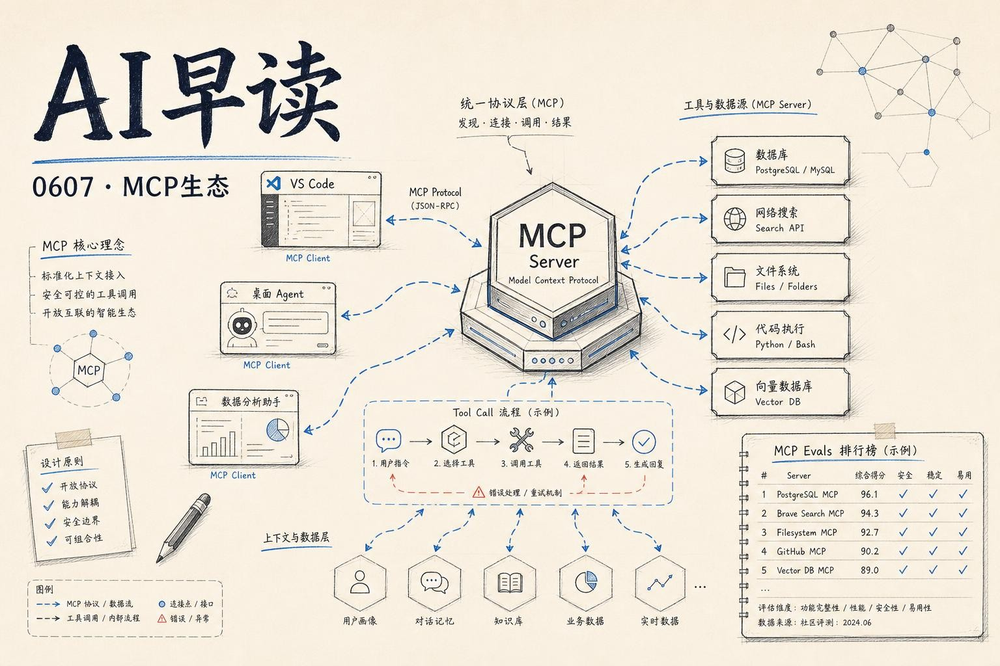

## MCP 应用进入 VS Code

AI Engineer 大会上，GitHub 的 Marlene Mhangami 和 Liam Hampton 展示了一个将 MCP（Model Context Protocol）应用直接嵌入 VS Code 编辑器的方案。这个叫 `MCP Apps` 的机制让开发者可以在编辑器内运行交互式 UI - 不再只是通过聊天窗口发消息，而是以原生 Webview 的形式呈现一个完整的 MCP 工具面板。模型可以通过 MCP 协议调用编辑器侧的组件，渲染表单、图表和交互控件，用户在 VS Code 内就能完成数据查看、参数调整和结果预览。

链接：[Building Interactive UIs in VS Code with MCP Apps — Marlene Mhangami & Liam Hampton, GitHub](https://www.youtube.com/watch?v=_xIwFcnHqp4)

## 意图债务：代码之外的新债

Addy Osmani 提出了一个值得深思的概念：软件健康不光有技术债和认知债，还有第三种 - 意图债。技术债藏在代码里，认知债藏在人脑子里，而意图债藏在那些你从没写下来的东西里：当初为什么要这么做、有什么约束条件、哪些权衡是刻意为之。AI 能帮你重构代码，也能帮你重建对系统的理解，但意图是唯一一个模型结构上无法插手的方向 - 它可以推断出一个听起来合理的理由，但那不是真正的决策原意。随着智能体大规模进入开发流程，未文档化的决策意图会以比以往更快的速度贬值。

链接：[The Intent Debt - Addy Osmani](https://addyosmani.com/blog/intent-debt/)

## Lockdown Mode 上线：提示注入的最后一道闸

OpenAI 正式向 Free、Go、Plus 和 Pro 用户推出了 Lockdown Mode 功能。这个模式的核心思路很直接：限制 ChatGPT 发出的出站网络请求，从根本上切断提示注入攻击后的数据外泄通道。Simon Willison 的评价切中要害 - 他此前提出的 Lethal Trifecta（致命三重奏）框架认为，LLM 系统的安全漏洞需要同时具备三个条件：访问私密数据、暴露于不可信内容、以及数据外泄路径。切断外泄路径是最容易操作的一环，也是 Lockdown Mode 在做的事。值得一提的是，这个功能的推出也侧面说明，ChatGPT 默认状态下对蓄意的数据外泄攻击并没有足够坚固的防护。

链接：[OpenAI Help: Lockdown Mode - Simon Willison](https://simonwillison.net/2026/Jun/5/openai-help-lockdown-mode/)

## MicroPython + WASM：轻量代码沙箱

Simon Willison 发布了一个实验性项目 `micropython-wasm`，用 MicroPython 编译成 WebAssembly 来搭建代码执行沙箱。他在 Datasette 生态中一直想做这件事：允许用户在应用内运行自定义代码，同时不必担心恶意插件破坏环境。MicroPython 编译到 WASM 后，天然具备了内存隔离和 CPU 上限控制的能力，文件系统和网络访问也可以由宿主程序精确管控。这个思路比用 Docker 容器或子进程更轻量，安装依赖也只是 pip install 一步。对于需要安全执行用户代码的场景，这是一个值得关注的方案。

链接：[Running Python code in a sandbox with MicroPython and WASM - Simon Willison](https://simonwillison.net/2026/Jun/6/micropython-in-a-sandbox/)

## 五个小模型，一出金融戏

Hugging Face 的 Build Small Hackathon 上出现了第二篇值得一读的构建报告：`Thousand Token Wood v2` 将一个多智能体经济模拟游戏改造成了“你当幕后操盘手”的版本。五只森林生物分别跑着不同实验室的小模型（GPT-OSS-20B、MiniCPM3-4B、Nemotron-Mini-4B 和一个微调的 Qwen 0.5B），每只动物可以放贷、私语消息、做空市场、收买盟友。游戏设计的亮点在于信息不对称 - 玩家给一个智能体的“内幕消息”是否真实，这个标记必须完全不在模型的 prompt 中出现，否则一旦被读出游戏就崩塌了。作者自述最重要的一条测试就是扫描每个 agent 的完整 prompt，确保敏感标记从未泄露。当你要给智能体秘密信息时，假设它一定会泄露 - 直到测试证明它不会。

链接：[Five labs, five minds: building a multi-model finance drama on small models - Hugging Face Blog](https://huggingface.co/blog/build-small-hackathon/thousand-token-wood-sim-v2)

---

*来源：VerySmallWoods Research Feed - 2026-06-07 UTC*
