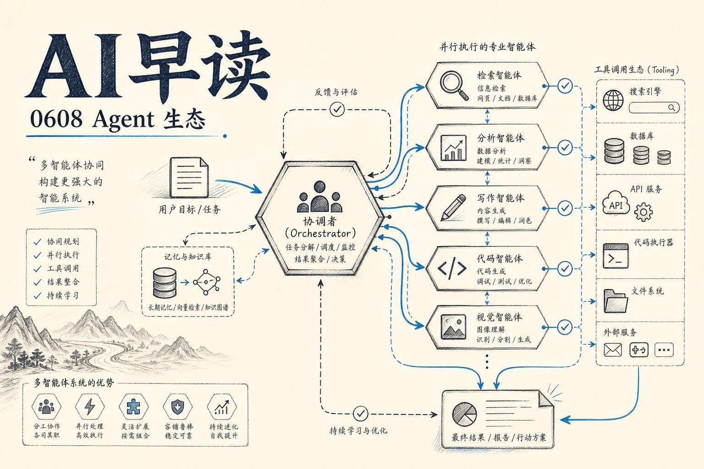

过去 24 小时，AI 圈的关键词可以浓缩为一个：**Agent**。从多智能体系统的入门教程登上 `Towards Data Science` 热门，到 MCP 管道的规模化实践，再到 OpenAI 超级应用的野心和 Deepseek 在美国企业中的快速渗透 - Agent 生态正在从演示阶段走向生产环境。

与此同时，Anthropic 在华盛顿的游说策略也浮出了水面，一条从技术实力到政策影响力的链接正在形成。

## 多智能体系统走进主流开发者视野

`Towards Data Science` 发布了一篇详细的 Python 多智能体系统教程，以旅行规划为场景，把整体任务拆解为 Research Agent、Activity Planning Agent、Budget Agent 和 Final Travel Assistant 四个角色。每个 Agent 持有一个独立的 system prompt 定义职责，通过 `OpenAI` 客户端串行调用，最终汇总为一份完整的行程单。

这篇文章的特别之处不在于技术深度 - 它用 `gpt-4.1-mini` 做后端、OpenRouter 做网关、简单的类封装做 Agent 蓝图 - 而在于它说明了一件事：多智能体编排已经不再是研究实验室的专属话题，而是任何一个有 Python 基础的开发者都可以尝试的实践。当 `Towards Data Science` 这样的平台把多智能体作为「中级教程」来推，意味着这个领域正在经历从专业到大众的拐点。

[来源](https://towardsdatascience.com/building-a-multi-agent-system-in-python/)

## MCP 管道与 Agent 可观测性：从原型到规模

`AI Engineer` 频道在同一天放出了两场相关讨论。Rafael Levi（Bright Data）的分享聚焦于从 MCP（Model Context Protocol）协议到自建管道的规模化路径 - 当 Agent 不再只是一个 demo，而是需要处理真实数据流时，管道本身的编排和可靠性就成了瓶颈。另一场是 Dat Ngo（Arize）关于 LLM 可观测性与评估的分享，讨论了在生产环境中如何衡量 Agent 的行为是否正确。

两场分享共同的潜台词是：Agent 的「玩具阶段」正在结束。当企业真正把 Agent 接入业务时，可观测性、评估、管道可靠性这些运维层面的问题开始变得和模型能力一样重要。

- [From MCP to Scale: Pipelines That Build Themselves](https://www.youtube.com/watch?v=zTZ0qunQXnM)
- [LLM Observability, Evaluation, Experimentation Platform](https://www.youtube.com/watch?v=JsCCrBF7F1g)

## OpenAI 的超级应用野心

OpenAI 的超级应用战略再次被媒体聚焦。据 `Financial Times` 报道，OpenAI 计划在未来几周内推出一个重构版的 ChatGPT，将其打造成一个「超级应用」 - 集成了编码工具和 AI Agent，把免费用户逐步引导至 Codex 等付费产品。一位 OpenAI 高级员工的表态很直白：「Chat is dead。」

核心产品负责人 Thibault Sottiaux 的描述更远：他正在构建一个「在你生活的方方面面都能帮助你的个人 Agent，无论是个人事务还是工作」。这种叙事并不新鲜 - 去年就有媒体报道过 OpenAI 的超级应用计划，但这次的信号是 OpenAI 已经明确砍掉了 Sora 等「副线」产品，集中资源押注一个统一的平台入口。

从行业格局看，这个策略直接对标 Anthropic 在企业客户中的影响力。同时，价格战的阴影也在逼近。

[来源](https://techcrunch.com/2026/06/07/openai-is-still-working-on-that-super-app/)

## Deepseek 在美国企业的渗透：价格驱动的 Token 经济

`Ramp` 的 2026 年 6 月企业软件趋势数据显示，Deepseek 登顶了增长速度最快的软件供应商榜单。Ramp 首席经济学家 Ara Kharazian 指出，美国企业正在直接向 Deepseek 付费、将数据传输到其平台 - 这跟开源自托管是两回事。Kharazian 对使用中国模型的安全和竞争风险提出了警告，也怀疑这股趋势能持续多久。

但数据的指向很清晰：Deepseek V4 在 4 月底发布，性能比不上最好的西方模型，但价格差距远大于性能差距。在推理平台（Fireworks AI、DeepInfra、fal AI）的推动下，企业正越来越基于性价比来选择模型。Kharazian 称之为「Token 经济」的雏形 - 模型选择越来越像商品采购，价格与性能的权衡成为核心决策因素。

同一份数据也否定了「SaaSpocalypse」（AI 杀死 SaaS）的叙事：Figma 和 Paper 等设计工具的需求依然强劲。

[来源](https://the-decoder.com/deepseek-topped-ramps-trending-software-vendors-in-june-2026-as-us-companies-chase-cheaper-ai/)

## Notion 中断事件：模型可靠性成为基础设施问题

一个值得关注的小插曲：Notion 在 6 月 7 日早间发布状态更新，称 Anthropic 的 Opus 4.7 和 4.8 模型出现性能下降，导致选择这些模型的用户出现高失败率。Notion 一度禁用了所有 Anthropic 模型，十二小时后才恢复访问。

Notion 产品负责人 Max Schoening 对此的回应很有意思 - 他说自己「很震惊」有这么多人转发这条状态，想把它炒作成「模型质量问题」。他解释道，「这是临时服务中断。这种事会发生在 Notion 身上，也会发生在 GitHub、AWS 和你用的 OpenClaw 身上」。

Anthropic 回应称是「短暂的基础设施问题」，问题已解决。但当模型成为产品核心依赖时，API 的每一次抖动都是直接的业务影响 - 这不是危言耸听，是基础设施级的风险。

[来源](https://techcrunch.com/2026/06/07/notion-restores-access-to-anthropic-after-service-disruption/)

## Anthropic 的华盛顿路线

`The Algorithmic Bridge` 发表了一篇深度分析，梳理了 Anthropic 如何通过 Mythos 模型的安全叙事影响特朗普政府的 AI 政策走向。从 2025 年 7 月特朗普称 AI 是「刚出生的漂亮宝宝」要让它「茁壮成长」，到 2026 年 5 月 NYT 报道白宫在考虑建立正式 AI 模型审查流程 - 这中间的转折，很大程度上是 Anthropic 一手推动的。

关键节点是 Anthropic 的 Mythos Preview 模型 - Anthropic 自己宣称它「在发现和利用软件漏洞方面能超越除了最顶尖人类以外的所有人」，并因此暂缓公开发布。这个宣称本身就成了政策游说的核心论据。随后 Anthropic 发布的一系列政策文件 - 从美中冲突白皮书到递归自我改进的博客文章 - 都在反复使用同一个叙事框架：AI 太强了，需要政府介入。

分析指出，Anthropic 已经不只是 AI 模型公司，它在华盛顿扮演的角色更像一个「有技术分支的游说机构」。这种从技术实力到政策影响力的直接转化，可能是未来几年 AI 治理中最值得关注的动态之一。

[来源](https://www.thealgorithmicbridge.com/p/how-anthropic-courted-trump)

---

*来源：VerySmallWoods Research Feed - 2026-06-08 UTC*
