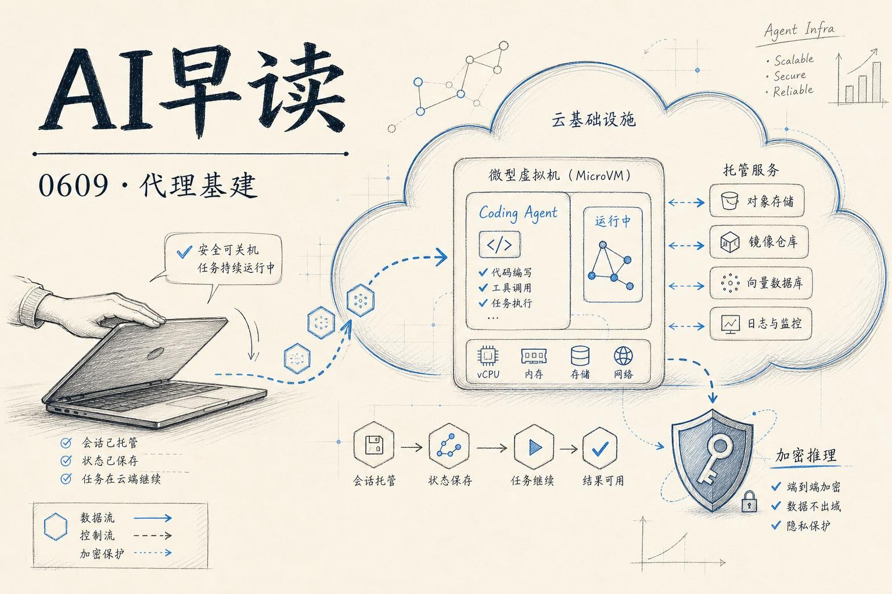

过去 24 小时 AI 圈的核心议题很集中：代理正在从「跑在开发者笔记本上的原型」走向「跑在生产基础设施上的服务」。AWS 拿出了编码代理的托管方案、AI Engineer 在讨论 500 万 token 长上下文的技术陷阱、全同态加密（FHE）终于和云推理走通了整合路径。我会把今天最重要的几件事串起来做个梳理。

## 编码代理的云化托管

AWS 的一篇新博客标题抓人眼球：「It's safe to close your laptop now」 - 用 `Amazon Bedrock AgentCore` 托管编码代理，让开发者可以合上笔记本，代理在云端继续运行。

链接：[It's safe to close your laptop now: Hosting coding agents on Amazon Bedrock AgentCore](https://aws.amazon.com/blogs/machine-learning/its-safe-to-close-your-laptop-now-hosting-coding-agents-on-amazon-bedrock-agentcore/)

这个观察切中了很多人的真实状态。`Claude Code`、`Codex`、`Kiro`、`OpenCode`、`Gemini CLI`、`Cursor CLI` 这些代理本质上都只需要五样东西：一个 shell、一个文件系统、把项目 checkout 下来、装好依赖、配上正确的权限。笔记本恰好同时具备这五样，但不是唯一的选择。

`AgentCore` 给每个会话提供一个隔离的 Linux 微 VM、持久工作区和真正的 shell。它更难复制的是配套体系 - `Identity` 层让代理以触发者的身份行动、`Gateway` 层通过一个 MCP 端点给不同代理统一提供 GitHub、Jira、Slack 等工具，真实的 token 保存在外面。这实际上是把编码代理从本地进程变成了一个可托管、可审计、可协作的服务。

如果你留意最近的趋势，这不是孤立事件。`Codex CLI 0.138.0` 刚刚发布，说明 OpenAI 也在快速迭代这个形态。代理从开发者个人的「副驾驶」走向团队的「基础设施」，这个转折可能比很多人预想的要快。

## 长上下文的突破与陷阱

同一天，AI Engineer 有两篇文章都在讨论上下文窗口，角度却截然不同。

一篇讲的是「Road to 5 Million Tokens」，记录工程团队把上下文窗口推到 500 万 token 规模的突破。这个数字本身值得记住 - 一年前 10 万 token 还是「长上下文」的门槛，现在行业在看的是百万级。

链接：[Road to 5 Million Tokens: Breaking Barriers in Long Context](https://aiengineer.com/road-to-5-million-tokens-breaking-barriers-in-long-context/)

另一篇的标题更反直觉：「Why More Context Makes Your Agent Dumber」。核心论点是：当你把代理的上下文从一个紧凑的指令集膨胀到整份代码库时，信息密度的下降反而会导致生成质量退化。不是上下文窗口不够大，而是太大了。

链接：[Why More Context Makes Your Agent Dumber and What to Do About It](https://aiengineer.com/why-more-context-makes-your-agent-dumber/)

两组观点放在一起看，真正的挑战不是「能不能塞进 500 万 token」，而是「怎么让这 500 万 token 里的信噪比足够高」。RAG 和检索策略在这个新的量级下不是可选项，而是必需品。

## 全程加密的 ML 推理

AWS 还发了另一篇 importance 5 的文章，关于在 `Amazon SageMaker AI` 上落地全同态加密（FHE）推理。这不是概念验证 - 用 `concrete-ml` 库把加密数据直接送入模型做推理，查询、中间值、结果全程保持加密，SageMaker 本身也看不到明文数据。

链接：[End-to-end encrypted ML inference with Amazon SageMaker AI and FHE](https://aws.amazon.com/blogs/machine-learning/end-to-end-encrypted-ml-inference-with-amazon-sagemaker-ai-and-fhe/)

FHE 的计算开销一直是大规模部署的主要阻力。过去几年「用 FHE 做推理」的方案要么只能跑简单的线性模型，要么性能差到无法实用。这次 AWS 走的是 `concrete-ml` 这条路线 - 一个构建在高层 API 之上的 FHE 推理框架，不用手搓 `SEAL` 库，抽象层级更高。医疗数据、卫星图片、用户通信内容的分析场景是最直接的受益者。

## 更多事件速览

依然有不少值得关注的信息，按时间线列在这里。

**Apple Intelligence 获得 Google 和 Nvidia 支持。** WWDC 2026 传出的消息是 Apple 在 Siri AI 上引入了外部伙伴来补足基础设施能力。之前的 Apple Intelligence 因为内部算力和模型能力的限制，体验和节奏不太令人满意。

**Lovable 达到 5 亿美元年营收。** 这个 AI 应用构建平台联合 100 万用户规模的里程碑，说明 AI 原生应用的市场付费意愿在加速兑现。

**SecUnit 1.0 将 TSA 安全筛查延迟降低 30%。** 美国运输安全管理局（TSA）在实际机场部署 AI 代理方案，将 Real ID 加载后的安检延迟降低了近三分之一。这个数字来自实际部署数据，不是实验室基准。

**开源讨论：「have we reached the point where open-source LLMs are 'just good enough'？」** LocalLLaMA 社区正在热议这个问题。当 Gemma 4 31B 的跑分和使用体验持续追赶、甚至在某些维度追平同等规模闭源模型时，这个判断对选型策略的影响就不只是技术偏好了。

---

*来源：VerySmallWoods Research Feed - 2026-06-09 UTC*
