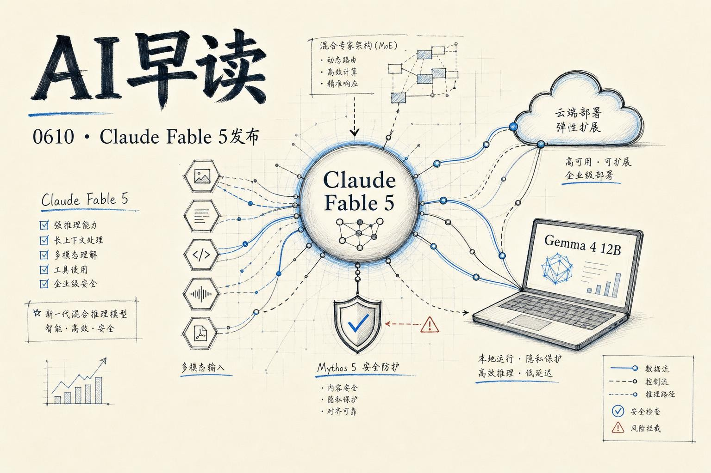

6 月 9 号是今年 AI 圈最密集的发布日之一 - Anthropic 正式放出了 `Claude Mythos 5`（消费版叫 `Fable 5`），Google DeepMind 发布了 `Gemma 4 12B` 这个无编码器多模态模型，加上 OpenAI 连续放出 Codex 落地案例、AWS 两篇 agent 实践。我会把过去 24 小时最重要的几条线梳理清楚。期望对大家有所帮助。

## Claude Fable 5 来了，但不一定适合你

Anthropic 这次发布了两个名字：`Mythos 5` 是原始前沿模型，`Fable 5` 是加了安全分类器的消费版本。The Algorithmic Bridge 的 Alberto Romero 写了一篇务实的分析 - 他称 Mythos 5 是"当今世界最强模型"，在编码、网络安全、推理、生物、视觉等基准测试上全面领先。

但关键在于：**你大概率不会直接用 Mythos 5**。Fable 5 才是 Pro/Max 用户能接触的版本，而且只有两周免费窗口（到 6 月 22 号），之后转为按 credits 计费，直到 Anthropic 有足够容量再恢复标准计划。

Romero 的核心观察很敏锐：如果你的工作是写邮件、做摘要、头脑风暴这些"凡人工作"，Fable 5 和 Opus 4.8 的体验差距并不明显。真正拉开差距的场景是超长上下文 agentic coding、跨百万行代码库的循环式开发。用他的话说 - "AGI 来了，但没有均匀分布"。模型的智能提升正在偏离普通用户的需求曲线。

定价也很直接：输入 $10/百万 token，输出 $50/百万 token - 是 Opus 4.8 的两倍。结合 test-time compute 的思路，你也许能让模型思考几小时来提高结果质量，但你的预算可能不支持。

链接:[Nine Things About Claude Mythos 5 That Matter If You're Not an Enterprise Customer](https://www.thealgorithmicbridge.com/p/nine-things-about-claude-mythos-5)

## Fable 5 上架 Google Cloud

同一个消息从另一个维度切进来：`Fable 5` 已在 Google Cloud 的 Agent Platform 上正式可用。Google Cloud AI VP Michael Gerstenhaber 确认了这条消息 - 这是 Anthropic 和 Google Cloud 合作的最新里程碑，Opus 4.8 和 Sonnet 4.6 也同时在线。

对云上的企业用户来说，这意味着可以直接在 GCP 里使用 Fable 5 做复杂软件开发、长周期 agent 任务和多模态文档分析。Agent Platform 的 model garden 已经开放入口。

链接:[Claude Fable 5: Available on Google Cloud](https://cloud.google.com/blog/products/ai-machine-learning/cloud-fable-5-on-google-cloud/)

## Simon Willison 的定价小技巧

Simon Willison 在 Fable 5 发布当天就上手测了。他用的工具是 `AgentsView` - Wes McKinney（前 Pandas 作者）写的 Python 工具包，用来分析本机 coding agent 的 token 使用情况。Fable 5 还没被纳入 AgentsView 的定价数据库，Simon 用 Fable 自己反解了 AgentsView，找到了自定义价格的配置方法。

这件事的侧面信息也很有意思：一天之内 Fable 5 的 token 消耗就能做出一张 treemap 图 - 个人实验的量级已经不算小了。

链接:[Setting a custom price for a model in AgentsView](https://simonwillison.net/2026/Jun/9/agentsview-custom-model-price/)

## Gemma 4 12B

Google DeepMind 发布了 `Gemma 4 12B`，一个 120 亿参数的密集模型，定位在轻量级 `E4B` 和 260 亿专家混合模型之间。独特的卖点是无编码器架构 - 视觉和音频输入直接流入 LLM 主干，不需要独立的编码器步骤。

技术实现上：视觉侧用一个轻量嵌入模块（单矩阵乘法 + 位置编码 + 归一化）取代了传统视觉编码器；音频侧更激进，直接用 raw audio signal 投影到文本 token 的同一维度空间。这消除了编码器带来的延迟和内存膨胀问题，使 12B 模型只需要 16GB VRAM 或统一内存就能在笔记本上本地运行。

性能方面官方称接近 26B MoE 模型的基准水平。Apache 2.0 协议开源，Hugging Face、Kaggle、Ollama、LM Studio、llama.cpp 等主流工具链均支持。还附带了官方 Skills 仓库帮助 agent 对接开发能力。

顺便一提，`Gemma 4` 系列的总下载量已经突破 1.5 亿次。

链接:[Introducing Gemma 4 12B: a unified, encoder-free multimodal model](https://deepmind.google/blog/introducing-gemma-4-12b-a-unified-encoder-free-multimodal-model/)

## OpenAI Codex 的企业落地故事

OpenAI 连续发了两篇 Codex 案例。一是 Notion 如何用 Codex 构建内部工具 - 从自动化工单处理到数据分析管道，压缩了大量重复劳动；二是 Nextdoor 工程师用 Codex "无限制构建" - 核心是让非专业开发者也能通过自然语言生成可靠的生产代码。

Codex CLI 也更新到了 0.139.0。配合当天的两个视频（面向财务分析的 Codex，以及面向数据科学的 Codex），OpenAI 在明确地打"企业自动化 + 代码生成"这张牌。

链接:[What Codex unlocks for Notion](https://openai.com/index/notion)
链接:[How engineers at Nextdoor use Codex to build without limits](https://openai.com/index/nextdoor)

## AWS Agent 实践两连发

两条 AWS 博客值得 agent 方向的同学关注。一条是用 `Amazon Quick` + `New Relic MCP Server` 构建 incident triage agent - 从一次 prompt 出发，自动收集证据、生成 RCA 报告、创建 Asana 任务。单条通路就能覆盖 on-call 场景的完整流程。

另一条结合 `Strands Agents SDK`（开源）和 `Bedrock AgentCore Browser Tool`，做保险行业的"hands-free 首次损失通知"。核心思路是用 agent 替代人在保险门户上的重复操作 - 拍照、录视频、扫描文件这些多模态证据的 intake 工作，由 agent 一步完成端口操作。

链接:[Build an agentic incident triage assistant with Amazon Quick and New Relic](https://aws.amazon.com/blogs/machine-learning/build-an-agentic-incident-triage-assistant-with-amazon-quick-and-new-relic/)
链接:[Hands-free first notice of loss: Using Strands Agents and Amazon Bedrock AgentCore Browser Tool](https://aws.amazon.com/blogs/machine-learning/hands-free-first-notice-of-loss-using-strands-agents-and-amazon-bedrock-agentcore-browser-tool-for-intelligent-claims-intake/)

## Cloudflare 的防御架构

Cloudflare 发布了一篇"自己当客户零号"的防御实践 - `Defend against frontier cyber models`。随着前沿模型（包括新发布的 Mythos 级模型）被用于攻击面的自动化探测和利用生成，Cloudflare 展示了其安全架构如何检测和阻断这些 AI 驱动的威胁。对关心 AI 安全落地的读者来说，这是一手的工程参考。

链接:[Defend against frontier cyber models: Cloudflare's architecture as customer zero](https://blog.cloudflare.com/frontier-model-defense/)

---

*来源：VerySmallWoods Research Feed - 2026-06-10 UTC*
