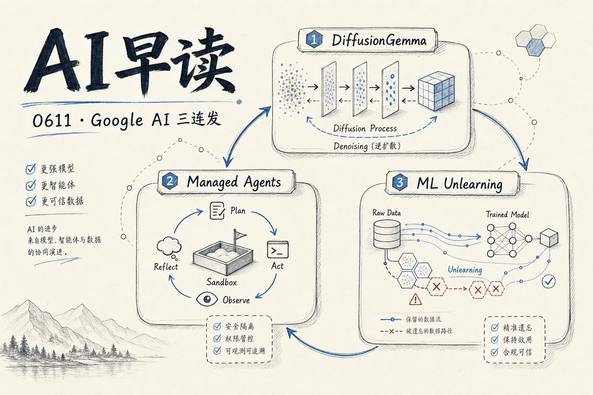

Google 昨天密集放了三颗弹 - DiffusionGemma、Gemini Managed Agents 底层拆解，以及 ML 遗忘审计框架。每一颗都值得单独成篇，但挤在同一天就很有意思了。我会把这三条串起来讲，再补上 GitHub Copilot CLI 和 Claude Fable 5 的动向。

## DiffusionGemma：用扩散模型加速文本生成

Google DeepMind 发布了 `DiffusionGemma`，一个用扩散（diffusion）架构做文本生成的模型。传统 LLM 是自回归的 - 一个 token 接一个 token 地预测，延迟与生成长度成正比。DiffusionGemma 换了一条路：从噪声开始，通过多步去噪逐步还原完整输出。这个设计让它在某些任务上达到 4 倍的速度提升。

这并不是说 diffusion 会取代自回归 - diffusion 在需要批量生成、对延迟不敏感的场景更合适。但 Google 在 Gemma 家族里塞进这条分支，说明他们正在认真探索自回归之外的路线。从 Simon Willison 的分析看，DiffusionGemma 目前还是研究性质的发布，但开放了权重和推理代码。

链接：[DiffusionGemma: 4x faster text generation](https://deepmind.google/blog/diffusiongemma-4x-faster-text-generation/)

## Gemini Managed Agents：一行代码背后的沙箱

Philipp Schmid 写了一篇非常实操的拆解，讲 Google 的 `Managed Agents` 底层是怎么跑的。调用 `interactions.create()` 看起来只是一行 SDK，但背后拉起了一个完整的执行环境 - 4 vCPU、16 GB RAM 的 Linux 沙箱，Gemini 3.5 Flash 作为编排器，在推理、工具调用、代码执行的循环里反复迭代，直到任务完成。

值得注意的设计：沙箱环境可以通过 `environment_id` 跨调用持久化 - 第一次装好依赖，第二次直接复用。而且 Preview 期间环境计算不收费，只收模型 token 的费用。这对做原型验证来说是个不错的体验。

链接：[How Gemini Managed Agents Works under the Hood](https://www.philschmid.de/how-managed-agents-work)

## Google Research：ML 遗忘审计框架

同一天，Google Research 放出了一个用于审计机器学习“遗忘”（machine unlearning）的框架。它的核心问题很直接：如果一个模型声称已经“忘记”了某批数据，你有多大把握相信它？团队提出了一个基于统计检验的方法，用来判断两组数据是否来自完全不同的分布 - 本质上是在给“遗忘”的声明做置信度评估。

这个方向在合规场景会越来越重要。欧盟 AI Act 已经提到了用户数据的“被遗忘权”，落实到模型层面需要可审计的方法论。

链接：[New framework for auditing machine unlearning](https://research.google/blog/new-framework-for-auditing-machine-unlearning/)

## GitHub Copilot CLI 接入 LSP

GitHub 博客发了篇很实用的文章：给 GitHub Copilot CLI 配上 Language Server Protocol（LSP）。之前 Copilot CLI 理解代码靠的是 grep、解 JAR、翻 `node_modules` - 文本级别的暴力搜索。接上 LSP 之后，agent 可以发送 `textDocument/definition` 这类语义请求，拿到精确的类型、签名和引用位置。

文章里详细展示了怎么通过 Agent Skill 自动安装和配置 LSP 服务器，目前支持 14 种语言。如果你用 Copilot CLI 写代码，这个技能值得一试。

链接：[Give GitHub Copilot CLI real code intelligence with language servers](https://github.blog/ai-and-ml/github-copilot/give-github-copilot-cli-real-code-intelligence-with-language-servers/)

## Claude Fable 5 余波

Claude Fable 5 的热度还没退。Simon Willison 写了条很妙的观察："If Claude Fable stops helping you, you'll never know" - Fable 5 采用了“有节制”的推理策略，模型遇到不擅长的任务时会直接不出声，而不是输出不确定的内容。这对可靠性可能是好事，但对用户来说，一个静默拒绝的模型比一个会犯错但坦诚的模型更难调试。

Latent Space 的 AINews 也专门做了一期 Fable 5 的解读，标题叫 "Mythos but Safe, with Controversial Terms" - 暗示 Fable 5 在安全和能力之间的取舍比之前更激进。

链接：[If Claude Fable stops helping you, you'll never know](https://simonwillison.net/2026/Jun/10/if-claude-fable-stops-helping-you/#atom-everything)

---

*来源：VerySmallWoods Research Feed - 2026-06-11 UTC*
