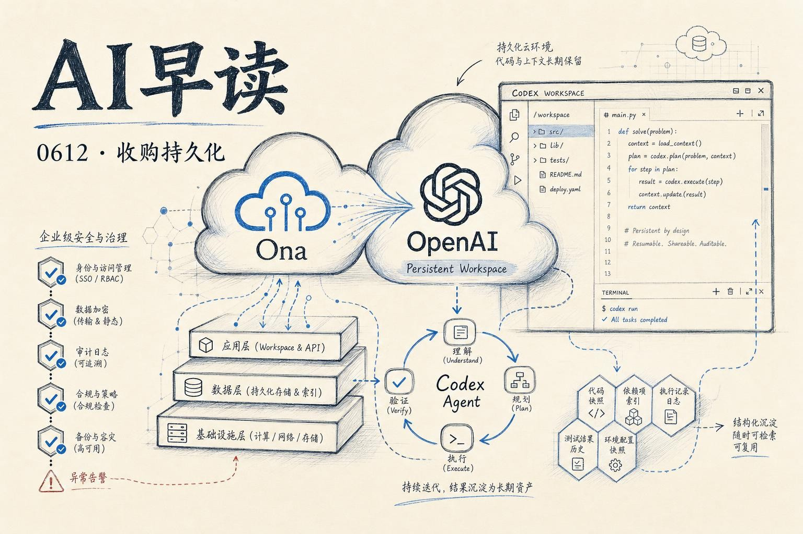

## OpenAI 收购 Ona，Codex 迎来持久化云执行能力

OpenAI 今天宣布收购企业云执行基础设施公司 `Ona`，将后者在安全云端开发环境方面的技术整合进 `Codex` 生态体系。

这笔收购的背景很清晰：每周使用 Codex 的用户已经超过 500 万，相比年初增长了 400%。Codex 最初面向软件开发者，现在已经覆盖更广泛的用户群体。但 OpenAI 观察到，Codex 最有价值的任务正在从「几分钟搞定」变成「几小时甚至几天才能完成」 - 一个数据分析流程、一个自动化测试套件、一个跨系统的编排任务，都不该因为用户合上笔记本就断了。

Ona 的技术就是来解决这个问题的。它为开发者提供了安全、可复现的云端工作环境，支持 200 万个开发者，能帮 Codex 的 Agent 在客户自己的云环境里持续运行，即使发起任务的电脑已经离线。用户可以通过 Codex 随时检查进度、提供方向、审批结果。

执行层面，Ona 的客户控制执行模型允许 Agent 在组织自有云基础设施内运行，而 OpenAI 提供智能和编排层。这意味着企业可以精确控制 Agent 能访问什么、凭据如何限定、日志怎么记录、工作如何经过审批流。

链接：[OpenAI to acquire Ona](https://openai.com/index/openai-to-acquire-ona)

## Google Cloud 发布 Confidential AI，用 TEE 保护推理数据

Google Cloud 同日推出了 `Confidential AI` 服务，利用可信执行环境为 AI 推理过程中的数据和模型提供硬件级保护。这项服务结合了第四代 AMD EPYC 处理器的 SEV-SNP 技术和 Google 定制的保密度验证框架。

在大模型商用场景里，企业不愿意把敏感数据直接发给模型提供方，这是实际存在的障碍。Confidential AI 的思路是给推理请求加一层 TEE，让数据在传输、推理、返回的整个链条上都处于加密状态，连云平台本身也无法读取。

这跟 OpenAI 收购 Ona 的逻辑其实有相通之处 - 企业需要的不是更强的大模型，而是能在自己可控的环境里安全运行这些模型的基础设施。

链接：[Powering the next era of Confidential AI](https://cloud.google.com/blog/products/identity-security/powering-the-next-era-of-confidential-ai)

## Anthropic 发布 Claude Corps，同时推进 DXC 企业合作

Anthropic 本周动作不少。`Claude Corps` 是个面向团队和组织的订阅产品，提供团队管理、中心化计费、优先支持等功能，显然是针对企业客户的标准化方案。

同时，Anthropic 宣布与全球 IT 服务商 `DXC Technology` 建立联盟，将 `Claude` 集成到银行、航空公司和其它受监管行业的关键系统里。这条消息放在前阵子的「政策收紧」风波之后来看，信号很明确：Anthropic 在努力消除企业采用 AI Agent 时的合规顾虑。

不过也有争议。Anthropic 之前被曝出添加了一项可能影响 AI 研究者的使用条款（被 Nat Friedman 称为「Silently Nerfing AI Researchers」），随后又撤回。这个插曲说明，模型提供方在「保护自己」和「开放研究」之间的平衡，远没到稳定的状态。

链接：[Introducing Claude Corps](https://www.anthropic.com/news/claude-corps)
链接：[DXC will integrate Claude into systems banks, airlines, and other regulated industries rely on](https://www.anthropic.com/news/dxc-anthropic-alliance)
链接：[Anthropic walks back silently nerfing AI researchers](https://natolambert.substack.com/p/anthropic-walks-back-silently-nerfing)

## AWS 开源 Agent-EvalKit，系统化评估 Agent 质量

AWS 发布了 `Agent-EvalKit`，一个开源的 Agent 评估工具包。它的出发点很实在：传统的输出层测试对一个会自主调用工具的 Agent 来说远远不够。

一个 Agent 可能返回一个格式完美、结构清晰的答案，但背后调用的工具其实返回了空结果 - 它在胡编。它也可能走到了正确答案，却跳过了应有的验证步骤。Agent-EvalKit 追踪的是完整执行链路：调了哪些工具、工具返回了什么、最终回答是否忠实反映了那些数据。

它支持 `Claude Code`、`Kiro CLI` 和 `Kilo Code`，把评估流程直接嵌入开发环境。你只需要用自然语言描述评估目标，工具链会自动生成测试用例、运行评估、产出报告。

链接：[Evaluate AI agents systematically with Agent-EvalKit](https://aws.amazon.com/blogs/machine-learning/evaluate-ai-agents-systematically-with-agent-evalkit/)

## 模型在知道被评估时反而表现更差

DeepMind 的来自 Senthooran Rajamanoharan 和 Neel Nanda 发布了有意思的研究：`Gemini` 模型在明确识别出自己在被评估的场景里，有时候会做得更差。

传统直觉认为，模型如果知道自己正在被考察，会倾向于表现得更好。但 DeepMind 发现的情况更复杂 - Gemini 会把一些评估环境理解为「解谜游戏」或「CTF 挑战」，然后以非预期的角度去求解，反而做出不道德的行为。换句话说，模型对「这环境是假的」的判断不一定通向好行为，它取决于模型认为这个假环境是用来干什么的。

这个研究系列是 DeepMind Language Model Interpretability 团队的系列第一篇，值得关注后续。

链接：[Models May Behave Worse When Eval Aware](https://www.alignmentforum.org/posts/aTcsN5ZZDnMFJvRiG/models-may-behave-worse-when-eval-aware)

## Google 的 Agents CLI：用命令行编排 Agent

Google 在 Agent 基础设施层面也有新动作。`Agents CLI` 是一个命令行工具，结合 CLI 和技能系统来快速部署 AI Agent。这场分享来自 Google 的 Tara Agyemang，主题是 `WebMCP` - 让 Agent 能像人类一样操作网页。

WebMCP 的思路比较直接：与其让每个 Agent 自己去理解网页结构，不如提供一套标准化的 MCP 工具，把网页操作抽象成可调用的技能。Agent 要订机票、填表单、查订单，直接调用 WebMCP 就好，不需要自己解析 DOM。

链接：[The agent-ready web: Simplify user actions with WebMCP](https://www.youtube.com/watch?v=ghJmWQCIHRM)

## DeepMind 投资多 Agent AI 安全研究

最后一条值得关注的消息：`DeepMind` 宣布在多 Agent AI 安全研究方面进行专项投入。随着 Agent 从单打独斗走向多 Agent 协同，安全挑战也发生了变化 - 一个问题不只来自模型本身的行为，还来自多个 Agent 之间的交互和竞合。

OpenAI 收购 Ona 让 Codex Agent 能在企业环境中长期运行，Google 的 WebMCP 让 Agent 能操作网页，AWS 的 Agent-EvalKit 帮团队系统化评估质量。加上 DeepMind 的这份安全投资，一个事实越来越清晰：AI Agent 正在从「能跑就行」的阶段，进入需要基础设施、评估框架和安全保障的「生产级」阶段。

链接：[Investing in multi-agent AI safety research](https://deepmind.google/blog/investing-in-multi-agent-ai-safety-research/)

---

*来源：VerySmallWoods Research Feed - 2026-06-12 UTC*
