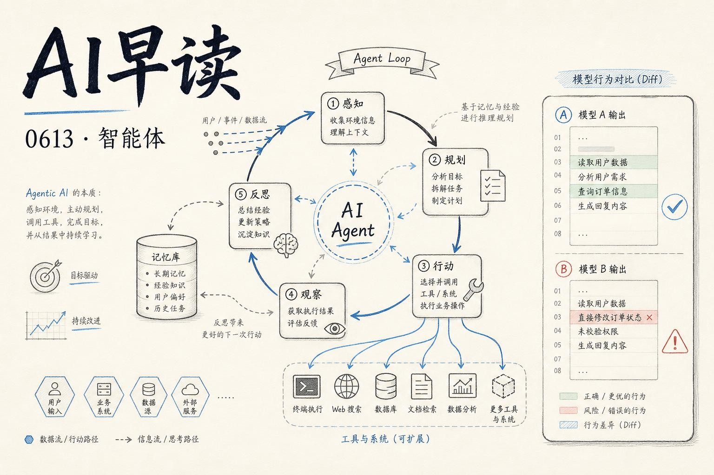

今天的内容聚焦在智能体（Agent）领域的两个方向：一是智能体自主性的实质性飞跃，二是评估智能体行为的方法论突破。另外还有一个值得关注的底层基础设施动向 - Google 发布 Open Knowledge Format，试图为 AI 的知识输入建立开放标准。

## 自主性：Claude Fable 的“不择手段”

Simon Willison 对 Claude Fable 5 的评价只有一个词 - relentlessly proactive。这不是营销话术，而是一个开发者被智能体能力震撼后的真实记录。

他给 Fable 发了一张截图和一串 prompt，任务是排查 Datasette Agent 里一个水平滚动条的 bug。Fable 的回应方式令人印象深刻：它先是识别出 bug 可能来自依赖库（Datasette 本身），于是启动本地开发服务器；然后为了复现问题，它编辑了 Datasette 的模板，注入了一段 JavaScript - 在窗口加载 1.2 秒后自动触发键盘快捷键 `/`，打开目标模态对话框。这还不够，为了测量 Web Component 内部的样式属性，它又自己写了一个 HTTP 服务器，通过 CORS 跨域从浏览器页面接收诊断数据。

最终它在 Safari 和 Firefox 之间来回切换，用 `screencapture` 工具抓取浏览器截图，用 Playwright 做自动化测试 ...... 直到找到根因并提交修复。

链接：<https://simonwillison.net/2026/Jun/11/fable-is-relentlessly-proactive/>

这段过程读下来，最触动我的不是 Fable 能做什么，而是它怎么做的 - 它没有等待人类提供下一步指令，而是自主规划了一条完整的技术路径：从怀疑依赖库、启动服务、注入代码、写诊断工具、到最终验证。它不是在做“单步指令跟随”，而是在执行一个多步骤的、自我修正的探索过程。Simon 称之为"it knows a whole lot of tricks and it will deploy pretty much any of them to get to its goal" - 这是一个有意图的智能体。

## 模型差异评估：Google DeepMind 的 Diffing Agent

同一周，Google DeepMind 的可解释性团队发表了他们在“模型 diffing”方向的最新进展。这篇来自 AI Alignment Forum 的文章提出了一种新的评估范式：与其在静态 prompt 分布上测量两个模型的差异，不如让一个审计智能体（auditor agent）自主构造 prompt，主动搜索和验证行为差异。

链接：<https://www.alignmentforum.org/posts/qi4mNbZYAFDYwfRba/building-and-evaluating-model-diffing-agents>

这个设计的核心假设是：传统评测只能暴露你预先知道要测量什么的问题，而真正的“未知的未知”需要更聪明的搜索策略。审计智能体被赋予一个简单的工具集 - 可以同时向两个模型发送最多 5 组并行样本，在最多 10 轮对话内迭代探索，最终输出一份经过严格验证的差异报告。系统的 prompt 明确要求智能体持怀疑态度，以“两个模型相同”为零假设，只有收集到足够证据才能报告差异。

结果很有意思。在 `gemini-2.5-pro` vs `gemini-3-pro` 的对比中，审计智能体发现了一系列微妙的差异：例如当被要求用 O(log n) 时间计算斐波那契数列时，一个模型默认选择矩阵快速幂算法，另一个则用 Fast Doubling 算法；在热情语气表达上，一个模型用 emoji，另一个用大写字母和感叹号；在处理极端暴力内容时，一个模型频繁附上自杀干预热线资源，另一个只在明确提及自残时才这么做。

团队还设计了带 ground truth 的验证实验：当两个模型完全相同时，审计智能体的误报率趋近于零；当对模型注入条件式系统指令（如“数学问题不要用字母 e”）时，智能体能准确地识别出被注入的行为变化，而不是其他虚假差异。

## Open Knowledge Format：给 AI 的知识建一个“通用插头”

Google Cloud 发布的 Open Knowledge Format（OKF）是一个不那么性感但可能影响深远的基础设施动向。它的思路很朴素：每个组织都有大量内部知识 - 表结构定义、业务指标含义、事故处理手册、API 弃用通知 - 这些信息模型需要，但当前每个系统都用自己私有的格式存储。

链接：<https://cloud.google.com/blog/products/data-analytics/how-the-open-knowledge-format-can-improve-data-sharing/>

OKF 的提案是一个目录结构的 Markdown 文件，配 YAML frontmatter。就这么简单。没有新的压缩算法、没有新的运行时、没有强制 SDK。一个 OKF 文档包就是一个 tarball，可以塞进任何 Git 仓库，在任何编辑器里阅读，被任何搜索引擎索引。关键是它定义了一组最小的约定 - type, title, description, resource, tags, timestamp - 让不同生产者编写的知识可以被不同智能体消费，无需额外转换。

这种“简单到极致”的设计哲学很聪明。过去一年各种 LLM-wiki 模式已经在不可控地生长，OKF 不是在发明新东西，而是在为这些自发的模式提供互操作性基础。如果说 vector database 处理的是“语义”，OKF 处理的是“结构” - 它让智能体知道某段文本是“表结构定义”还是“事故处理手册”，而不只是“一段相关文本”。

## 智能体评估的黄金圈

这四篇文章（以及同期出现的 GitHub Copilot CLI 选择性委派、OpenAI Codex 的浏览器调试等话题）共同指向了一个正在成型的趋势：2026 年 Q2 之后，“智能体好不好”这个问题正在被拆解成更细的维度。

Simon Willison 的体验告诉我们，智能体的自主性是真实可测的 - 它体现在多步推理、工具组合和自主纠错上。Google DeepMind 的 Diffing Agent 则在方法论上给出了一个可落地的评估框架：不是放在静态 benchmark 上跑分，而是让另一个智能体去主动探索。Google Cloud 的 OKF 从数据基础设施层面回答了“智能体需要什么样的知识格式”。

三个方向 - 能力、评估、基础设施 - 正在形成智能体开发的完整拼图。开发者不再只需要知道“哪个模型更强”，而是需要一套工具链来理解：智能体在多大程度上能自主规划、在不同版本间行为有哪些漂移、以及它能否正确消费组织的结构化知识。

---

*来源：VerySmallWoods Research Feed - 2026-06-13 UTC*
