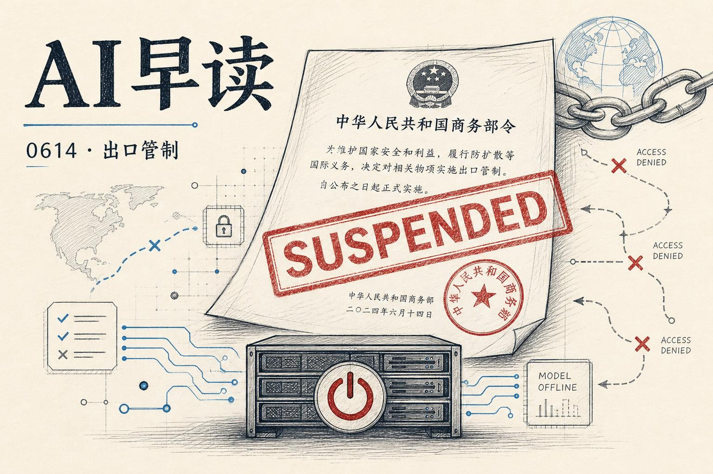

## 美国政府援引国安法，突令封禁 Fable 5 和 Mythos 5

6 月 12 日下午，Anthropic 收到美国政府的出口管制指令，要求立即暂停所有外国国民对 `Fable 5` 和 `Mythos 5` 的访问权限 - 包括 Anthropic 内部的外国籍员工。指令援引国家安全权力，未给出具体的国家安全关切细节。Anthropic 随后对全球用户关闭了这两个模型。

Anthropic 当天晚些时候发布声明，表示对这项指令持不同意见。声明指出，政府认为发现了一种绕过 Fable 5 安全防护的方法（即“越狱”），但 Anthropic 评估后认为，这个所谓的越狱手段只能发现少量已知的、轻微的漏洞，且其他公开模型无需越狱就能发现同样的问题。Anthropic 还强调，Fable 5 在发布前经过了数千小时的红队测试，其安全防护效果是迄今所有已部署模型中最强的，且目前没有任何测试者找到过通用越狱方法。

链接：[Statement on the US government directive to suspend access to Fable 5 and Mythos 5](https://www.anthropic.com/news/fable-mythos-access)

Simon Willison 在博客中记录了这个过程。他编写了一个脚本来探测 API 访问状态，观测到自己的 Fable 5 访问权限在北京时间 6 月 13 日上午约 10:59（美西时间 6:59pm）被正式切断，API 返回 `404 not_found_error`，提示“Claude Fable 5 is not available”。

链接：[Statement on the US government directive to suspend access to Fable 5 and Mythos 5](https://simonwillison.net/2026/Jun/13/us-government-directive-to-suspend-access/#atom-everything)

Anthropic 在声明中表示，如果这个标准被应用到全行业，实际上将停止所有前沿模型的新部署。公司承诺正在与政府沟通，争取尽快恢复访问。

## OpenAI WebRTC 语音会话，现在支持文档上下文

Simon Willison 更新了他的 `openai-webrtc` 浏览器工具。新版本支持使用 GPT-Realtime-2 模型 - OpenAI 称之为“首个具备 GPT-5 级别推理能力的语音模型”。最实用的更新是：现在可以在浏览器中粘贴大量文档内容，然后通过语音与 AI 讨论这些信息。

链接：[OpenAI WebRTC Audio Session, now with document context](https://simonwillison.net/2026/Jun/12/openai-webrtc/#atom-everything)

这个工具的初始版本 2024 年 12 月就发布了，当时主要用于尝试 OpenAI 的 WebRTC 实时音频 API。GPT-Realtime-2 的上个月发布是这次更新的主要驱动力 - 与旧模型相比，2024 年 9 月的知识截止日期意味着它能回答更多近期问题。

## Gemini 的安全属性主要来自 SFT

Google DeepMind 语言模型可解释性团队在 AI Alignment Forum 发表了一篇简短的研报，发现了一个出乎意料的结果：Gemini 的安全相关属性，大部分是由预训练加 SFT（监督微调）带来的，而不是 RL（强化学习）或其他训练阶段。

链接：[SFT Drives Gemini's Safety Properties](https://www.alignmentforum.org/posts/nLrrYweeFxgXACSmS/sft-drives-gemini-s-safety-properties-1)

团队对 Gemini 3.1 Pro 和 Gemini 3 Flash 的预训练版本进行了 SFT，然后与生产版本在多个安全基准上做了对比。结果令人吃惊：SFT-only 模型和生产模型的表现在几乎所有评估中都高度重合，包括对齐评估、过度拒绝率、不安全响应率、奖励黑客行为等指标。这意味着对于 Gemini 系列而言，SFT 是一个非常高效的安全干预点。

## Vercel Workflow SDK 原生集成 Nitro v3

Vercel 宣布 Workflow SDK 的 Nitro v3 原生集成进入 Beta 阶段。workflow 步骤不再需要独立打包，而是与应用的其余部分在同一运行时中执行。Nitro 的 `useStorage()` 等服务端 API 可以在 `"use step"` 函数中直接调用，开发时还可以在 `/_workflow` 路径下使用工作流可视化界面。

链接：[Workflow SDK now runs natively in Nitro v3](https://vercel.com/changelog/workflow-sdk-now-runs-natively-in-nitro-v3)

依赖追踪和 tree-shaking 也让构建产物更小。对已经在用 Nitro 的团队来说，这个集成省掉了不少额外配置工作。

*来源：VerySmallWoods Research Feed - 2026-06-14 UTC*
