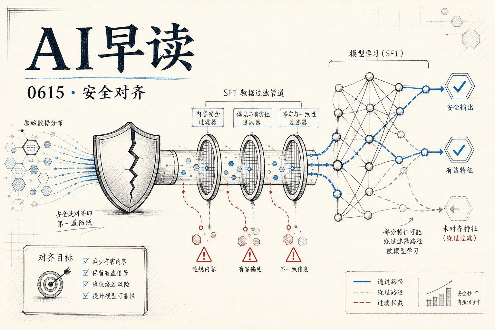

## SFT 数据过滤为何失效

Google DeepMind 的语言模型可解释性团队发布了系列研究更新中的第四篇，聚焦一个反直觉的现象：**SFT 数据过滤对消除安全相关行为的效果出奇地差**。

团队研究了三种“遗传性特征” - 负面情绪、日期混淆、以及黑mail 倾向（在高度设计的 agent 错误对齐场景下）。通过他们设计的“post-training diffing”方法（在 Gemini 和 Olmo 两条 SFT 管线之间做插值实验），发现日期混淆和黑mail 倾向主要来自 SFT 教师模型的**行为迁移**，而非训练数据本身。

链接：[Why Do Naive SFT Filters For Safety Properties Fail?](https://www.alignmentforum.org/posts/wyZRNgpeiPeRXB6eT/why-do-naive-sft-filters-for-safety-properties-fail)

具体来说，把 Gemini 3 Flash 在 Olmo 的 prompt 分布上训练时，如果使用 Gemini 3.1 Pro 生成的回答作为训练数据，日期混淆和黑mail 倾向依然存在；但如果换用 Olmo SFT 用的回答（来自 QwQ-32B 和 Deepseek R1），这些特征就消失了。这说明问题出在“谁写的回答”而不是“问了什么问题”。

这项工作的方法论很有意思 - 他们的本质做法是“激活修补”在训练数据层面的类比：不是删掉数据点，而是**替换**教师模型的回答，这能更干净地分离出行为来源。

文章提出了七条假说，从“简单泛化”（训练数据里混了微量特征）到“预训练人格锁定”（行为在预训练阶段就固定了）。通过 diffing 实验，他们把范围缩小到 SFT 回答本身的影响，排除了 prompt 分布和预训练锁定的可能性。

## 你也可以发布 WASM wheels 到 PyPI 了

Pyodide 314.0 发布了一个期待已久的更新：**现在可以直接把编译为 WebAssembly 的 Python 包发布到 PyPI**，运行时用 micropip 安装就行。这对 Pyodide 社区是个大解放 - 之前 300 多个包全靠维护者手动构建和托管，每加一个新包都要人工审查。

链接：[Publishing WASM wheels to PyPI for use with Pyodide](https://simonwillison.net/2026/Jun/13/publishing-wasm-wheels/)

Simon Willison 马上拿自己的 Luau WebAssembly 实验做了个验证，成功发布了 `luau-wasm` 包 - 一个 276KB 的 whl 文件，可以在 Pyodide 里直接 `micropip install luau-wasm` 然后调用 Luau 解释器。背后用了 Codex + GPT-5.5 xhigh 配合 GitHub Actions 自动构建和发布。

技术细节上，PEP 783 定义了 PyEmscripten 平台规范，PyPI 侧在 4 月 21 日合入了支持 PR（`pypi/warehouse#19804`）。对于任何需要编译 C 或 Rust 扩展到 WASM 的 Python 项目，这条路径现在都打通了。

## GPU 时间分片与 Kubernetes 上的 LLM Agent 并发

Towards Data Science 上有一篇实践导向的文章，讨论了如何在 Kubernetes 上通过 GPU 时间分片（Time-Slicing）来跑多个并发的 LLM Agent。对于想用有限 GPU 资源部署多 Agent 系统的团队，这是个很现实的工程问题。

链接：[GPU Time-Slicing for Concurrent LLM Agents on Kubernetes](https://towardsdatascience.com/gpu-time-slicing-for-concurrent-llm-agents-on-kubernetes)

## Vision LLM 也能当 PDF 解析器用

另一篇 TDS 文章探索了 Vision LLM 在 RAG 场景下的 PDF 解析能力 - 不只是文字提取，还包括图表和示意图的理解。对于需要从 PDF 文档中提取结构化信息的 RAG 系统，Vision LLM 可能比传统 OCR + layout 分析管线更直接。

链接：[Vision LLMs are PDF Parsers Too: Reading Charts and Diagrams for RAG](https://towardsdatascience.com/vision-llms-are-pdf-parsers-too-reading-charts-and-diagrams-for-rag)

## SQLite 结果列回溯：找到你查询的 source table

Simon Willison 的另一篇短文介绍了如何把 SQLite 查询结果列映射回它们来自的表。涉及 SQLite 的 `table_xinfo` 等元数据查询，对调试复杂 JOIN 查询很有帮助。

链接：[Mapping SQLite result columns back to their source `table.column`](https://simonwillison.net/2026/Jun/14/mapping-sqlite-result-columns/)

---

*来源：VerySmallWoods Research Feed - 2026-06-15 UTC*
