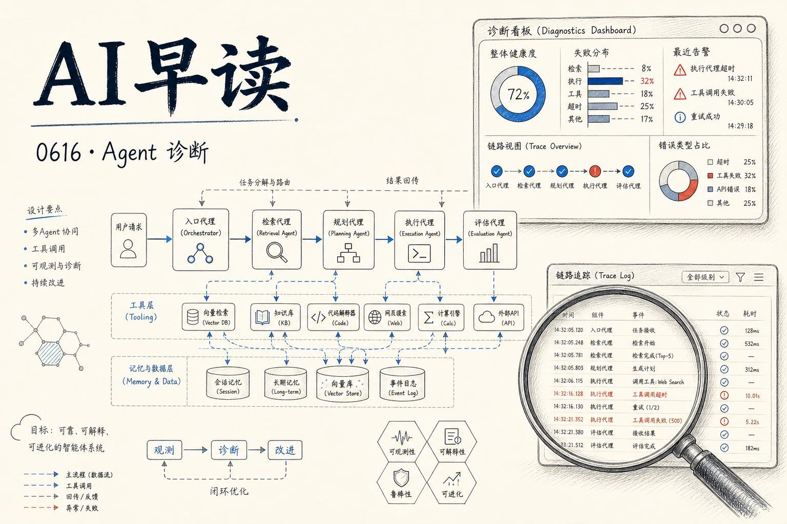

今天的 feed 有三篇 importance 5 的 AWS blog，分别覆盖了 AI Agent 的诊断评估、深度研究代理架构和 Gemma 4 开放模型上架  -  三条线串起来看，AWS 在 Agent 时代的基础设施布局相当完整。

## Agent 的「为什么」比「多少分」更重要

当你的 Agent 在生产中表现不佳时，知道它失败了只是开始。真正的问题是：为什么失败、该怎么修。

AWS 的 `Strands Evals` SDK 提供了一个答案。它通过 Detector 函数自动分析 Agent 的执行轨迹（execution traces），输出结构化的诊断结果  -  包含故障分类、置信度评分、因果链（从根因到下游症状），以及具体的修复建议：是改 system prompt 还是修 tool 定义。

```python
from strands_evals.detectors import run_detector

result = run_detector("agent_trace_123", detector_type="goal_completion")
print(result.failures)        # 故障列表
print(result.root_causes)     # 根因
print(result.recommendations) # 修复建议
```

传统评估只告诉你「这个 Agent 的目标完成率是 60%」，但排查那 40% 的失败原因需要人工翻轨迹。Detector 把这个过程从几小时压缩到几分钟  -  把「诊断瓶颈」从人工环节变成了自动化环节。

链接：[AI Agent Failure Detection and Root Cause Analysis with Strands Evals](https://aws.amazon.com/blogs/machine-learning/ai-agent-failure-detection-and-root-cause-analysis-with-strands-evals/)

## 把深挖的工作交给子 Agent

同一个团队在同一天发布了另一个模式：用 `LangChain Deep Agents` 和 `Amazon Bedrock AgentCore` 构建上下文丰富的研究代理。

核心思路很简洁  -  不让一个 Agent 的 context window 被原始网页内容撑爆。主 Agent 接收到研究任务后，把深度工作委派给隔离的临时子 Agent。每个子 Agent 拿到自己的 MicroVM（轻量虚拟机），里面有真实的浏览器做网页研究、完整的 Python 环境做数据分析。子 Agent 只返回精简结论，主 Agent 负责整合和决策。

```
主 Agent（协调）
├── 子 Agent A：搜索 + 阅读网页（MicroVM + 浏览器）
├── 子 Agent B：数据分析（MicroVM + Python）
├── 子 Agent C：图表生成
└── 返回精简结论 → 主 Agent 整合
```

这种「委派 - 隔离 - 汇总」的架构，比让一个 Agent 在单个 context window 里处理所有事情要实用得多。AgentCore 也作为 Deep Agents CLI 的原生沙箱提供方，`deepagents --sandbox agentcore` 就可以体验。

链接：[Build context-rich research agents with Deep Agents and Bedrock AgentCore](https://aws.amazon.com/blogs/machine-learning/build-context-rich-research-agents-with-deep-agents-and-bedrock-agentcore/)

## Gemma 4 登陆 Bedrock

Google DeepMind 的 `Gemma 4` 系列  -  包括 31B dense、26B-A4B MoE 和 E2B 三个变体  -  正式通过 Amazon Bedrock 提供。Apache 2.0 协议，支持推理、函数调用和多模态（文本 + 图像）。

几个关键数字：Gemma 4 31B 在 Artificial Analysis 的 Intelligence Index 达到 39，而 4B-40B 开放模型的中位数是 15。这符合它「intelligence-per-parameter」的设计目标  -  在有限的参数规模下压出更高的能力密度。

Bedrock 上的开放模型策略一直很清晰：给你领先的开源模型、跑在 AWS 的基础设施上、你的数据不用于训练、不分享给第三方。Gemma 4 的加入让这个矩阵又多了一个靠谱的选择。

链接：[Introducing Gemma 4 models on Amazon Bedrock](https://aws.amazon.com/blogs/machine-learning/introducing-gemma-4-models-on-amazon-bedrock/)

---

*来源：VerySmallWoods Research Feed - 2026-06-16 UTC*
