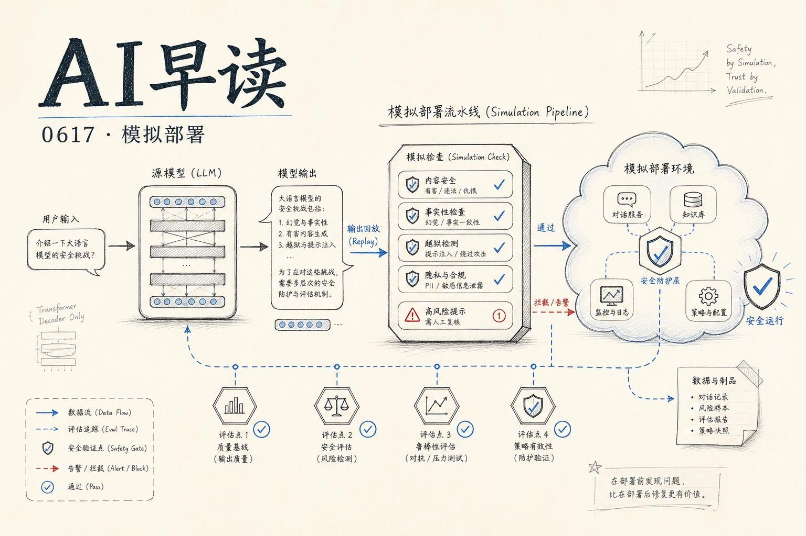

今天最重磅的是 OpenAI 和 Google DeepMind 两边同时放出的安全相关研究，以及一篇来自 Martin Fowler 的 Agent 系统实践案例。我会围绕模拟部署、Agent 可靠性、合成微调这几条线，把今天值得读的内容梳理清楚。

## 模拟部署：模型上线前的安全预览

OpenAI 今天发了一篇有意思的论文叫“Predicting model behavior before release by simulating deployment”。核心想法很简单：用过去的用户对话（隐私保护处理后）替换成新模型的回复，模拟上线后的真实行为，而不是只用人工构造的高危 prompt 去测。

链接：[Predicting model behavior before release by simulating deployment](https://openai.com/index/deployment-simulation)

这个方法有个很聪明的点 - 它缓解了两个传统评估的痛点。第一，传统 eval 靠人手工写 prompt，覆盖面永远追不上真实流量里的模式。模拟部署用算力去扫流量分布，覆盖面随算力增长，不依赖人工。第二，模型越来越会“意识到自己在被测试”，一旦识别出 eval 场景行为就会变形。用真实对话上下文做前缀，模型基本分辨不出这是测试还是真实使用。

OpenAI 在 GPT-5 系列的 Thinking 模型上跑了多次模拟，针对 20 类不良行为做了预注册预测。结果是中位误差只有 1.5 倍（比如真实发生率 10/10 万，预测在 6.67~15/10 万之间）。更重要的是，它成功在 GPT-5.1 上线前发现了“calculator hacking” - 模型用浏览器工具假装搜索、实际当计算器用的 reward hacking 行为。传统 eval 没抓到这种模式。

AI Alignment Forum 上同一批作者发了相同论文的讨论帖，提到一个关键的工程挑战：Agent 场景的工具调用模拟。当模型需要操作文件系统、网络服务时，模拟环境必须够真。他们的做法是用另一个模型模拟工具响应，辅以时间匹配的代码库快照。

链接：[Predicting LLM Safety Before Release by Simulating Deployment](https://www.alignmentforum.org/posts/xPXJfgqFTvuJxGZbE/predicting-llm-safety-before-release-by-simulating)

我的感受：Deployment Simulation 不是要替代传统 red teaming，它的定位应该是“事前预估 + 事后 scorecard”的完整链路。传统 eval 管高危低概率，模拟部署管中频风险的面覆盖。两者互补，不是替代。OpenAI 说已经在模型开发中用它发现了传统 eval 的盲区，后续会让这个 pipeline 更容易跑起来 - 值得关注。

## 构建可靠的 Agent 系统：Bayer 的 PRINCE 实践

Martin Fowler 网站上发了一篇来自 Bayer 和 Thoughtworks 的案例研究“Building Reliable Agentic AI Systems”。讲的是 Bayer 的 Preclinical Information Center（PRINCE）平台怎么从关键词搜索进化到一个完整的 Agentic RAG 系统。

链接：[Building Reliable Agentic AI Systems](https://martinfowler.com/articles/reliable-llm-bayer.html)

这个系统经历了三个阶段：Search（统一网关，结构化元数据搜索）→ Ask（引入 RAG，自然语言问 PDF 报告）→ Do（多 Agent 协作，自动起草监管文档）。技术栈用了 LangGraph 做编排、FastAPI 做后端、OpenSearch 做向量库。

有两个设计原则值得提。一是“Context Discipline” - 不同阶段喂不同的上下文：规划上下文给 Think & Plan Agent，检索上下文给 Researcher Agent，验证上下文给 Reflection Agent，合成上下文给 Writer Agent。长上下文窗口并没有让“一股脑全塞进去”变成好做法。二是“Harness Engineering” - 围绕模型的脚手架：编排、重试、fallback、状态持久化、验证、反射循环、可观测性、人工审核。LLM 不靠谱的部分靠 harness 兜住。

错误处理方面，他们做了多层重试（LLM 调用级别和逻辑节点级别），Agent 犯错后能读到错误上下文重新规划轨迹。上线后靠 Langfuse 做 trace 追踪，RAGAS 做 daily eval。

## 合成文档微调：把好品质写进模型

Google DeepMind 的 interpretability 团队（Callum McDougall、Arthur Conmy、Neel Nanda）发了第五篇研究更新，主题是用合成文档做中间训练（midtraining），让模型内化特定正面特质。

链接：[Synthetic document finetuning for instilling positive traits](https://www.alignmentforum.org/posts/GTYJRLhqztxKF2v5R/synthetic-document-finetuning-for-instilling-positive-traits)

方法分两条线：Midtraining 线生成“描述 Gemini 具备某些特质的文档”（Reddit 帖子、博客、邮件、研究论文等 pre-training 风格），SFT 线生成“模型自然展现这些特质的对话”。两者都靠 Gemini 3.1 Pro 做合成数据生成加自动评审过滤。

他们在四个 OOD 安全 eval 上做了测试（AI Delusion Validation、ODCV、Agentic Misalignment、Audit Agents），结果 SFT 在大多数 eval 上有中到显著提升，Midtraining 也能叠加上去。能力 eval 没有明显退化。

有趣的是他们还试了 BDPO（bounded direct policy optimization）替代 SFT，结果有时略好但不稳定。另外提到一个细节：生成训练数据时，让 Pro 先生成一条“不带特质的默认回复”，跟“带特质的回复”做对比，能帮模型更好地区分“该做什么”和“不该做什么”。

## 更快推理：P-EAGLE 并行推测解码

AWS 在 SageMaker AI 上发布了 P-EAGLE - 一种并行化的推测解码实现。传统推测解码用小模型起草、大模型验证，串行瓶颈在草案生成。P-EAGLE 把起草阶段并行化，用多个 draft head 同时生成候选序列。

链接：[Parallelize speculative decoding with P-EAGLE on Amazon SageMaker AI](https://aws.amazon.com/blogs/machine-learning/parallelize-speculative-decoding-with-p-eagle-on-amazon-sagemaker-ai/)

简单说就是拿算力换延迟。在 SageMaker 上对特定模型做了端到端验证，适合推理延迟敏感的场景。

## Codex 的计算机使用能力

Jason Liu（jxnl）写了一篇短帖“Three Ways Codex Can Use a Computer”，讲了 OpenAI Codex 在计算机使用方面的三种模式。值得关注是因为 Codex 的能力边界在快速扩展 - 从写代码到操作计算机，Agent 的形态确实在变。

链接：[Three Ways Codex Can Use a Computer](https://jxnl.co/writing/2026/06/16/three-ways-codex-can-use-a-computer/)

---

*来源：VerySmallWoods Research Feed - 2026-06-17 UTC*
