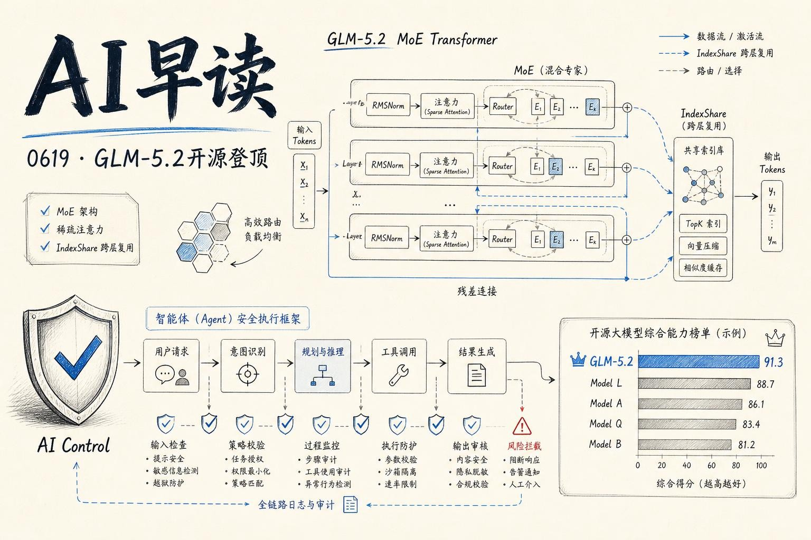

过去 24 小时，AI 圈最热的话题是 `GLM-5.2` - Z.ai 开源的这个 753B MoE 模型在多个基准上超越了 MiniMax-M3、DeepSeek V4 Pro 和 Kimi K2.6，成为当前最强的开放权重模型。与此同时，Google DeepMind 发布了 AI Control 安全路线图，Amazon Bedrock AgentCore 正式 GA，OpenAI 也在罕见病诊断和 Codex 两个方向有了新动作。

链接：[GLM-5.2 is probably the most powerful text-only open weights LLM - Simon Willison](https://simonwillison.net/2026/Jun/17/glm-52/#atom-everything)

## GLM-5.2：开源模型新王

Simon Willison 的评价直截了当：`GLM-5.2` "probably the most powerful text-only open weights LLM"。Artificial Analysis 的独立评测也确认，它在 Intelligence Index v4.1 上以 51 分领先 MiniMax-M3（44 分）、DeepSeek V4 Pro（44 分）和 Kimi K2.6（43 分）。

模型采用 MoE 架构，总计 753B 参数，激活参数 40B，上下文窗口达到 100 万 token（上一代 GLM-5.1 是 20 万）。权重以 MIT 许可证开源，推理成本约 $1.40/M 输入、$4.40/M 输出 - 对比 GPT-5.5 的 $5/$30 和 Claude Opus 4.5-4.8 的 $5/$25，性价比优势明显。

链接：[GLM-5.2 is the new leading open weights model - Artificial Analysis](https://artificialanalysis.ai/articles/glm-5-2-is-the-new-leading-open-weights-model-on-the-artificial-analysis-intelligence-index)

一个有意思的发现是：GLM-5.2 在每个 Intelligence Index 任务上的平均输出 token 高达 43k（GLM-5.1 是 26k，MiniMax-M3 是 24k），说明它倾向于生成更长、更详细的答案。这也是它在 Code Arena WebDev leaderboard 上排名第二（仅次于 Claude Fable 5）的重要原因 - 长答案在前端编码任务中往往更完整。

链接：[Code Arena WebDev leaderboard](https://arena.ai/leaderboard/code/webdev)

## IndexShare：让 100 万 token 上下文更实用

Sebastian Raschka 在他的架构笔记中重点分析了 `GLM-5.2` 的新机制 IndexShare。模型复用了 GLM-5 和 GLM-5.1 的 Multi-head Latent Attention 和 DeepSeek Sparse Attention（DSA），但 IndexShare 做了一个巧妙的优化：每四层才运行一次完整的 sparse-attention top-k indexer，中间三层直接复用选定的 token 索引。

链接：[GLM-5.2 and IndexShare for Long-Context Sparse Attention - Sebastian Raschka](https://sebastianraschka.com/blog/2026/glm-5-2-indexshare.html)

这意味着 100 万 token 推理的计算成本大幅下降 - 注意力模式仍然是自适应的，但模型不用在每一层都重复决定“该关注哪些 token”。对实际部署来说，这可能是比 benchmark 分数更重要的改进。

## DeepMind 发布 AI Control 路线图

Google DeepMind 同一天在 Alignment Forum 发布了 GDM AI Control Roadmap v0.1 - 一份面向内部部署的 AI 智能体安全框架。核心思路是把不完美对齐的 AI 智能体当作“潜在的内部威胁”，类似安全领域对可疑内部员工的处理方式。

链接：[GDM AI Control Roadmap - AI Alignment Forum](https://www.alignmentforum.org/posts/hEtkyKGoPpFeWnKkX/gdm-ai-control-roadmap)

框架分为三个层次。威胁建模方面，它借鉴了 MITRE ATT&CK 安全框架，提出了 TRAIT&R 分类法，覆盖三类风险：控制权丧失（恶意内部部署）、工作破坏（产出有缺陷的安全研究）、直接伤害（破坏或泄露关键资产）。防御层面设定了两个不变目标：可靠检测恶意意图或行为，以及有效的攻击预防与响应。能力分级方面，模型能力越强（如能进行不透明推理、实施复杂网络攻击），防御措施就随之升级，定义了 D1-D4 四个检测等级和 R1-R3 三个预防与响应等级。

配套的博客文章介绍了具体措施：使用可信 AI 系统作为“监督者”持续审查运行中智能体的推理、行动和计划，检测异常行为并及时干预。

链接：[Securing the future of AI agents - Google DeepMind](https://deepmind.google/blog/securing-the-future-of-ai-agents/)

## Amazon Bedrock AgentCore 正式可用

Amazon Bedrock AgentCore harness 在 6 月 18 日宣布 GA。这个产品解决的是智能体从原型到生产之间的基础设施鸿沟。AWS 团队引用 Simon Willison 的定义 - "LLM agent runs tools in a loop to achieve a goal" - 指出 agent loop 本身从来不是难点，真正难的是围绕它的基础设施：沙箱化的计算环境、存储、密钥管理、网络配置、状态管理、可观测性，以及当服务用户超过一个人时冒出来的并发、隔离、身份、扩展问题。

链接：[Amazon Bedrock AgentCore harness is now GA - AWS ML Blog](https://aws.amazon.com/blogs/machine-learning/amazon-bedrock-agentcore-harness-is-now-generally-available-go-from-idea-to-production-grade-agent-in-minutes/)

AgentCore 的目标是让团队从“写 agent loop”的重复劳动中解放出来，把精力放在工具定义和业务逻辑上。这与 DeepMind 的安全框架形成有趣的对称 - 一个解决部署复杂度，一个解决部署风险。

## OpenAI：罕见病诊断与 Codex 新能力

OpenAI 今天有两个值得关注的消息。

与波士顿儿童医院等机构合作发表在 NEJM AI 上的研究显示，o3 Deep Research 模型重新分析了 376 个此前未确诊的罕见病病例，在专家复核后成功找到了 18 个诊断（额外确诊率 4.8%）。这些病例此前已经过多轮专家分析和商业流程的检查。模型的作用不是做出临床决策，而是基于表型描述、遗传变异数据和最新文献，生成“证据链”供专家审查。这种方法让医生在科学知识持续更新的背景下，对积压的未确诊病例进行大规模重新分析成为可能。

链接：[Using AI to help physicians diagnose rare genetic diseases affecting children - OpenAI](https://openai.com/index/diagnose-rare-childhood-diseases)

另一个方向是 Codex。OpenAI 发布了 Codex 的 Record & Replay 功能演示 - 让开发者录制一次操作流程后可以重放，这对自动化测试和调试工作流很有价值。

链接：[Record & Replay in Codex - OpenAI YouTube](https://www.youtube.com/watch?v=ZK3JhU73W18)

---

*来源：VerySmallWoods Research Feed - 2026-06-19 UTC*
