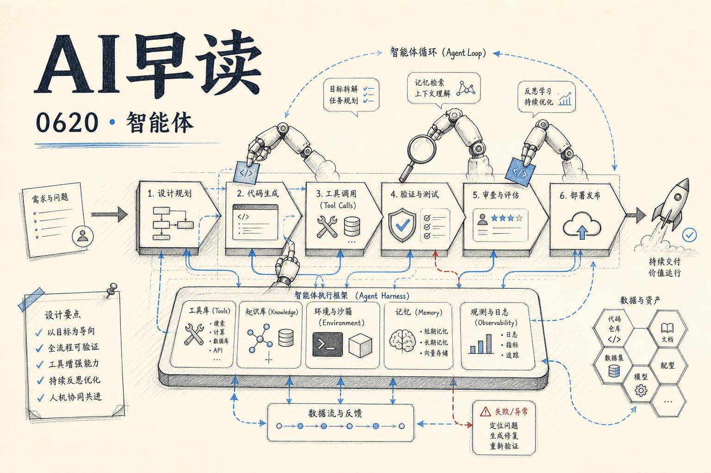

过去 24 小时的研究源里，有一条 importance 5 的条目和四条 importance 4 的条目集体指向同一个方向：AI agent 正在从写代码延伸到部署、数据分析、信息检索的每一个环节。这篇会梳理五篇最有价值的文章，看看 agent 到底在怎么改变软件生命周期。

## Agent 就是模型加一个 harness

Google 这周出了一份白皮书《The New SDLC With Vibe Coding》，由 AddyOsmani 等三人合写。整份白皮书最核心的框架就一句话：一个 agent 是一个模型加上一个 harness。

模型是同一个输入。其余的全部是 harness：指令文件、规则文件、工具和 MCP 服务器、运行沙箱、编排逻辑、可观测性。白皮书给出的粗略比例是 10% 模型、90% harness。这个比例听着高，但等你花一周时间调试过一个 agent 的奇怪行为之后，就不会觉得夸张了 - 模型是引擎，harness 是车、路和交通规则。

两个数字让这个框架变得具体。在 Terminal Bench 2.0 上，有团队只改了 harness（模型完全没动），就把 coding agent 从 30 名开外推进了前五。LangChain 的另一个实验，在固定模型周围只改了 system prompt、工具和中间件，就在同一个 benchmark 上提升了 13.7 分。两次都没碰模型。

所以当 agent 做蠢事的时候，先 debug harness - 大概率是缺了个工具、规则写太松、忘了加护栏、或者 context window 里塞满了垃圾。大部分 agent 的失败是配置失败。这个认知让人安心，因为配置是今天就能修的东西，不用等下一个更强的模型。

链接：[The New Software Lifecycle](https://addyosmani.com/blog/new-sdlc-vibe-coding/)

## Context 工程决定你的账单

如果 harness 是系统，那么 context 工程就是里面最重要的旋钮。白皮书把 agent 的 context 分成六类：指令、知识、记忆、示例、工具和护栏。真正影响账单的决策，是哪些进 static context、哪些进 dynamic context。

Static context 每轮对话都要加载：系统指令、规则文件（AGENTS.md、CLAUDE.md 等）、全局记忆、核心护栏。它可靠，但也贵 - 因为每次调用都要付钱。Dynamic context 按需加载：任务匹配时才触发的 skill、工具返回的结果、从 RAG 拉来的文档。你只为当前任务触及的数据付费。

这个平衡一旦失准 - 往一边偏你就烧 token、淹没有效信号；往另一边偏 agent 就忘了保命规则。白皮书的建议是把这条边界当真正的架构决策来对待：走 PR 评审、像代码一样版本管理。

让 dynamic context 可扩展的窍门是 Agent Skill 的渐进式披露：agent 启动时只看一小段元数据，任务匹配时加载完整指令，真正用到时才拉重型参考资料。这样单个 agent 可以携带几十个 skill，仍然只支付正在用的那一个。

链接：[The New Software Lifecycle](https://addyosmani.com/blog/new-sdlc-vibe-coding/)

## 验证是 vibe coding 和工程的分界线

在 vibe coding 到 agentic engineering 的光谱上，你可以用同一个 agent 坐在任何位置。决定你在哪儿的唯一因素是验证。

测试覆盖确定性的部分：这个输入、那个输出。Eval 覆盖不确定的部分。白皮书对 eval 的拆分很实用：output evaluation 检查最终结果是否正确，trajectory evaluation 检查到达结果的路径 - 工具调用和推理过程 - 是否合理。两个都要。一个看起来正确但跳过了检查的答案，比一个明显有问题的更危险。

白皮书里最强的一句话：set the bar at the eval, not the demo。Demo 只能证明 agent 能成功一次。一个带真实验证规则的 eval 套件，才能证明它稳定可靠。

AI 压缩了生命周期，但不均匀。实现从几周缩到几小时。需求、架构和验证反而变慢了 - 因为这些都是判断工作。于是规格质量成了瓶颈，验证被移到了流程中间。

具体到每个阶段：需求不再是在团队之间传递的文档，而是对话，同时产出规格和第一个原型。架构是最顽固的人类环节 - 一致性 vs 可用性这类取舍依赖模型看不到的业务上下文。实现的真实增益在 25%~39% 之间，但 METR 的研究也发现，算上检查和修复的时间后，有经验的开发者在某些任务上反而慢了 19%。两个数字都是真的 - 诚实的总结是，AI 把实现从写代码变成了审代码。维护是被低估最深的一个环节 - AI 写的代码比人写的更容易重构，但前提是你得有足够的测试来担保。

链接：[The New Software Lifecycle](https://addyosmani.com/blog/new-sdlc-vibe-coding/)

## Cloudflare 让 agent 可以免账户部署

Agent 写完代码之后需要部署。这一步在过去是死结：注册账号、浏览器 OAuth 流、复制粘贴 API token、多因素认证 - 对交互式 copilot 已经够烦了，对后台 agent 就是硬止损。

Cloudflare 这周推出了一项针对性功能：Temporary Accounts for AI Agents。Agent 只需运行 `wrangler deploy --temporary`，就能在 Cloudflare 上获得一个临时 Worker。部署保持 60 分钟在线，期间人类可以认领这个临时账户将其转为永久。如果过期不认领，自动销毁。

背后的设计逻辑很清晰。后台 AI session 越来越多，没有人类在循环中干预。Agent 需要试错 - 写、部署、验证的循环越短越好。Agent 平台也在构建自己的部署能力，让代码“直接能用”变成基本预期，而不是每个新服务都要走一遍注册流程。

当 agent 不知道 `--temporary` 标志存在时，Wrangler 还会主动提示它 - agent 看到提示后重新带上 `--temporary` 运行，Cloudflare 自动为其创建临时账户、授权 API token、返回一个认领 URL 给人类用户。整个过程没有浏览器、没有复制粘贴、没有“请在 60 秒内点击确认”。

链接：[Temporary Cloudflare Accounts for AI agents](https://blog.cloudflare.com/temporary-accounts/)

## GitHub 的 Qubot：内部数据分析 Agent

GitHub 内部用 Copilot 搭了一个名为 Qubot 的数据分析 agent，允许任何员工用自然语言查询公司数据仓库中的任何数据模型。Qubot 不是报表工具或仪表盘的替代品，而是用来回答探索性问题 - “哪个用户群在某个功能上的留存最高？”“上周哪个产品对指标变动贡献最大？” - 然后秒级返回答案。

架构分三层。Slack、VS Code 和 Copilot CLI 三个入口，其中 Slack 无需配置，提问后以 Copilot Cloud Agent 形态生成一个实例，答案直接回 Slack 线程，同时存为 PR 里的 markdown 报告。Context layer 采用联邦方式：Bronze 层由产品团队贡献 schema 和元数据，Silver 层由数据团队维护查询示例和必选过滤条件，Gold 层由业务团队维护指标定义。Context agent 自动从多个仓库摄取和组织这些文档。Query engine 负责将自然语言翻译成 SQL。

最有意思的设计是 context agent - 团队可以通过标准化模板或直接引用包含相关上下文的仓库来贡献知识，context agent 自动摄取、组织和验证。这意味着数据分析 agent 的知识库不是一次性搭建的，而是随着组织的数据资产持续生长。

链接：[How we built an internal data analytics agent](https://github.blog/ai-and-ml/github-copilot/how-we-built-an-internal-data-analytics-agent/)

## AWS 给 Bedrock Agent 加上了 Web Search

Agent 的另一个结构性限制是知识冻结在训练时间。今天 AWS Bedrock AgentCore 正式提供了 Web Search 能力 - 一个由 Amazon 直接运营的 web index 驱动的搜索工具，覆盖数百亿文档，持续刷新，新内容几分钟内就能反映。

对开发者来说，这意味着不需要对接第三方搜索 API、不需要管理配额和 rate limit、不需要解析不一致的结果格式、不需要维护 snippet 提取逻辑。Agent 通过标准 MCP 协议调用，一次 `tools/list` 就能发现。查询流量不出 AWS，隐私模型保证查询不离开服务边界。

这个能力解决了一个更本质的问题：当 agent 只有训练数据里的知识时，它无法回答“今天的股价”“刚发布的版本号”“昨晚的球赛结果”。而让 agent 接入实时 web 信息，是 fix stale knowledge 的正解。只是过去自己搭这件事太复杂了 - 每项都是单独的项目。AWS 选择把它做成一个零配置的 managed connector，背后是一个持续更新的数十亿级 web index 和知识图谱。

链接：[Introducing Web Search on Amazon Bedrock AgentCore](https://aws.amazon.com/blogs/machine-learning/introducing-web-search-on-amazon-bedrock-agentcore/)

---

*来源：VerySmallWoods Research Feed - 2026-06-20 UTC*
