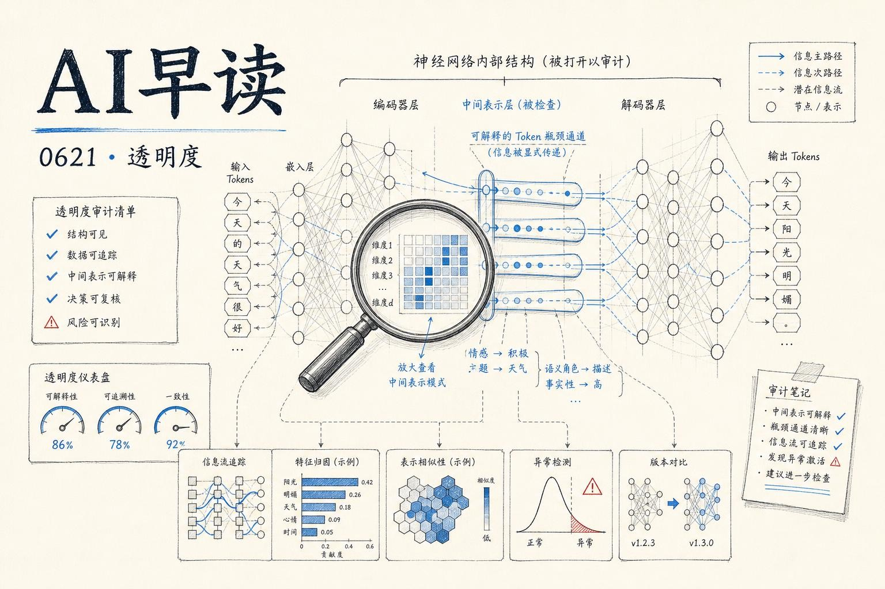

今天的 AI 早读有几条值得停下来看的内容。我梳理了五件事：Google DeepMind 给 DiffusionGemma 做了一次透明度审计，结果比预想的好；Nobel 奖得主 John Jumper 离开 DeepMind 加入 Anthropic，这个时间点很有意思；OpenAI 的 Codex 现在能看一遍操作就无限重复执行了；Meta 内部员工士气跌到 2020 年以来最低；还有几个值得关注的开源模型进展。

---

## GDM 对 DiffusionGemma 的透明度审计

Google DeepMind 的 interpretability 团队和 text diffusion 团队联合发布了一篇论文，核心问题是：DiffusionGemma 作为一个在连续潜空间里做大量计算的模型，它的推理过程比自回归模型更难理解吗？

答案是：变量层面的透明度差不多，但算法层面的透明度确实更难。

变量透明度指的是我们能否理解模型在某个中间步骤的计算状态。论文发现，DiffusionGemma 的名义 opaque serial depth 是 Gemma 的 28.6 倍 - 但这是因为中间 self-conditioning 向量看起来不可解释。实际上，如果把那些中间向量替换为 top-k 或 top-p token，模型的性能几乎没有下降。这意味着这些中间状态本身是可解释的，于是真正的 opaque serial depth 只比 Gemma 高 1.1 倍。

算法透明度才是真正的挑战。自回归模型是一个 token 接一个 token 生成的，每个新 token 的决策依据是之前所有的 token，因果关系是清晰的。而扩散模型在同一张 canvas 上同时生成所有 token，它可以在生成过程中进行非时序推理 - 比如先写一个答案，然后在后续的去噪步骤中回头修改前面的内容。论文发现了一个很有意思的现象叫 retroactive self-correction：让 DiffusionGemma 数 400 到 800 之间的完全平方数，它会先猜一个错误答案，列出平方数列表，然后回头把前面的错误改正。这在自回归模型里不会发生。

另一个现象是 token smearing：模型确定某个 token 会出现在某处，但不清楚具体位置，于是把概率分布 “涂抹” 在相邻位置上。

链接：[How Transparent Is DiffusionGemma (and why it matters)](https://www.alignmentforum.org/posts/zoYXpdaMgFT43Wc24/how-transparent-is-diffusiongemma-and-why-it-matters)

论文还提出了 24 个开放问题，期待社区继续研究。对我来说，这篇工作的价值在于它为未来的潜空间推理模型（比如 o‑series 的 latent CoT）建立了一套透明度评估框架。

---

## Nobel 奖得主 John Jumper 从 DeepMind 跳槽到 Anthropic

这是今天最大的新闻。AlphaFold 的创造者、2024 年 Nobel 化学奖得主 John Jumper 将离开 Google DeepMind，加入 Anthropic。TechCrunch 和 Reuters 都有报道，量子位也做了中文报道。

链接：[Nobel laureate John Jumper is leaving DeepMind for rival Anthropic](https://techcrunch.com/2026/06/20/nobel-laureate-john-jumper-is-leaving-deepmind-for-rival-anthropic/)

这件事有几个观察角度。一是人才流动还在加速 - DeepMind 最近连续走了多位核心人物。二是 Anthropic 正在持续积累顶级研究人才，从基础模型对齐到生物医药领域的 AI 应用，Jumper 的加入意味着 Anthropic 可能会在科学计算方向上有更大投入。三是这个时间点：DiffusionGemma 论文刚刚发布，Google 在尝试新的模型架构，而 Jumper 在这个节点选择离开，信号意义很强。

---

## OpenAI Codex：看一遍就学会重复执行

OpenAI 的 Codex 产品有了一个新能力：它现在可以观察用户完成一次操作，然后永久记忆并自动重复执行。The Decoder 的报道说这是朝着 AI 个人助理方向又迈进了一步。

链接：[OpenAI's Codex can now watch you work once and repeat the task forever](https://the-decoder.com/openais-codex-can-now-watch-you-work-once-and-repeat-the-task-forever/)

这个功能本质上是一个 demonstration‑based automation：用户演示一次操作流程，Codex 记录步骤、生成可复用的自动化脚本，之后可以在没有用户干预的情况下反复执行。这和传统的 RPA 工具有本质区别 - 传统 RPA 需要人工配置规则和边界条件，而 Codex 是从一次演示中直接推断出完整的工作流。

OpenAI 上周公布了 Q1 财报：营收 57 亿美元，但烧掉了 37 亿美元。规模化收益还在路上。

---

## Meta 员工士气跌至 2020 年以来最低

量子位报道了 Meta 内部的一条动态：公司内部直播中出现员工公开批评管理层，CTO 承认 AI 重组搞得一塌糊涂。

链接：[Meta员工士气跌至20年谷底！内部直播当众开骂，CTO承认AI重组糟糕透顶](https://www.qbitai.com/2026/06/436966.html)

Meta 在 AI 基础设施上的投入规模巨大，但内部重组的混乱程度从这条新闻里可见一斑。在大模型军备竞赛中，Meta 的开源策略（Llama 系列）获得了社区认可，但组织的消化能力是否跟得上投入速度，是一个值得关注的问题。

---

## 开源模型动态：GLM-5.2、VibeThinker-3B、SpatialClaw

几条值得关注的开源进展：

GLM-5.2 据称用不到一半的 token 消耗达到了最高水平的 98% 智能表现。有开发者对比测试后发现，GPT-5.5 的幻觉率是 MIT 协议的开源模型 GLM-5.2 的 3 倍。如果数据可靠，这对开源生态是个很强的信号。

链接：[GPT-5.5 hallucinates 3x more than MIT-licensed GLM-5.2](https://arrowtsx.dev/bigger-models/)

NVIDIA 推出了 SpatialClaw，一个将代码作为操作接口的空间推理 agent，无需额外训练即可使用。VibeThinker-3B 则是一个基于 Qwen2.5-Coder-3B 的推理模型，展示了小模型在特定推理任务上的潜力。

链接：[NVIDIA AI Introduce SpatialClaw: A Training-Free Agent That Treats Code as the Action Interface for Spatial Reasoning](https://www.marktechpost.com/2026/06/19/nvidia-ai-introduce-spatialclaw-a-training-free-agent-that-treats-code-as-the-action-interface-for-spatial-reasoning/)

---

*来源：VerySmallWoods Research Feed - 2026-06-20 UTC*
