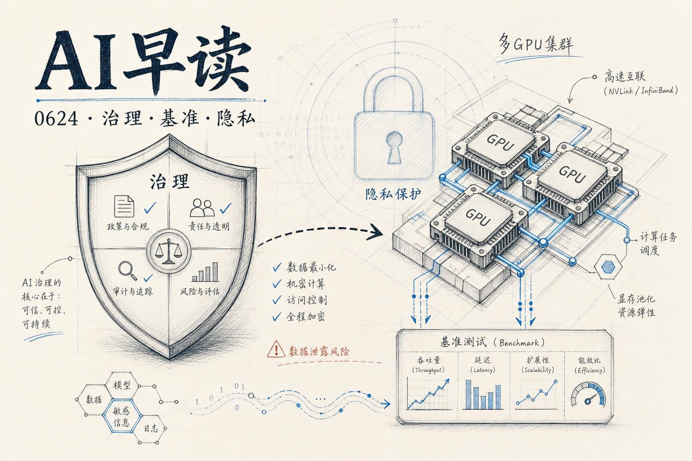

这两天 AI 圈有两条主线在同时推进：一条是安全与治理，OpenAI 联合发起了 Appia Foundation，试图给前沿 AI 评估建立一套可互操作的开放标准；另一条是底层基础设施，Together AI 发布了 ParallelKernelBench，告诉你前沿模型写多 GPU 内核的真实水平，Google Cloud 则在机密计算上迈了一大步。两条线都指向同一个方向 - AI 正在从“能不能跑”走向“能不能安全、高效、可信地跑”。

## AI 治理的新基础设施

OpenAI 联合 Linux Foundation 发起了 [Appia Foundation](https://appiafoundation.org)，目标是开发一套开放、模块化的技术规范，把国际标准和现有框架翻译成可落地的评估准则。直白地说，现在各家机构都在做自己的 AI 安全评估，但结果不能互认 - 你在 A 国测过的模型，到了 B 国还得重测一遍。Appia 想做那个让数据可以互相流通的“信任翻译层”。

链接：[Helping build shared standards for advanced AI](https://openai.com/index/helping-build-shared-standards-for-advanced-ai)

这个思路和 OpenAI 前几个月发布的 Frontier Safety Blueprint 一脉相承。那篇文章呼吁建立更完善的美国国内框架、加强 CAISI（AI 标准与创新中心），同时强调前沿风险是全球性的，各国需要建立兼容的安全框架、可信的风险发现渠道、以及协调的应急响应机制。

有意思的一点是，OpenAI 并没有把这件事当成自己的独角戏。它在 C2PA、ISO/IEC JTC 1/SC 42、Frontier Model Forum、Agentic AI Foundation 等多个标准组织中都有参与。Appia 的定位是把这些分散的工作串起来 - 不是从零造轮子，而是让已有的标准能够“互操作”。

## 前沿模型的多 GPU 短板

Together AI 发布的 [ParallelKernelBench](https://www.together.ai/blog/parallelkernelbench)（PKB）是一份让前沿模型难堪的成绩单。测试覆盖了 87 个真实生产环境中的多 GPU 内核编写任务 - 不是那种玩具 demo，而是来自 Megatron-LM、DeepSpeed、TensorRT-LLM、NeMo-RL 等顶级项目的真实代码块。结果是什么呢？最好的模型也只能正确解决不到三分之一的题目，而且其中只有不到四分之一能跑赢 PyTorch + NCCL 的朴素基线。

链接：[ParallelKernelBench: Frontier LLMs can't write fast multi-GPU kernels (yet)](https://www.together.ai/blog/parallelkernelbench)

这个结果其实反映了多 GPU 编程的深层难点。单 GPU 的优化是有限的 - 算力和内存带宽就是天花板。但一旦跨 GPU，通信就成了另一个维度的问题。Tensor parallelism、expert parallelism、context parallelism、sequence parallelism - 每种策略创造不同的通信模式，设计空间是组合爆炸的。模型不仅要算得快，还要知道怎么在 GPU 之间搬数据，通过 copy engine、TMA、SM load/store 还是 NVLS，以及是否要把通信和计算融合在一起。

PKB 里有一个亮眼的数据点：虽然模型整体表现不理想，但有几条生成的内核比所有公开实现都快，其中一条是针对 NVIDIA NeMo-RL 的 GRPO 训练循环的 - 这个场景之前根本没有可参考的优化实现。这说明模型在特定子问题上确实能找到人类还没发现的优化路径，只是离“通用可靠”还有很长的路。

## 可验证的隐私 AI

Google Cloud 这边也在做一件看起来平行、但实际互补的事情 - [扩大 Confidential Computing 的覆盖范围](https://cloud.google.com/blog/products/identity-security/verifiable-trust-in-the-ai-era-whats-new-in-confidential-computing/)。核心新闻是 Confidential G4 VM 和 Confidential GKE Node 开始支持 NVIDIA RTX PRO 6000 Blackwell GPU，并且覆盖了 Google Cloud 的所有区域。

链接：[Verifiable, private AI: Google Cloud expands Confidential Computing frontiers](https://cloud.google.com/blog/products/identity-security/verifiable-trust-in-the-ai-era-whats-new-in-confidential-computing/)

机密计算的核心价值其实很简单：你的模型和数据在 CPU 和 GPU 上跑的时候，连云服务商也不能看到内存里的内容 - 硬件级别的 TEE（Trusted Execution Environment）提供加密保护。这对于涉及敏感数据的 AI 推理和微调场景来说很关键 - 金融、医疗、生物制药等领域的数据合规要求几乎没有回旋余地。

结合上面的治理话题来看，这是一个有趣的互补。Appia 解决的是“谁能信任谁评估的结果”，机密计算解决的是“你的数据在计算过程中不会被偷看”。两者都在建立信任，但一个在流程层，一个在硬件层。

## Prompt Injection 的新视角

Simon Willison 转发了一篇很有意思的论文 - [Prompt Injection as Role Confusion](https://role-confusion.github.io)。核心发现是：模型之所以容易受到 prompt injection 攻击，本质上是因为它无法区分“自己的文本风格”和“用户输入的文本风格”。

链接：[Prompt Injection as Role Confusion](https://simonwillison.net/2026/Jun/22/prompt-injection-as-role-confusion/)

研究者发现，把一条恶意指令换个风格写 - 和模型内部思考的文本风格保持一致 - 攻击成功率会显著提升。反过来，“去风格化”（destyling）把恶意文本改写得和角色标签风格不同，攻击成功率从 61% 直接掉到 10%。一个对人类来说几乎没有区别的改动，对模型来说是天壤之别。

论文提出了一个值得认真对待的判断：LLM 只有在真正获得了“角色感知”能力之后，prompt injection 才有可能从根本上被解决。在那之前，防御本质上是一场永无休止的打地鼠游戏。

---

*来源：VerySmallWoods Research Feed - 2026-06-23 UTC*
