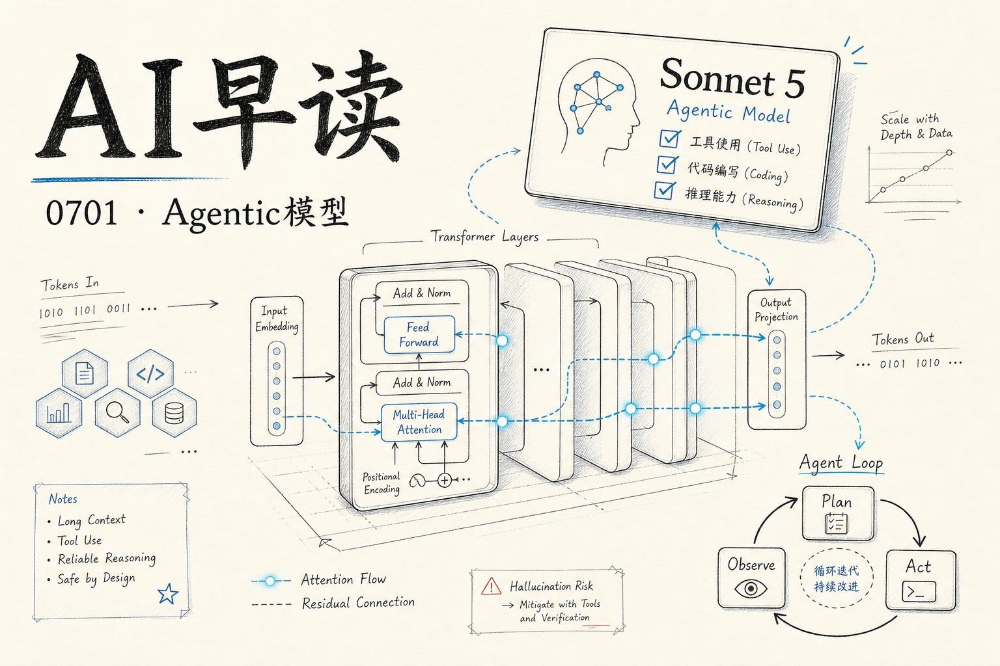

昨晚到今天凌晨，AI 圈迎来了一波密集发布。Anthropic 放出 `Claude Sonnet 5`，Google 推出 `Nano Banana 2 Lite` 和 `Gemini Omni Flash`，微软发了 `SkillOpt` 研究，Vercel 则一口气更新了容器注册表、Dockerfile 支持和 Agent 功能。我会把这些动态逐一梳理，重点放在模型能力和 Agent 基础设施两个方向上。期望对大家有所帮助。

## Claude Sonnet 5：Sonnet 史上最大跨代升级

Anthropic 在 6 月 30 日正式发布了 `Claude Sonnet 5`，官方称其性能接近 `Opus 4.8`，但价格维持 Sonnet 级别。这是 Sonnet 系列发布以来最显著的一次代际跨越。

链接：[Introducing Claude Sonnet 5](https://www.anthropic.com/news/claude-sonnet-5)

评测数据很直观：在 BrowseComp（Agentic 搜索评测）和 OSWorld-Verified（计算机使用评测）上，Sonnet 5（橙色曲线）在中等 effort 水平就全面超越了 Sonnet 4.6（灰色曲线），高 effort 下能与 Opus 4.8 相当。这意味着开发者可以用更低的成本获得接近 Opus 的 Agent 能力。

Sonnet 5 的定价策略也值得关注。目前到 8 月 31 日有首发折扣：输入 $2/百万 tokens，输出 $10/百万 tokens。正式价格是 $3/百万输入、$15/百万输出 - 和 Sonnet 4.6 相同。但 Simon Willison 在他的分析中补充了一个容易被忽略的细节：Sonnet 5 采用了新分词器，同样文本输入会产生约 30% 更多的 tokens。英文文本约 1.4 倍，中文（简体）基本持平。相当于英文场景下存在约 30% 的隐性涨价。

链接：[What\'s new in Claude Sonnet 5](https://simonwillison.net/2026/Jun/30/claude-sonnet-5/#atom-everything)

实际体验方面，早期用户的反馈集中在同一个点上：Sonnet 5 会主动完成复杂任务，而不是中途停下。多位工程师在做集成测试时观察到，模型不仅完成了指定操作，还在无人要求的情况下检查了自己的输出、确认 Bug 是否复现、甚至额外写了测试用例。在 Coding Agent 场景下，这种“能把尾巴收干净”的能力，比基准分数的提升更有说服力。

Sonnet 5 在 AWS Bedrock 和 Claude Platform on AWS 上同步上线，支持企业级安全配置和区域数据驻留。

链接：[Introducing Claude Sonnet 5 on AWS](https://aws.amazon.com/blogs/machine-learning/introducing-claude-sonnet-5-on-aws-anthropics-most-capable-sonnet-model/)

## Google 双模型发布：Nano Banana 2 Lite 与 Gemini Omni Flash

Google Cloud 在同一天发布了两个新模型：`Nano Banana 2 Lite`（基于 Gemini 3.1 Flash Lite 架构的轻量图像模型）和 `Gemini Omni Flash`（多模态 Omni 模型）。Google 的策略很明确 - 在低价、高效率模型这条赛道上持续加注。

链接：[Bringing speed and strong cost performance to the market with Gemini Omni Flash and Nano Banana 2 Lite](https://cloud.google.com/blog/products/ai-machine-learning/nano-banana-2-lite-and-gemini-omni-flash-available/)

Google 同时还宣布了 `Gemini Enterprise Agent Platform` 的远程 MCP 服务器。这意味着你可以在 Claude Code、Cursor 等外部 IDE 中，通过 MCP 协议直接调用 Google Cloud 内部的 Agent Platform 资源 - 模型、Prompt 模板、Notebook，都能跨工具链访问。这是一个很实用的生态开放动作。

链接：[Build agents even faster with Gemini Enterprise Agent Platform\'s fully-managed, remote MCP server](https://cloud.google.com/blog/products/ai-machine-learning/gemini-enterprise-agent-platform-remote-mcp-server/)

## 微软 SkillOpt：Agent 技能成为可训练参数

微软研究院今天发了一篇有意思的研究 - `SkillOpt`，核心思路是把 Agent 的“技能”当作可训练的参数来优化。

链接：[SkillOpt: Agent skills as trainable parameters](https://www.microsoft.com/en-us/research/blog/skillopt-agent-skills-as-trainable-parameters/)

目前的 Agent 系统里，技能模块（tool calling、plan decomposition、memory retrieval）大多是人工编写或手工调参。SkillOpt 的做法是把这些技能统一建模为可微分的参数，然后用梯度下降来更新。如果能走通，Agent 的定制成本会大幅下降 - 不用再写一堆 prompt 来定义“怎么做”，而是让模型在数据中自己学到最优的技能组合。

## Vercel 全面容器化：VCR、Dockerfile、Sandbox

Vercel 今天发布了一系列基础设施更新，方向非常一致：全面拥抱容器。

- `VCR`（Vercel Container Registry）：标准 OCI 容器镜像仓库，支持 `docker push`/`pull`/`tag`。Vercel 项目可以有无限制的仓库，推送的镜像会自动优化为 Fluid Compute 的快照格式。

链接：[Introducing VCR: Vercel Container Registry](https://vercel.com/changelog/introducing-vcr-vercel-container-registry)

- `Dockerfile on Vercel Functions`：现在可以直接把 Dockerfile 部署到 Vercel Functions 上，自定义运行环境。

链接：[Run any Dockerfile on Vercel](https://vercel.com/blog/dockerfile-on-vercel)

- `Vercel Services`：多框架可以在一个项目中并行运行。同时还有 Sandbox 自定义镜像支持、Functions 包体积上限提升到 5GB、以及 `Vercel Agent` 的公开 Beta（支持聊天对话、调查分析和批准执行）。

Vercel 这些更新的思路很清楚：不再要求开发者适配 Vercel 的约定，而是让 Vercel 适配开发者的工具链。Kubernetes 原生的团队可以直接推镜像，传统 PaaS 用户继续用 Dockerfile，Agent 生态的用户可以在 Vercel Agent 里操作基础设施。

## 其他值得关注的消息

- `Google TabFM`：零样本表格数据基础模型，直接在表格上做分类、回归等任务，不依赖特征工程。

链接：[Introducing TabFM: A zero-shot foundation model for tabular data](https://research.google/blog/introducing-tabfm-a-zero-shot-foundation-model-for-tabular-data/)

- `Sourcegraph Agentic Batch Changes` 公开 Beta：Cody 的批量代码修改升级为 Agent 自动执行。

链接：[Agentic Batch Changes is now in public beta](http://localhost:5174/blog/agentic-batch-changes-public-beta)

- `Vercel` 和 `Shopify` 宣布合作重建 Hydrogen 框架。

链接：[Vercel and Shopify are rebuilding Hydrogen](https://vercel.com/blog/vercel-and-shopify-are-rebuilding-hydrogen)

- `Pragmatic Engineer` 发布了访问 OpenAI、Anthropic 和 Cursor 总部的印象记，对比三家公司的工程文化和产品路线。

链接：[Impressions from visiting OpenAI, Anthropic, & Cursor](https://newsletter.pragmaticengineer.com/p/impressions-from-visiting-openai)

- `Claude Science` - Anthropic 的 AI 科学家工作台已经正式可用。

链接：[Claude Science, an AI workbench for scientists, is now available](https://www.anthropic.com/news/claude-science-ai-workbench)

---

*来源：VerySmallWoods Research Feed - 2026-07-01 UTC*
