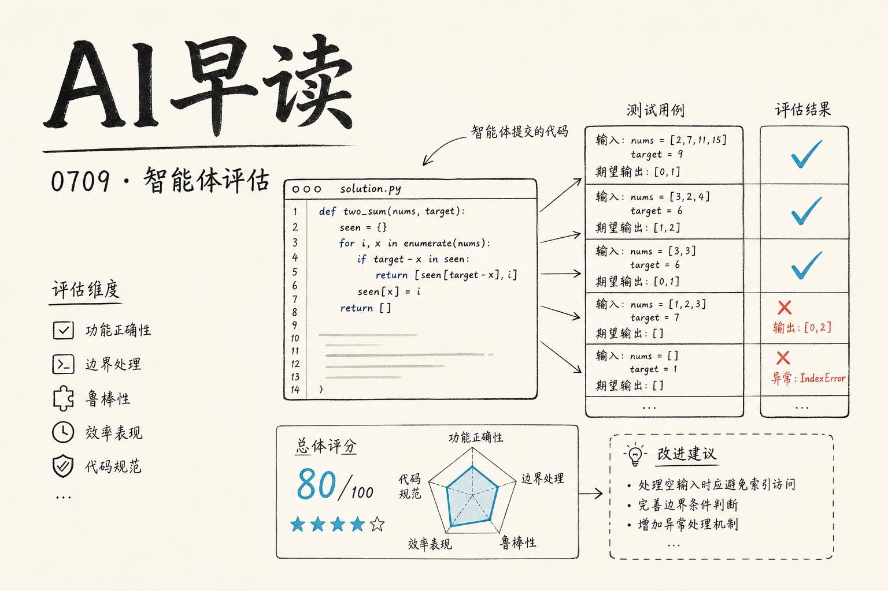

## 当了三成测试题是坏的

OpenAI 今天发表了一篇扎实的 audit 报告，标题叫 *Separating signal from noise in coding evaluations*，内容是翻箱倒柜查了一遍 SWE-Bench Pro 这个业界常用的编程评测集。结论有点尴尬：大约 30% 的题目是坏的。

链接：[Separating signal from noise in coding evaluations](https://openai.com/index/separating-signal-from-noise-coding-evaluations)

他们的排查方法分两层。先是自动化 pipeline 对 731 道公共题目做预筛，用 investigator agent 去跑测试、看文件、分析失败模式，标记出 200 道（27.4%）可疑题目。然后搞了一轮人工审查，找五位资深工程师分别独立审，不一致的地方再升级讨论。人工这边标记出的问题题量更大，249 道（34.1%）被判定为 broken。

损坏模式分四类：**过度严格的测试**（测了题目没有要求的行为），**未明确的 prompt**（隐藏测的东西题目里压根没提），**低覆盖率的测试**（实现不对也能混过去），以及**误导性 prompt**（题目指向了和测试相反的方向）。第四个是最伤的 - 模型按照题目的要求去写，结果测试测的是另一件事。

这个问题有多严重呢？八个月前前沿模型通过率是 23.3%，现在已经到了 80.3%。如果 30% 的题目底层就有缺陷，那这个上升曲线里有多少是模型真变强了，多少是数据集被污染了，很难分清楚。OpenAI 最后给的 advice 很直白：模型开发者要格外仔细地检查评测结果。这个劝告放到整个 agent eval 领域都成立。

## 智能体的“起飞前检查”

Tomasz Tunguz 写了一篇短文，讲他自己搭的 agent memory 架构。思路很直观，叫 preflight check。

链接：[The AI Preflight Check](https://www.tomtunguz.com/the-ai-preflight-check/)

他说上下文长度不是天花板，记忆架构才是。一个查询过来，比如“总结 Q3 董事会材料”，背后是 20 万 token 的邮件、PDF 和聊天记录。他的方案是三步走：

1. **Preflight** - agent 扫描自己的技能库（一组写好的 workflow 文件，大概 90 个），检索和当前任务匹配的技能，只把相关的加载到上下文里
2. **本地执行** - 一个 35B 的本地模型（Ornith 35B，跑在 Apple Silicon 上）处理日常工作。大约 80% 的请求在本地就完成了，只有需要推给前沿模型的才放出去
3. **Watchdog 夜间巡检** - 每晚用异步推理跑一遍白天的执行记录，决定哪些技能应该固化、哪些逻辑应该转成确定性代码（比如日历排期的比较，LLM 不该干这件事，Rust 更合适）

这看起来像一套很自洽的完整流程 - 但有意思的地方在于昨天 watchdog 第一次没有提出任何改进建议。Tunguz 自己说 “我不觉得这会持续，但它暗示了一点：系统在某个改进程度后会进入平台期，只有真正新的异常才需要人类介入了”。

## 为什么 harness 工程突然这么热

Lilian Weng 前两天发了一篇长文，一口气梳理了 35 篇关于 Harness Engineering for RSI 的论文。Latent Space 的 AINews 专门跟了一期来解读。

链接：[AINews - Lilian Weng summarizes 35 papers on Harness Engineering for RSI](https://www.latent.space/p/ainews-lilian-weng-summarizes-35)

"Harness" 这个词在 agent 工程语境里越来越重了。Weng 的梳理清晰地分出了两层：核心智能（模型本身的推理能力）和 harness 层（外围的交互、检索、工具调用、评估、自改进循环）。她指出，即使很多 harness 的改进最终会被吸收到核心模型里，“指定目标和上下文的必要性不会消失”。

这个预判和今天 OpenAI 的 audit 形成了呼应。SWE-Bench Pro 的 30% broken tasks 本质上是一个 harness 问题 - 评测本身的设计决定了信号质量。当数据集本身的缺陷率达到这个量级，模型之间几个百分点的差距还有多少意义？

另一个值得注意的进展是 Hugging Face 今天发布的 vLLM transformers backend 升级。

链接：[Native-speed vLLM transformers modeling backend](https://huggingface.co/blog/native-speed-vllm-transformers-backend)

他们做了件很实用的事：让 transformers 的模型在 vLLM 里的推理速度追上（甚至超过）原生 vLLM 实现。原理是用 torch.fx 做静态图分析，找到可以融合的操作，然后用 ast 重写代码，把 matched 的算子映射到 vLLM 的优化 kernel 上。实测 Qwen3-4B、32B 和 235B MoE 三个模型，throughput 全部打平或超越原生实现。

这对模型作者来说很友好 - 你只需要把模型用 transformers 实现一次，跑 vLLM 时加一个 `--model-impl transformers` 参数，就能拿到完整的 vLLM 优化（continuous batching、custom attention kernels、tensor parallelism）。而且 transformers 实现同时可以用于训练，省掉了一份代码两套维护的麻烦。

## Agent 工程师大会的回响

今天还聚合了一大批 AI Engineer 大会的演讲视频。几个印象比较深的：

- “Your coding agent doesn‘t always follow your rules” - Talha Sheikh（Checkout.com）探讨了 agent 对规则指令的遵循度问题，imp 5
- “Teaching Coding Agents to do Spreadsheets” - Nuno Campos（Witan Labs）展示了让 coding agent 理解电子表格任务的挑战，imp 4
- “I Run a Fleet of AI Agents Across Three Machines. Here’s What Broke.” - Kyle Jaejun Lee（KRAFTON）讲了三机集群上运行 agent 舰队遇到的实操坑，imp 4
- “Build AI Systems for Discernment, Not Approval” - Angel Ortmann Lee（Duolingo）从 Duolingo 的视角讨论了 agent 系统应该追求判断力而不是审批感，imp 4

这组 talk 和上面的论文梳理在同一个方向上共振：agent 工程正在从“把这个模型挂到 API 上”的阶段，切换到“怎么设计 harness、怎么评估、怎么让它可靠地执行长流程”的阶段。

Vercel 也在今天正式发布了 Vercel Agent，定位是“你可以在生产环境放心的 agent”。

链接：[Vercel Agent: An agent you can let near production](https://vercel.com/blog/vercel-agent)

产品层面它和上述趋势吻合：agent 的可靠性需要从系统架构层面解决，而不是靠换一个更强的模型就能搞定。Vercel 的解法是把 agent 的工作流和部署基础设施深度绑定，让 agent 的行为可观测、可回滚、可审计。

---

*来源：VerySmallWoods Research Feed - 2026-07-08 UTC*
