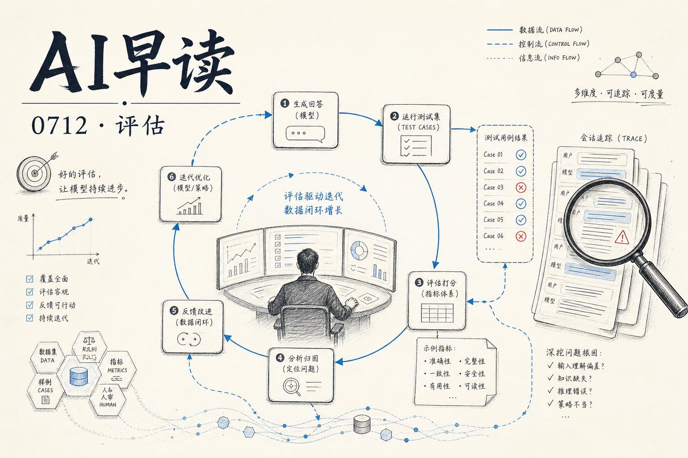

Hamel Husain 和 Antaripa Saha 在 7 月 11 号发了一篇很有意思的实验报告 - `Do Automated Evals Work?`。他们拿 100 条来自真实公寓租赁 AI 的生产 trace，请领域专家逐条人工标注了 39 个 failure，然后把这些标注全部藏起来，分别喂给 Braintrust Loop、Arize AX Alyx、LangSmith Engine，以及 Claude Code、Codex、Factory Droid 几个通用 coding agent，看它们能抓到多少。

结果挺有层次感的。我会梳理这份实验的核心发现，再结合当天其他几条值得关注的文章一起看。

## 实验：100 条 trace，39 个已知失败

数据集来自一个真实的 AI 房产租赁助手 - 用户通过短信或电话咨询公寓信息、预约看房，agent 负责回答并安排。部分对话按规定需要转人工。领域专家按照 error analysis 流程逐一审查，建了一个包含 39 个 labeled failure 的 taxonomy。

然后他们把标注全抹掉，给每个系统发了一份相同的 prompt：描述了产品场景、要求识别 recurring failure 并按 cluster 归类、引用具体的 conversation turn 或 tool call。Prompts 刻意保持轻量，没有透露已标注的 failure 信息。

三个平台型工具 + 三个通用 coding agent 各自跑了同一个任务。

## 成绩单：recall 最高的 87%，precision 最高的 91%

关键数据整理如下：

| 系统 | Recall | Precision | 新发现 | 误报 |
|-----|--------|-----------|--------|-----|
| Braintrust Loop | 87.2% | 79.1% | 20 | 9 |
| Arize AX Alyx | 74.4% | 91.0% | 19 | 3 |
| LangSmith (chat agent) | 79.5% | 77.5% | 20 | 9 |
| Codex (GPT-5.5 High) | 84.6% | 82.8% | 20 | 11 |
| Factory Droid (GPT-5.5 High) | 84.6% | 83.3% | 17 | 10 |
| Claude Code (Opus 4.8) | 79.5% | 77.4% | 17 | 14 |

几个直观的印象：

**Braintrust Loop 是最容易上手的。** 它的 recall 最高，用起来最顺 - 上传 trace、跑 eval、导出结果，流程很干净。代价是误报也最多（9 个），通常是 Loop 对“完整性”要求过严，或者把内部的 tool metadata 当成了用户应该看到的东西。

**Arize AX Alyx 用 recall 换了 precision。** 91% 的 precision 意味着它报出来的东西基本都准。特别擅长抓“无根之词” - 把普通一居室叫成“loft”、把最便宜的市场价单元说成 affordable housing 选项、回答了没有 floor 信息的问题、承诺了 callback 但没有对应的 action。这些都是人工审查可能扫过去的细节。

**LangSmith 的 trace 阅读界面是最好的。** 它内置的 Engine 工具能自动找 recurring issues 并关联到 trace，但覆盖面不够，只能跑 chat agent 做实验。LangSmith 的 chat agent 报 failure 时会精确引用哪条 message 或 tool call，验证成本最低。问题是它的 severity 评级不准 - 几项误报被标成了 high severity，这种干扰对团队排 priority 影响不小。

**通用 coding agent 的表现和专用平台不相上下。** Claude Code、Codex、Factory Droid 拿到了相同的 prompt 和 trace，引用的证据也很具体：精确的 tool argument、日期、价格、矛盾的值。它们还抓到了平台漏掉的一些细节，比如一个 in-person tour link 被当成 virtual tour 的确认。

## 所有系统都漏了同一类 failure

这是整篇论文最值得读的部分。**所有系统漏掉的 failure 属于同一类型：trace 本身看起来完全正常，但 agent 的实际表现没有达到产品的真实目标。**

具体例子：
- **销售异议处理**：agent 的职责是租房，但遇到异议直接放弃了，没有尝试回应租客的顾虑。
- **SMS 里的 markdown**：agent 用 markdown 格式回复短信，租客手机上看到的只有散落的星号和井号。
- **语音打断**：voice agent 在通话中打断用户，没有等人说完。
- **漏掉人工转接**：公司规定某些情况必须转人工，agent 自行处理了。

这些 failure 在 trace 文本里根本看不见。一段 transcript 里 assistant 礼貌地接受异议、结束对话，看起来就是一次成功处理。没有任何信息告诉系统：这是 SMS 渠道、这个场景公司承诺过要转人工。

作者提出了一个关键概念 - **criteria drift（标准漂移）**：你在评估一个系统前，并不清楚什么算“好”、什么算“坏”。这些标准是在你阅读 trace 的过程中逐渐浮现的。这就是为什么完全把 eval 外包给自动化工具不靠谱 - 工具不知道你不知道什么。

## 替代方案：人在回路里，AI 做加速

作者没有否定自动化 eval 的价值。他们的建议很实际：不要一次性跑完出报告就完事。更好的做法是自己先标注一批 trace，让 AI 从标注中学习 failure taxonomy，然后 AI 帮你找出下一批疑似 case，你再确认或驳回。每一轮都在把更多产品上下文带进 eval suite。

Shreya Shankar 在文末演示了这个工作流：她让 coding agent 基于已有的 trace 搭一个简易审查界面，自己在上面标注，agent 用 Claude 的 monitor tool 实时观察她的标注行为，从中推断出 taxonomy，再回来找新的疑似样本。人仍然是判断者，但 AI 让这个过程高效了很多。

> “As an AI product builder, you should stay in the loop instead of completely outsourcing evals to AI. If a tool could find and fix every issue on its own, it would do the same for your competitors, and there would be nothing left to set your product apart.”

链接：[Do Automated Evals Work?](https://parlance-labs.com/blog/posts/auto-evals/index.html)

## AI Alignment Forum：瓶颈不在研究，在政治意愿

同一天，Charbel-Raphaël 在 Alignment Forum 上发了一篇论点鲜明的文章 - 当前 AI 安全的最大瓶颈不是缺乏聪明的政策思路，而是政治意愿不足。

几个核心数据：
- 全球约 1000 位最有影响力的政策制定者中，大部分人从未认真讨论过 catastrophic AI risk。
- 在联合国全球对话活动的 1534 份书面提交中，只有 1 份提到了“takeover”，提及 x-risk 的不到 1%。
- 美国 AI 安全领域研究人员与 advocacy 人员的比例大约是 3.6 : 1。
- 科技行业 2023 年与欧盟委员会关于 AI 议题的会晤次数，是公民社会的 7 倍。

文章认为，在“意识觉醒 - 被说服 - 积极参与 - 成为倡导者”这条漏斗里，大部分人连第一级都没到。额外的研究产出边际价值不高了 - 真正的瓶颈是把已有的 best practices 变成实际执行的规则。

链接：[The Current Bottleneck is Political Will, Not Research](https://www.alignmentforum.org/posts/EexsebbYhbe2gXkPP/the-current-bottleneck-is-political-will-not-research)

## 本地 AI 的现状与前景

AI Engineer 的 State of the Union 圆桌请来了 NVIDIA、Osmantic、Roboflow、EXO Labs 和 Matthew Berman，聊的是同一个问题：为什么本地 AI 现在值得认真对待，以及它离实用还有多远。

讨论提到的主要趋势包括：消费级 GPU 上的推理速度已经可以用、小模型在特定任务上的表现不断提升、以及本地推理在延迟和隐私上的天然优势。但也指出工具链和生态还不够成熟 - 不是跑不跑得动的问题，是用起来有多顺手的问题。

链接：[State of the Union: Why Local, Why Now](https://www.youtube.com/watch?v=KB41dTlX1Uc)

## Solo agent builder 问题：人人都重新发明了更糟的 CI/CD

Sumaiya Shrabony 的 talk 标题本身就很有意思 - “每个 solo agent builder 最终都会重新发明一个更糟版本的 CI/CD”。

Agent 开发者在早期阶段通常会自己搭一套简陋的 eval 和测试流程：本地跑几次、改改 prompt、再跑几次。这个循环跟 CI/CD 的核心概念几乎一模一样，但缺少了 CI/CD 体系的自动化和团队协作支持。工具层面的支持正在追赶，但目前大多还是手动工序。

链接：[Every Solo Agent Builder Eventually Reinvents a Worse Version of CI/CD](https://www.youtube.com/watch?v=WLXxTaPagA8)

---

*来源：VerySmallWoods Research Feed - 2026-07-12 UTC*
