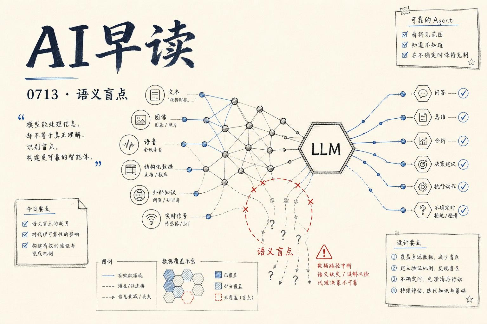

过去 24 小时的 AI 圈平静中藏着不少硬货。AI Engineer 频道集中发布了一批高质量 talk，从语义盲点到 Agent 可靠性，从知识系统到 PR 评审框架，信息密度相当高。我把最重要的几条梳理出来。

## 语义盲点：50 万个传感器让 LLM 彻底懵了

AI Engineer 频道上，Phaidra 的 Raahul Singh 和 Vanč Levstik 讲了一个相当震撼的案例：在工业场景中接入 50 万个传感器数据后，LLM 出现了彻底的语义盲点 - 模型不是偶尔犯错，而是完全丢失了对上下文的感知能力。

问题不在于单个传感器读数有误，而在于大规模传感器数据流的时序和关联模式超出了 LLM 的注意力窗口与语义压缩能力。模型看到的数据是“对的”，但读出的意义却是错的。这个演讲用大量实际工控数据演示了这种盲点如何产生、如何检测，以及如何通过结构化的数据预处理来规避。

链接：[Semantic Blindness: 500,000 Sensors Confused an LLM - Raahul Singh & Vanč Levstik, Phaidra](https://www.youtube.com/watch?v=EUsPvBeIx70)

## AI 知识系统的核心命题：怎么让模型理解“知道”什么

微软的 Pablo Castro（Distinguished Engineer & CVP for AI Knowledge）在另一个 talk 中讨论了 AI 知识系统的底层设计问题。他的核心观点是：当前大多数 AI 知识系统本质上仍然是检索系统，不是真正的“知道”系统。

Castro 认为，知识系统需要从“找到相关片段”进化为“理解知识结构” - 包括实体关系、时间线、版本演化、以及知识的不确定性标记。微软在这一领域的 Copilot 系列产品线已经积累了相当多的实践，但 Castro 坦言，离真正的知识理解还有很长的路。

链接：[On AI and Knowledge - Pablo Castro, Microsoft](https://www.youtube.com/watch?v=RGSFUqzqErE)

## 独立对齐：让语言模型通过推理成为道德主体

Alignment Forum 上出现了一篇有分量的长文。Michele Campolo 提出了一个具体的训练流程，让语言模型从“被灌输道德偏好的机器”进化为“通过独立推理形成道德判断的 advisor”。

文章的核心分三步：让模型先以无偏 advisor 身份分析道德问题、再通过推理形成自己的立场、最后与外部道德框架做对比校准。作者用 Claude Sonnet 4.6 做了一个初步验证 - 模型在 reasoning 阶段确实能得出与训练时灌输的立场不完全一致的结论。这个方向的潜在价值在于：如果模型的道德行为来自推理而非指令，它在面对分布外场景时会更鲁棒。

链接：[Independent alignment of language models - Michele Campolo](https://www.alignmentforum.org/posts/vPaXtarnJ37kGfPdJ/independent-alignment-of-language-models)

## ReviewDebt：一个给每个 PR 打分的实用框架

eBay 的 Sachin Gupta 在 AI Engineer 频道上介绍了一个叫 ReviewDebt 的框架。它本质上是一套量化 PR 评审健康度的指标体系 - 每个 PR 都在提交时获得一个“评审债务评分”，基于变更复杂度、文件影响范围、代码所有者匹配度、评论响应速度等维度。

这个框架最有价值的部分不是评分本身，而是它让团队能看清评审瓶颈在哪里 - 是某个模块的 reviewers 始终过载？还是某些类型的变更总是在 late review？ReviewDebt 已经在 eBay 内部跑了一段时间，数据上确实改善了评审吞吐量。

链接：[ReviewDebt: a practical framework for scoring every pull request - Sachin Gupta, eBay](https://www.youtube.com/watch?v=TJPInBjhE4Q)

## 不止于此

今天还有几条值得点到的内容：Paperclip 团队的 Dotta 讨论了 Agent 的 Liveness Model - 当你说一个 Agent“做完了”，你到底在说什么。Towards Data Science 上有一篇教你怎么用 Claude Code 编排 100+ 并行 Agent 的实操文，包括 headless 模式的最佳实践。另一边，AI Engineer 的 Jack Cable 讲了一个“AI bugpocalypse”的话题，内容是关于 AI 系统 bug 的爆发式增长及其应对。

信息量不小，但主线很清楚：行业正在从“让 AI 跑起来”转向“让 AI 可靠地跑起来” - 从语义盲点到评审框架，从知识系统的缺陷到 Agent 完成状态的精确定义，大家都在回答同一个问题：我怎么知道它在正确地工作？

---

*来源：VerySmallWoods Research Feed - 2026-07-13 UTC*
