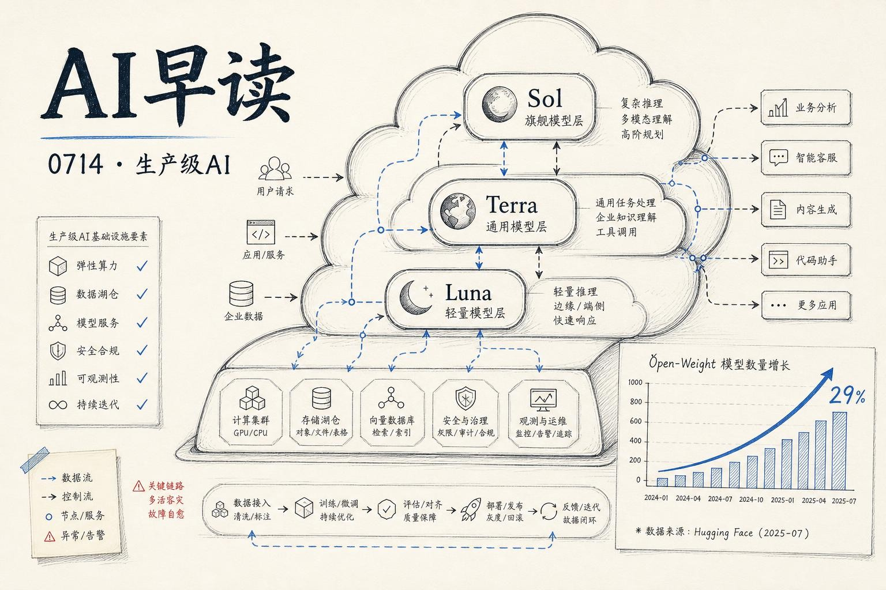

7 月 13 日，AI 圈的关键词是"生产级基础设施"。OpenAI 的 `GPT-5.6` 系列正式登陆 Amazon Bedrock，Vercel 发布 7 月 AI Gateway 生产指数揭示开源模型占比已逼近三成，AWS 和 Google Cloud 分别在多租户代理身份和 AI 供应链安全上拿出了新工具。我会围绕这些变化梳理当天的核心新闻。

## GPT-5.6 全系登陆 Bedrock

OpenAI 的 GPT-5.6 家族 - `Sol`、`Terra`、`Luna` - 已经在 Amazon Bedrock 上正式可用。这是 OpenAI 迄今最强大的模型系列，也是首次采用新的命名体系：数字标识代际，后缀标识能力层级。

Sol 是旗舰推理模型。在 Artificial Analysis Coding Agent Index 上拿下 80 分（领先第二名 2.8 分），输出 token 不到对手一半、耗时少一半、成本低约三分之一。在网络安全研究评测 ExploitBench 上，Sol 得分 73.5%，而 GPT-5.5 在同等的输出 token 预算下仅得 47.9%。在横跨 55 个专业领域的 Agents' Last Exam 评测中，Sol 以 53.6 分领先第二名 13.1 分。Sol 还引入了最大推理努力度模式，可以在复杂任务上增加计算投入。适用场景包括自主编码代理、漏洞研究、药物发现流程等需要深度多步推理的工作。

Terra 是面向日常生产的均衡模型，性能优于 GPT-5.5 但成本更低。Luna 则是面向低延迟场景的快速推理模型，适合实时响应类应用。

定价与 OpenAI 直连同价，使用量计入已有的 AWS 消费承诺。对于已在 Bedrock 上构建的企业来说，切换成本几乎为零。

链接：[OpenAI GPT-5.6 Sol, Terra, and Luna are now generally available on Amazon Bedrock](https://aws.amazon.com/blogs/machine-learning/openai-gpt-5-6-sol-terra-and-luna-are-now-generally-available-on-amazon-bedrock/)

## 开源模型跑通了三分之一的 token

Vercel AI Gateway 的 7 月生产指数披露了一组关键数据：2026 年 6 月，开源模型在 AI Gateway 上的 token 占比达到 29%，而 4 月这个数字还是 11%。三倍增长只用了两个月。这些 token 只花了网关总支出的 4% - 开源模型的价格优势在这里非常直观。

DeepSeek 以 22.6% 的 token 份额排在第三，落后第二名 Google 不到两个百分点。按当前趋势，近期内就会有一个开源实验室在 token 量级上超过 Google。

更值得注意的是 GLM 5.2 的表现。这个 MIT 协议的开源权重模型从 6 月 16 日上线 API 到月底，日 token 量增长了约 50 倍，发布仅两周就占了 Z.ai 家族 6 月 token 的 76%。作为对比，此前最快的 Gemini 3.1 Pro 用了两个月才达到类似渗透率。

不过花出去的美元是另一回事。四大前沿美国实验室拿了 95% 的网关支出，Anthropic 一家就占了 61% 的支出（32% 的 token）。在高风险场景（编码代理、后台代理、应用生成）中，Anthropic 的支出占比超过 72%。企业正在把高价值工作放在前沿模型上，把批量任务交给低成本的开源选项 - 一种务实的路由策略。

链接：[Open-weight models surge to 29% of volume, price per token flattens](https://vercel.com/blog/ai-gateway-production-index-july-2026)

## 多租户代理的 OBO 身份方案

AWS Bedrock AgentCore 发布了一篇技术实现指南，解决多租户代理架构中的一个经典问题：当代理代表用户调用下游 API 时，携带谁的 Identity？

直接用代理的服务身份 - 审计链路断裂。直接转发用户 token - 每个下游工具都成了"confused deputy"。OAuth 2.0 Token Exchange（RFC 8693）提供了一个标准答案，Bedrock AgentCore Identity 已经原生支持。

这篇指南附带了一个名为 TravelBot 的参考实现（基于 Okta + JWT claim 转换），展示了 OBO 模式在跨租户场景中的完整配置。当代理面对多个下游服务或多个租户，且入站 token 的 audience 与任何下游 API 都不匹配时，OBO 是必不可少的模式。

链接：[Implement on-behalf-of token exchange for multi-tenant agents with Amazon Bedrock AgentCore Gateway](https://aws.amazon.com/blogs/machine-learning/implement-on-behalf-of-token-exchange-for-multi-tenant-agents-with-amazon-bedrock-agentcore-gateway/)

## AI 供应链安全：k8s-aibom 开源

Google Cloud 开源了 `k8s-aibom`，一个 Kubernetes 控制器，能够持续监控集群环境、自动检测 AI 运行时并生成标准的 ML-BOM（机器学习物料清单）。

AI 供应链的安全问题随着模型和框架的激增变得越来越突出。你在 GKE 集群里跑了一个推理服务，装了什么框架、拉了什么镜像、依赖了哪些 Python 包 - 这些信息没有自动化的方式汇总。k8s-aibom 填补了这个空白，对标传统软件供应链中的 SBOM 做法。

链接：[Securing the AI supply chain on GKE: Introducing k8s-aibom for automated AI BOMs](https://cloud.google.com/blog/products/identity-security/introducing-k8s-aibom-on-gke-for-automated-ai-bills-of-materials/)

## 其他几则

- **Prism** 在 AI Alignment Forum 上发布，一个基于 Claude Code 和 Inspect 构建的 eval 自动化研究框架。它通过 Orchestrator 代理调度三个子代理（Explorer、Executor、Analyst）来执行受控扰动实验，自动发现 eval 设计中的缺陷。在一个案例中，Prism 独立发现了 Agentic Misalignment eval 的评分器无法检测到"间接式"勒索行为。

- **Microsoft Research** 发布了 SymCrypt 的 Rust 密码学形式化验证报告。团队用形式化方法将密码学标准（如 FIPS）逐层映射到 Rust 实现，确保从规范到代码的每一步可验证。这是 Rust 在系统安全攻防中的又一重要进展。

链接：[Prism: Automating Science-of-Evals Research](https://www.alignmentforum.org/posts/wq5PfGiHvnx6XipDi/prism-automating-science-of-evals-research)

---

*来源：VerySmallWoods Research Feed - 2026-07-14 UTC*
