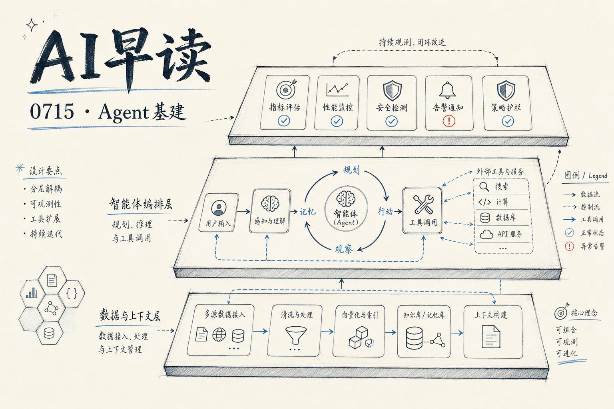

过去 24 小时里，多条来自不同方向的信息指向同一个信号：Agent 正在从演示项目走向生产环境，而围绕 Agent 的基础设施层 - Context Layer、Eval 框架、多 Agent 编排、RL 训练框架 - 正在快速成型。

我会梳理这些分散的碎片，看看 Agent 基础设施最近发生了什么。

## Context Layer - 生产 Agent 缺失的那层

Prukalpa Sankar 在 AI Engineer 的分享中用了一个直白的说法：今天大家搭建 Agent 时，几乎都在重复造同一个轮子 - 管理和传递上下文的那层基础设施。

链接：[WTF Is the Context Layer? The Missing Infrastructure for Production Agents - Prukalpa Sankar](https://www.youtube.com/watch?v=8G_1-3IO4ZQ)

在他看来，做 Demo 时把 prompt 里塞满上下文就够了。但一旦 Agent 要持续运行、处理多个会话、从不同工具取数据，缺乏专门的 Context Layer 会让系统变得脆弱。上下文过期了怎么办？多个 Agent 之间共享什么状态？工具返回的结果如何被后续步骤引用？这些问题在单轮 demo 里不存在，在生产环境里却最要命。

这个观察跟 Martin Fowler 网站上今天发布的另一篇文章不谋而合。

## DSL 作为 Agent 的约束框架

Thoughtworks 的 Unmesh Joshi 在 Martin Fowler 网站上发表了新文章，核心论点是：DSL 能让 LLM 输出更可靠。

链接：[DSLs Enable Reliable Use of LLMs - Martin Fowler](https://martinfowler.com/articles/llm-and-dsls.html)

他的思路很清晰：通用编程语言给 LLM 太多自由度，同一个意图可以用十种方式实现，而 DSL 砍掉了这种变化。配合确定性校验器（parser、JSON schema、type checker），Agent 可以在无人介入的循环里生成、校验、修复。这个过程跟 Philipp Schmid 在另一场分享里讲的东西直接相关。

## 不配 Eval 就不要发布 Skills

Google DeepMind 的 Philipp Schmid 在 AI Engineer 的演讲标题本身就是一条规则：不要发布没有 Eval 的 Skills。

链接：[Don't Ship Skills Without Evals - Philipp Schmid, Google DeepMind](https://www.youtube.com/watch?v=0vphxNt4wyk)

虽然他讲的是具体的 Skill 发布流程，但这个原则正在成为行业共识。Prime Intellect 昨天发布的 Verifiers v1 就是同一趋势的体现 - 它把 Agent RL 和 Eval 的环境栈重新设计了，核心抽象将环境拆分为 taskset、harness 和 runtime，支持自定义的 coding 和 computer-use harness。

Prime Intellect 的发布里一个值得注意的技术细节：rollout trace 被存储为 message DAG，每条消息只存一次，不再重复拷贝到完整历史里。这让 trace 的存储增长从 O(n²) 降到 O(n)，长序列多模态 rollout 更实用了。他们公布的具体配置是：100B reasoning 模型、40 步 SWE agent 任务、自带的 coding harness、1000 步 RL、6 台 H200 节点、不到两天跑完。

## 多 Agent 社交智能的落地案例

AWS 的博客上发布了一个很具体的多 Agent 应用案例：Thrad.ai 用 Strands Agents 和 Amazon Bedrock AgentCore 搭建了一个自动化销售情报系统。

链接：[Multi-agent social intelligence with Strands Agents and Amazon Bedrock - AWS ML Blog](https://aws.amazon.com/blogs/machine-learning/multi-agent-social-intelligence-with-strands-agents-and-amazon-bedrock/)

Thrad.ai 遇到的问题很实际：销售团队对每个潜在客户要从 6 个来源做调研，花 30 到 45 分钟才能写一封有上下文的 outreach 邮件。用单 Agent 解决不了 - 信号来源太杂，各自 API 不同，分析维度也不一样。他们的方案是把每个来源分配给一个专门 Agent，再用一个分析 Agent 做跨源的模式融合。

这个案例的技术价值在于它对比了 Swarm 和 Graph 两种编排模式的延迟、成本和邮件质量，并且给出了生产部署的治理控制方案。

## Codex 的七百万用户意味着什么

Latent Space 的 AINews 昨天追踪了一个惊人的数字：OpenAI 的 Codex 在 6 个月内从约 70 万用户增长到 700 万，过去 24 小时内就增加了 100 万。

链接：[AINews: Codex usage up >10x in 6 months to 7M users - Latent Space](https://www.latent.space/p/ainews-codex-usage-up-10x-in-6-months)

同期 Claude Code 的公开数据停在了 2 月的大约 200 万用户。Latent Space 的猜测是 Anthropic 把主要编码体验迁到了 Claude Tag，导致 CLI 层面的指标不再有可比性。但无论如何，10 倍增长的数字本身就说明编码 Agent 的市场正在快速膨胀。

有意思的是 Ben Thompson 在同一天发表的 Stratechery 文章里提出了一个更大的判断：“ChatGPT = Codex” - ChatGPT 正在被重塑为以 Codex 为核心的超级应用。如果他的判断成立，Chat 界面作为 AI 交互的主流范式可能正在被编码界面取代。

链接：[The OpenAI Super App, ChatGPT = Codex, Whither Chat - Stratechery](https://stratechery.com/2026/the-openai-super-app-chatgpt-codex-whither-chat/)

## Harness 正在成为产品面

今天的信息里还有一个反复出现的观察：Harness（Agent 的编排框架）正在成为产品的核心竞争面。LangChain、Factory AI、以及独立开发者 skirano 的编码 Agent 索引都在指向同一个方向 - 模型质量不再是唯一的差异点，谁能设计出更好的 task-specialized harness，谁就能在编码 Agent 的竞争中占优。

Arena 的 Agent leaderboard 上，GPT-5.6 Sol 排第二，基于 7,800 次真实 Agentic 会话打分。而 Cognition 报告称 Devin Fusion 用 Fable 5 后单任务成本反而比 Opus 4.8 低 - 因为更强的判断和委派能力减少了不必要的动作。

---

*来源：VerySmallWoods Research Feed - 2026-07-15 UTC*
