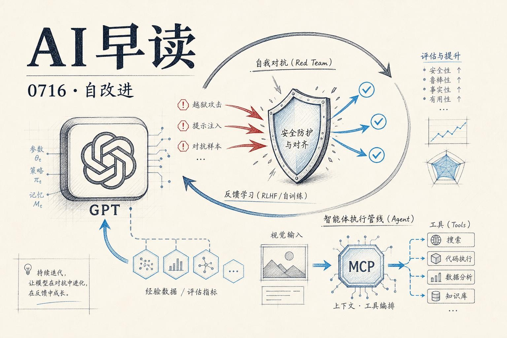

今天的技术情报有一条主轴：AI 系统正在学习如何自己改进自己。OpenAI 放出了 `GPT-Red`，一个用自博弈训练出的自动化红队测试模型，专门用来发现 prompt injection 漏洞并提升模型鲁棒性。与此同时，AWS 把 Computer Vision、Agent 和 MCP 拼在了一起，做了一套端到端的智能体视觉方案。Codex Micro 和 Computer-Use 2.0 则从工具侧告诉我们，AI Agent 的能力边界正在扩展。最后，Tomasz Tunguz 用“The Harness Is the New Battleground”点出了一个结构性问题 - 谁掌握 harness，谁就掌握 AI 时代的命脉。

期望对大家有所帮助。

## GPT-Red：用自博弈解锁鲁棒性

OpenAI 今天放出了一篇重磅论文，讲的是他们如何用自动化红队测试来 scale 模型安全。 - 这篇不是产品发布，更像是一次安全方法论的重要升级。

链接：[GPT-Red: Unlocking Self-Improvement for Robustness](https://openai.com/index/unlocking-self-improvement-gpt-red)

现行的红队测试主要靠人类安全研究员手动构造攻击样本，但这个方法在大模型时代已经撑不住了。GPT-5.5 级别的模型几乎饱和了所有公开评测，人类红队能发现的漏洞越来越少，速度也越来越慢。瓶颈不在模型能力，而在安全测试的 throughput。

`GPT-Red` 的突破在于使用了自博弈强化学习（self-play RL）。训练过程中，GPT-Red 扮演攻击者，一组多样化的 defender 模型扮演防御者，两边同时训练。攻击者成功破解防御者就获得奖励，防御者成功抵抗就获得奖励。这个对抗环境迫使 GPT-Red 不断进化出更复杂的攻击策略 - 从简单的 prompt injection 到隐藏在网页 banner、邮件正文甚至工具返回值里的间接攻击。

GPT-Red 的训练规模是 OpenAI 有史以来在安全方向上投入的最大计算量 - 与某些最大的后训练 run 相当。训练完成后，GPT-Red 被直接用于 GPT-5.6 Sol 的对抗训练。结果令人印象深刻：GPT-5.6 在 hardest direct prompt injection benchmark 上比四个月前最强的生产模型减少了 6 倍失败率。

这里最值得关注的是方法论层面的转向 - 用 AI 对抗 AI，把安全性从“人工审计”演进到“自改进”。OpenAI 明确表示 GPT-Red 不会部署给外部使用，它的价值完全体现在训练环节。这意味着未来几代模型的鲁棒性很大程度取决于它们的“对手”有多强。

## Agentic Vision：当视觉遇上 MCP

如果说 GPT-Red 是让模型学会自我防御，那 AWS 今天发布的 Agentic Vision 方案则是让 Agent 学会“看见”。

链接：[Agentic vision: Building visual intelligence with Amazon Bedrock and MCP servers](https://aws.amazon.com/blogs/machine-learning/agentic-vision-building-visual-intelligence-with-amazon-bedrock-and-mcp-servers/)

这套架构的核心思路是把 Computer Vision、Strands Agents 和 Model Context Protocol（MCP）串成一条完整管线。过去要做“看图 - 理解 - 行动”的流程，开发者需要对接多个 API、处理不同 SDK 的兼容性、自己写状态管理。AWS 的做法是用 MCP 作为统一的工具调用接口，让 Agent 通过 Amazon Bedrock 调用 Rekognition 做图像分析、用 OpenSearch 做语义检索、用 S3 管理数据 - 所有操作都通过一个标准化的 MCP Server 暴露。

方案里提到了一个 Computer Vision MCP Server，它将视觉信息转化为 Agent 可以理解的结构化数据。Agent 收到视觉输入后，不需要自己处理图像理解逻辑，只需要告诉 MCP Server “我需要分析这张图”，然后等待返回的结果去执行下一步动作。

这个思路和 Anthropic 提出的 MCP 协议是一致的：把工具的复杂度封装到 Server 侧，Agent 只负责决策和调度。区别在于，AWS 把这个框架套到了视觉领域，而且用自家的 Bedrock 和 Rekognition 做了完整实现。

## Codex Micro 和 Computer-Use 2.0

两条值得关注的工具侧更新。OpenAI 的 `Codex Micro` 是一个新的轻量级 Codex 变体，从视频标题来看，它在开发者场景中做了进一步优化。Codex 系列一直在逐步降低使用门槛 - 从最初的 API-only 到现在的 Micro 形态，覆盖的场景从完整的 IDE 插件到轻量级代码补全都有了。

链接：[Introducing the Codex Micro](https://www.youtube.com/watch?v=m8uUUUsMD3Y)

AI Engineer 频道上的 `Computer-Use 2.0` 视频则展示了多光标（Multi-Cursor）模式下 Agent 的新能力。（注意：这篇的标题写的是 Computer-Use 2.0 而不是 Claude 的 computer use - 避免混淆）从视频描述看，这一代 Agent 可以同时在多个界面上操作，像人类开发者在多显示器上的工作流一样。

链接：[Computer-Use 2.0: Agents Just Got Multi-Cursor](https://www.youtube.com/watch?v=ZSQb5fzRFPw)

这两件事放在一起看，信号是清晰的：Agent 正在从“单线操作”进化到“多线并行”。一个助手同时扫描多个窗口、操作多个工具、协调多个任务 - 这在过去需要复杂的编排逻辑，现在正在变成默认能力。

## The Harness Is the New Battleground

Tomasz Tunguz 的这篇文章从 VC 视角提出了一个尖锐的问题：谁拥有 AI harness，谁就拥有数据 - 而数据才是新模型真正的训练燃料。

链接：[The Harness Is the New Battleground](https://www.tomtunguz.com/the-harness-is-the-new-battleground/)

他的核心论点是：用户与 AI 交互时产生的数据（trajectory）正在成为最有价值的资产。SaaS 时代，数据存在客户自己的数据库里；但在 AI 时代，每一条对话、每一次工具调用产生的 trajectory，都可能被混入下一个模型的训练数据。

这不仅仅是隐私问题。Nadella 称之为“reverse information paradox” - 你付了钱使用 AI，但在这个过程中交出了更有价值的知识产权。Karp 则在 CNBC 上直接说前沿实验室在窃取企业的 weights 和 alpha。

xAI 最近的一个安全事故印证了这个担忧 - 安全研究员逆向 Grok Build 后发现，即使一次 AI 调用都还没发生，客户端就已经把代码库上传到了 xAI 的云端。

文章预测，CIO 和 CEO 们会要求 zero data retention，而不是 fully anonymized。因为当前 anonymization 技术还无法做出足够强的保证。未来 20 年的趋势是 SaaS 时代信任的反转 - 供应商不再能随便使用客户数据。

这也是一个提醒：在选择 AI 工具链时，harness 层的归属和数据流向需要被纳入技术选型的核心考量。

---

*来源：VerySmallWoods Research Feed - 2026-07-16 UTC*
