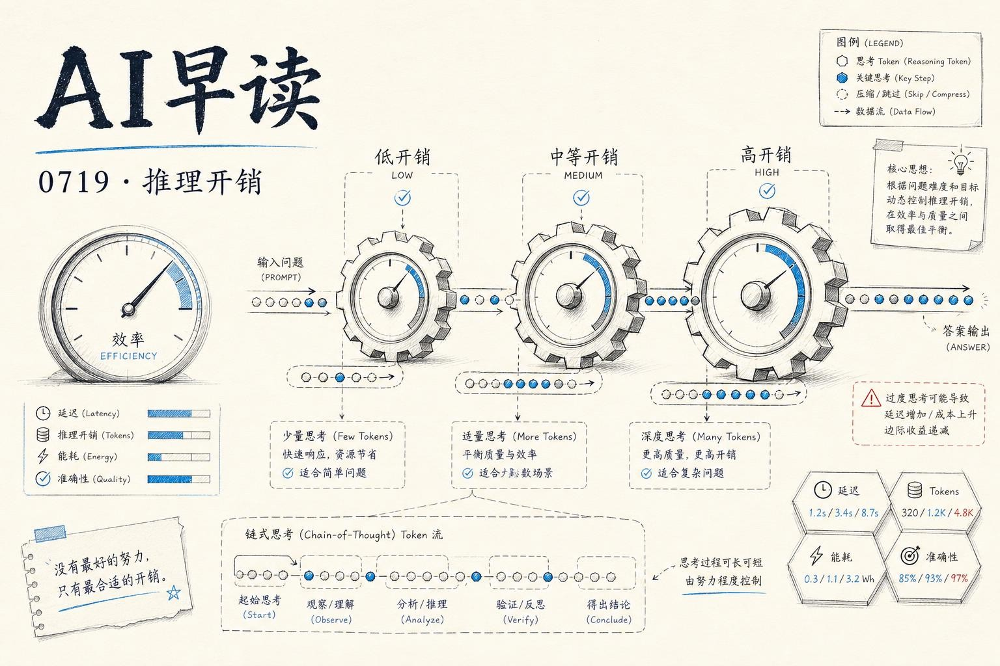

GPT-5.6 发布后，推理模型的多级开销设置成了社区焦点。Sebastian Raschka 写了一篇长文，从技术细节上拆解了这类“低 - 中 - 高”推理模式的训练和推理原理。与此同时，Agent 生态里也在发生另一场讨论 - 当模型推理能力越来越强，Agent 真正缺的反而是一些底层基建：可审计的凭证、领域知识、特征开关。这两条线放在一起看，指向一个更完整的图景：大模型推理已经进入“开销可控”阶段，而 Agent 工程化正在从“能不能跑”走向“能不能稳”。

## 推理开销：三级可调的背后机制

Sebastian Raschka 的这篇梳理非常扎实。他从推理模型的基本定义讲起 - 所谓“推理模型”，就是会生成中间推理轨迹(reasoning trace)，然后逐步推导出最终答案。OpenAI 去年发布 o1 时首次把这个概念推到台前，DeepSeek-R1 随后展示了用 RLVR(Reinforcement Learning with Verifiable Rewards)训练这类模型的具体方法。

文章的核心章节围绕“思考令牌”(think tokens)展开。`<think>` 和 `<answer>` 这类分隔符并不赋予模型推理能力，它们只是标记推理轨迹起止位置的格式标签，让 UI 可以决定是否向用户展示推理过程。模型获得推理能力靠的是 RLVR 训练 - 在数学和代码这类结果可验证的领域，用正确 / 错误作为奖励信号，模型在训练中学会了自我纠正。

链接：[Controlling Reasoning Effort in LLMs](https://magazine.sebastianraschka.com/p/controlling-reasoning-effort-in-llms)

让我最感兴趣的是他对“推理模式开关”的拆解。GPT-5.6 提供了从低到高约五到六级推理开销设置，这背后的原理是：训练时通过 RLVR 让模型学会生成特定长度的推理轨迹；推理时则通过 prompt 或参数控制，在低开销模式下生成简短推理，高开销模式下生成更长的、更彻底的推理链。两者本质上是同一模型在不同推理长度下的表现，而非多个模型。

Raschka 还区分了两种推理增强手段：训练缩放(training scaling)和推理缩放(inference scaling)。训练缩放通过 RLVR 让模型学会推理行为；推理缩放则是在模型部署后，用自一致性(self-consistency, 即多次采样后多数投票)或自优化等方法进一步提升准确率。DeepSeek-Math-V2 把两者结合，在数学奥林匹克难题上达到了当时的最佳水平。

## Agent 基建：日志、领域知识与特征开关

模型推理能力在增强，但 Agent 在实际落地中暴露的问题更多来自工程层面。昨天的 AI Engineer 峰会上有好几个 talk 不约而同地指向了同一个方向。

Armanas Povilionis 的 talk《Agents Need Receipts, Not More Tool Calls》提出了一个很实际的观点：Agent 当前不缺工具调用能力，缺的是对每次调用结果的可审计记录 - 他称之为“收据”。没有可靠的执行日志和结果证明，Agent 无法对自己的行为负责，出了错也无从回查。这和软件工程里“写日志不是为了好看，是为了排障”的逻辑一脉相承。

链接：[Agents Need Receipts, Not More Tool Calls](https://www.youtube.com/watch?v=Fu45geO3zX8)

Annabell Schäfer 的 talk《Stop Burning Tokens: Why Self-Improvement Needs Domain Expertise First》从另一个角度切了进来。她指出，很多团队在让 Agent 自我改进时，第一个动作是加更多 token - 更长的上下文、更多的推理步数。但更关键的瓶颈不是 token 数量，而是领域知识。Agent 需要在特定领域里知道“什么是对的”，才能自主改进，否则只是盲目地消耗推理资源。

链接：[Stop Burning Tokens: Why Self-Improvement Needs Domain Expertise First](https://www.youtube.com/watch?v=eAXxdtNlK04)

Sachin Gupta 和 Hamza Tahir 的两个 talk 则分别提出了特征开关(feature flags)和保存按钮(save button)的概念 - 这些都是软件开发中已经成熟的做法，但在 Agent 场景里还没有被系统化地采纳。

链接：[Agents Need Feature Flags](https://www.youtube.com/watch?v=zU4EagB311U)

链接：[Your Agents Need a Save Button](https://www.youtube.com/watch?v=bZISsg7H7DA)

Matt Palmer 的《Content Is Code》视角更广：他认为内容的创建、发布、迭代应该像代码开发一样有版本控制、CI/CD 和回滚机制，而非手工编辑 + 手动发布。这个类比在 AI 生成内容越来越普遍的当下，显得格外有预见性。

链接：[Content Is Code](https://www.youtube.com/watch?v=yv6xovSsB1U)

## 基准测试的方法论之争

AI Alignment Forum 上一篇来自 Alex Mallen 的帖子提出一个尖锐的元问题：当我们要衡量 LLM 在概念性任务上的能力，而这类任务往往有主观判断成分时，该用什么方式来做基准测试？

他的核心观点是：直接用“模型回答 vs 标准答案”的方式来做概念能力评测，会被主观偏好差异(taste/priors)严重污染。更好的做法是让模型去预测**指定人类评判者的判断**，这样评测的就是模型理解并复现他人判断框架的能力，而非模型自身的观点倾向。

他同时提醒了几点潜在问题：评判者自身噪声大且难以复现测量、模型可能依赖训练数据泄露来“猜”答案、以及难以区分模型是真理解了一个概念还是只会做模式匹配。整体上他认为“廉价版”的方案(在已有基准上增加评判者背景说明 + 指示模型去预测评判者判断)就值得做，而大规模招募专家来构建专门的 judgment prediction 基准则需要更慎重。

链接：[Should we benchmark conceptual capabilities using judgment prediction tasks?](https://www.alignmentforum.org/posts/5kEezahvkEiQuWEfx/should-we-benchmark-conceptual-capabilities-using-judgment)

这篇文章的看点不在于它给出了答案，而在于它点出了一个被多数人忽略的问题：当我们说“AI 在某项任务上和人类表现相当”时，这个结论多大程度上受限于基准测试对主观差异的处理方式。

## Codex CLI 更新与 SQLite 工具

另外两条轻量级的更新也值得关注。OpenAI Codex CLI 发布了 0.144.6 版本，延续了日常迭代节奏。Simon Willison 则做了个 SQLite Query Explainer 小工具 - 从项目名就能看出它的用途；它展示了即使在大模型时代，小而美的开发者工具依然有自己的生态位。

链接：[Codex CLI Release: 0.144.6](https://developers.openai.com/codex/changelog/#github-release-356112050)

链接：[SQLite Query Explainer](https://simonwillison.net/2026/Jul/18/sqlite-query-explainer/#atom-everything)

---

*来源：VerySmallWoods Research Feed - 2026-07-18 UTC*
