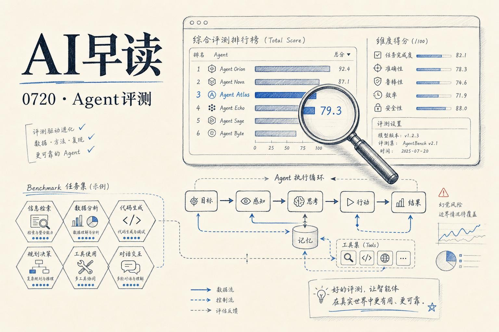

上周 AI 圈的话题很集中：Agent 评测到底该测什么？Perplexity 丢出了一个叫 WANDR 的新基准，专门考验研究 Agent “既要搜得广、又要挖得深”的能力。与此同时，一篇 TDS 上的文章狠狠戳了一下评测界的痛点  -  你的 Agent 可能评测全绿，但 CFO 看了账单就能把它砍掉。开源这边也不太平，Kimi K3、DeepSeek V4 Pro、GLM-5.2 三个万亿级 MoE 模型排排站，谁更能打？另外还有一项有意思的研究：AI 建议让人准确率降到三分之一，反而自信翻倍。

期望对大家有所启发。

## Agent 评测的巨大盲区

一位读者在 TDS 上分享了一个真实故事。他们公司做了一个客服运营 Agent，用一套 12 维度的评测框架严格检验过  -  任务完成率、忠实度、检索精度、工具调用准确率、幻觉率，全绿。结果 CFO 在月度 review 上放了一组数字，直接判了死刑。

这组数字叫“每成功解决一张工单的完整成本”（cost per successful outcome），跟大家习惯看的“每次调用成本”或“每 token 成本”完全不是一回事。

算术是这样的：Agent 每张工单尝试成本约 3.40 美元（推理 pass + 工具调用 + 重试 + 合成），成功解决了 71%，剩下 29% 尝试失败后转人工。转人工的工单每张约 4.20 美元。一千张工单算下来，总成本 4,618 美元，而纯人工只需要 4,200 美元。Agent 辅助后的流程反而贵了 10%。

链接：[Your AI Agent Passed Every Eval. Finance Still Killed It.](https://towardsdatascience.com/your-ai-agent-passed-every-eval-finance-still-killed-it/)

作者把这称为“底层结构问题”：token 单价确实一直在降，但 Agent 架构对 token 的消耗涨得更快  -  一次解析不再是一个模型调用，而是一个规划步 + 多次工具调用 + 多次推理回传 + 偶尔的自我批评循环 + 重试 + 最终合成。每个维度的质量单独测都是绿的，但合在一起的经济账是红的。

这个案例很值得每个做 Agent 的团队想一想：你的评测框架里，有没有那个叫“经济可持续性”的维度？

## Perplexity 发布 WANDR：给研究 Agent 上一把硬尺

同样是评测主题，Perplexity 开源的 [WANDR（Wide ANd Deep Research）](https://github.com/perplexityai/wandr) 基准走的是另一条路  -  它考验的是 Agent 在真实研究场景下“既要搜得广、又要挖得深”的能力。

WANDR 包含 500 个知识工作数据收集任务，每个任务附带层级化的资格键结构（qualification key hierarchy）。举个例子，一个任务要求找出至少 70 家美国公司，每家公司在 2026 年 3-4 月期间有 CEO 或 CFO 任命公告，每家需提供任命公告页和公司信息页。一共需要 140 条带来源的记录。

链接：[Perplexity AI Releases WANDR: An Open Benchmark Evaluating Research Agents](https://www.marktechpost.com/2026/07/19/perplexity-ai-releases-wandr-an-open-benchmark-evaluating-research-agents-that-must-search-wide-and-deep/)

评测方法上，WANDR 不用固定答案键。它自己再去 fetch 提交的页面，验证引文是否真的出现在页面上、是否真的支持对应要求。难度分三档（低/中/高各 167/166/167 个任务），中位数任务要求 50 个成员和 245 条记录。

结果很有意思。Perplexity 自家的 Search as Code（SaC）系统以 Soft F1 0.363 领先，但第二名 Anthropic 只有 0.249，OpenAI 和 Exa 更靠后。不过 SaC 每任务中位成本 5.20 美元、耗时 14.9 分钟、消耗 382 万 token。如果用 xhigh 配置，Soft F1 能到 0.447，但成本跨了四个数量级  -  从 0.03 美元到 324.83 美元不等。

四个核心发现值得记下来：

- 部分进展很常见，完整覆盖很稀有。
- 深层层级结构是最大的瓶颈  -  每多一层多一个故障点。
- 发现（discovery）是第一个结构性瓶颈，顶级发现完成率在 0.611 到 0.951 之间。
- 找到可用页面不算难，难的是把页面变成完整的证据。Perplexity 自己也有 41.4% 的页面缺少实质性需求点，57.5% 的引文没有完全支持对应的声明。

## 开源大模型三强排位赛

这一周的另一个重磅是万亿级开源 MoE 模型的比较混战。Kimi K3、DeepSeek V4 Pro、GLM-5.2，三个来自中国实验室的模型各占一席。一个有趣的维度是它们都支持百万 token 上下文。

简单排一下：

- **Kimi K3**（2.8T 参数，16/896 experts 激活）：三强中参数量最大，新发布的 Stable LatentMoE，带视觉和 1M 上下文。Moonshot 说它是首个公开的 3T 级模型，AI Index 评分约 57（仅次 Claude Fable 5 和 GPT-5.6）。
- **DeepSeek V4 Pro**（1.6T 参数，49B 活跃）：MIT 协议，已可在 Hugging Face 下权重跑。SWE-bench Verified 80.6%，Gemini 3.1 Pro 的水平。V4 Flash 变体更轻（284B 总参，13B 活跃）。
- **GLM-5.2**（744B 参数，约 40B 活跃）：三强中最轻，SWE-bench Pro 62.1。MIT 协议。在 K3 发布前它一直占着开源榜首。

链接：[Kimi K3 vs DeepSeek V4 Pro vs GLM-5.2: Open Trillion-Scale MoE Models Compared](https://www.marktechpost.com/2026/07/18/kimi-k3-vs-deepseek-v4-pro-vs-glm-5-2-open-trillion-scale-moe-models-compared-on-benchmarks-license-and-serving-cost/)

授权方面，DeepSeek V4 Pro 和 GLM-5.2 都是 MIT 协议，权重可以直接下载商业使用。Kimi K3 承诺 7 月 27 日前开源权重，采用 Modified MIT，在此之前仅能通过 API 访问。

## AI 建议让人更自信、更不准确

一项来自法意三所大学联合研究的数据很值得警惕。研究团队故意用了 AI 模型通常答不对的问题（比如电影《我爱贝克汉姆》中球队队服的颜色），来看人类在有 AI 建议时的判断变化。

结果：人类说“我不知道”的比例从 44% 暴降到 3%，准确率从 27% 降到 9%，而自信度从 30% 升到 76%。经济学家把这种现象称为“认知投降”（cognitive surrender） -  人类会接受不正确的 AI 答案，同时却比没有 AI 时更相信自己是对的。

链接：[AI advice made people 3x less accurate but 2x confident](https://thenextweb.com/news/ai-advice-suppresses-critical-thinking-wrong-answers-study)

沃顿商学院今年早些时候也报道过类似现象：人类 80% 的情况下会接受错误的 AI 回答，同时报告更高的自信度。新研究的刺点是它不仅证明人们信任错误的 AI 答案，还证明 AI 的“在场”本身，就抑制了人类识别自己“不知道”的认知习惯。

更令人担忧的是它和产品设计的冲突。AI 产品天生被设计成“回答问题”，而非“说不知道”。当这些产品变成搜索引擎的一部分、变成教育工具的底座，从小使用它们的儿童可能永远也发展不出“我知道自己不知道什么”这个关键能力。

## Claude Code 已悄悄用上 Rust 版 Bun

Simon Willison 周末拷问了一下自己的 Claude Code 安装包。他通过两个命令找到了证据：

```bash
strings ~/.local/bin/claude | grep -m1 'Bun v1'
# 输出 Bun v1.4.0

strings ~/.local/bin/claude | grep -Eo 'src/[[:alnum:]_./-]+\.rs'
# 输出 563 个 .rs 文件名
```

Jarred Sumner 在《Rewriting Bun in Rust》一文中确认：Claude Code v2.1.181（6 月 17 日发布）及之后版本使用了 Rust 移植的 Bun。启动速度在 Linux 上快了 10%，但“几乎没人注意到”。Sumner 说得好：“无聊就是好”。

链接：[Claude Code uses Bun written in Rust now](https://simonwillison.net/2026/Jul/19/claude-code-in-bun-in-rust/#atom-everything)

---

*来源：VerySmallWoods Research Feed - 2026-07-20 UTC*
