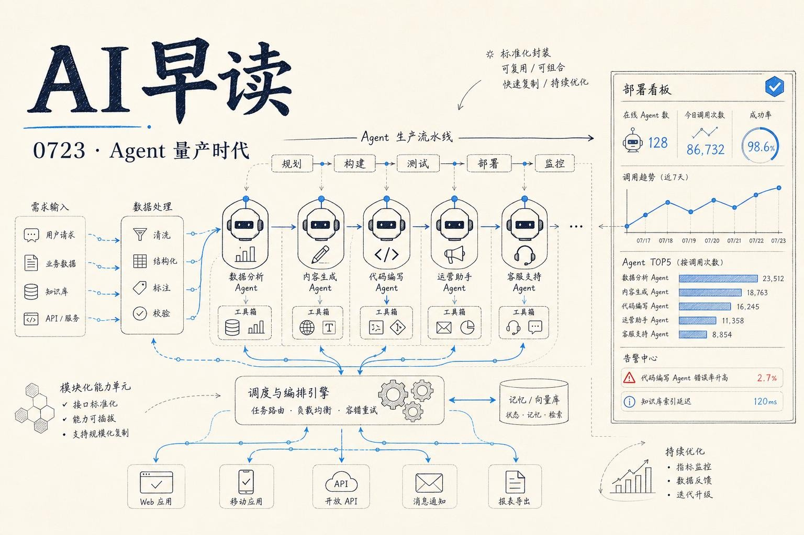

7 月 22 日，几件重要的事同时发生了。OpenAI 正式推出 `Presence` - 一个面向企业的 AI Agent 部署平台，Vercel 的 `eve` 上线了可安装的扩展系统，monday.com 公开了在 Amazon Bedrock 上规模化运行 AI Agent 的架构，GitHub 则晒出了 Copilot 的定价明细。它们讲的其实是同一个故事：AI Agent 正在从实验室里的概念验证，变成企业里每天都跑的生产系统。这篇文章我会围绕这四个事件，梳理当前 Agent 生产的几条主路径。期望对大家有所帮助。

## Presence：企业级 Agent 部署的“交钥匙”方案

OpenAI Presence 不是一个 API 端点更新，而是一个完整的部署产品。它会参与从需求拆解、系统对接、策略设置到上线后的持续改进全过程。

它的核心思路是“职责绑定” - 每个部署只做一件事，比如处理账单纠纷、处理保险理赔或解决 IT 工单。Agent 只拿到执行这项任务所需的知识库和系统权限。企业设定自己能接受的范围：Agent 可以做什么，什么操作需要审批，什么情况下必须转交人类。

这套思路并不新鲜。真正有意思的是它内置的持续改进机制。上线后的对话记录和转交信号会被 Codex 分析，Codex 会提出改进建议，团队审核后部署到生产。OpenAI 给出的数据是，他们自己的客服电话频道在一个月内达到了人工质量基准，75% 的来电无需人类介入就能解决。改进循环在上线 10 天内把转交率压低了 15 个百分点。

链接：[Introducing OpenAI Presence](https://openai.com/index/introducing-openai-presence)

## Vercel Eve 扩展：Agent 能力的模块化组装

如果说 Presence 是从应用层封装好的企业方案，那 Vercel 的 `eve` 扩展系统走的是完全不同的路线 - 它把 Agent 的能力拆成可独立安装、版本管理和覆写的软件包。

一个浏览器自动化扩展可能包含 navigation 工具、一个记忆扩展可能用 hooks 捕获上下文再用 tools 回放，一个自改进扩展可以组合 hooks 和动态指令。每个扩展就像 npm 包一样发布和依赖管理。

```
npx eve@latest extension init crm
```

这条命令会生成完整的扩展骨架：`tools/`、`connections/`、`skills/`、`hooks/`、`instructions.md`，结构与 Agent 本身一致。扩展安装后在 Agent 里以 namespace 方式调用 - `crm__search` 这样。消费者可以替换某个工具的实现、禁用某个能力、或在 hooks 里做结果后处理。

这种设计意味着 Agent 不再是单体应用，而是像 VSCode 一样可扩展的平台。生态才是护城河。

链接：[Extend eve agents with installable extensions](https://vercel.com/changelog/eve-extensions)

## monday.com 的 Agent 规模化实践

monday.com 在 Bedrock 上跑 AI Agent 的实践对整个行业都有参考价值 - 因为它不是一个新系统，而是一个十年老代码库的改造。

他们的数字很直接：90% 的开发者每月都在使用 AI 编码工具，这个比例一年前还只有一半左右。人均 PR 吞吐量上升了 50% 以上。这不是 POC 数据，这是生产侧的真实统计。

架构层面，monday.com 的方案依赖 Bedrock 的 Agent 编排能力和一个信心评分的自动合并机制 - 当 Agent 生成的代码改动通过了一定阈值，系统可以自动合并而无需人工审核。这是通往完全自治的一个切实路径。

链接：[AI Teammates: how monday.com runs production AI agents on Amazon Bedrock](https://aws.amazon.com/blogs/machine-learning/ai-teammates-how-monday-com-runs-production-ai-agents-on-amazon-bedrock/)

## Copilot 账单拆解：你到底在为什么付费

GitHub Copilot 最近改了计费方式 - 按 API 价格计 token。这引出一个自然的问题：既然钱一样，为什么不用 API 自己搞？

GitHub 给了一个很清楚的拆解。Copilot 的核心价值不在模型调用本身，而在模型周围那一圈“工具链”：从 Issue 到 diff 构建、上下文选择、工具调用、重试逻辑、安全策略再到审核工作流。它的评估表明，在 SWE-bench、TerminalBench 等基准上，Copilot CLI 在达成同样任务成功率的前提下，消耗的 token 数比直接用 API 少。

换句话说，Copilot 卖的不是 token，是围绕 token 的那套编排工程。BYOK 模式（自带密钥）让用户保留自己的云商合同，同时用 Copilot 的集成 - 这大概是当前最务实的定价方案。

链接：[Copilot vs. raw API access: What are you actually paying for?](https://github.blog/ai-and-ml/github-copilot/copilot-vs-raw-api-access-what-are-you-actually-paying-for/)

---

*来源：VerySmallWoods Research Feed - 2026-07-22 UTC*
