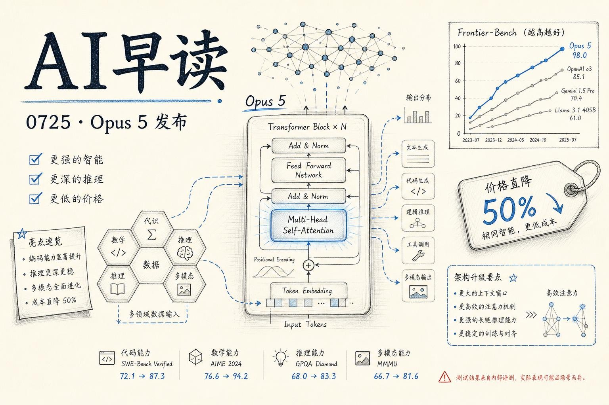

7 月 24 日，Anthropic 正式发布 `Claude Opus 5` - 这是一款在智能水平上接近旗舰模型 Fable 5、但价格减半的新主力模型。与此同时，Kimi K3 在 DeepSWE 上紧咬 Fable 5、Black Forest Labs 发布了多模态 FLUX 3、AI Engineer 大会密集输出 agent eval 方法论 - 这一天消息密度很高。我会把它们串起来看。期望对大家有所帮助。

## Opus 5 的核心定位

Anthropic 对 Opus 5 的定位很明确：**接近 Fable 5 的前沿智能，售价只有一半。** 在 Frontier-Bench、ARC-AGI 3、Zapier AutomationBench、OSWorld 2.0 等多项评测中，Opus 5 都取得了新的 SOTA 成绩。

几个关键数据点：

- **Frontier-Bench v0.1**：Opus 5 超越所有其他模型，相比 Opus 4.8 实现了翻倍以上的提升，单任务成本更低。
- **ARC-AGI 3**：这是一个要求模型解决全新问题的评测，Opus 5 的得分是次优模型的 3 倍。
- **Zapier AutomationBench**：Opus 5 的通过率约为次优模型的 1.5 倍，且在最低 effort 设置下通过的测试数量仍超过其他模型。
- **OSWorld 2.0**：Opus 5 以不到 Fable 5 三分之一的价格超越了 Fable 5 的最佳结果。

链接：[Introducing Claude Opus 5](https://www.anthropic.com/news/claude-opus-5)

链接：[Introducing Claude Opus 5 on AWS](https://aws.amazon.com/blogs/machine-learning/introducing-claude-opus-5-on-aws-anthropics-most-capable-opus-model/)

## 自主验证与工程能力

Anthropic 在发布中提供了多个体现 Opus 5 自主性的案例。其中一个尤其能说明问题：给定一张机械零件的图纸，要求模型写代码重建为 3D FreeCAD 模型 - 但故意不提供直接查看图纸的途径。Opus 5 自行构建了一套计算机视觉管线，从原始像素中提取几何信息，最终完成了重建。在相同的设置下，没有竞品模型能在五次尝试内解决这个问题。

另一例：Opus 5 拿到一个流行开源包管理器的真实 bug 后，不仅找到了根因，还修复了社区补丁遗漏的边缘情况。竞品模型只修复了表象，然后报告说问题已解决。

这种 "verify and iterate" 的能力 - 反复验证、小心迭代、做到成功为止 - 是 Opus 5 与上一代之间最显著的质变。在 Lovable 的 Fabian Hedin 的反馈中，这一特质被概括为 "steadier, with far less variance run to run"。

链接：[Claude Opus 5 now available on AI Gateway](https://vercel.com/changelog/claude-opus-5-now-available-on-ai-gateway)

## 生态接入节奏

发布当天，Opus 5 已经完成了主要生态的接入：

- **AWS**：在 Amazon Bedrock 上可用，AWS Machine Learning Blog 同步发布了详细的使用指南，包括如何配置 guardrails 来应对代码生成场景的安全需求。
- **Vercel**：AI Gateway 同步支持 Opus 5，提供了 reasoning effort 控制（从 minimal 到 xhigh）以及 model fallbacks 机制。
- **Claude 自身**：Opus 5 成为 Claude Max 的默认模型，也是 Claude Pro 上最强的可用模型。

Vercel 的 changelog 中特别提到，Opus 5 在低和中等 effort 设置下的质量就已经足够好，能以更少的 token 和延迟完成任务。

链接：[Best practices for Amazon Bedrock Guardrails](https://aws.amazon.com/blogs/machine-learning/best-practices-for-applying-amazon-bedrock-guardrails-to-code-generation-workflows/)

链接：[Workflow steps now support extended function durations](https://vercel.com/changelog/workflow-steps-now-support-extended-function-durations)

## 竞争维度：Kimi K3 的逼近

Anthropic 发布 Opus 5 的同一天，Together AI 发布了一份 Kimi K3 与 Claude Fable 5 的 DeepSWE 对比评测。结论颇为引人注目：

- **pass@1**：Fable 5 以 69.9% 对 68.5% 领先，差距仅 1.4 个百分点。
- **pass@4**：Kimi K3 以 89.4% 反超 Fable 5 的 88.5%。
- **成本**：Kimi K3 单次 rollout 费用 $4.65，Fable 5 为 $13.41，每美元解决的 task 数量 Kimi K3 是 Fable 5 的 2.8 倍。

两组模型的 task 级相关性高达 0.72 - 这是整个 DeepSWE 数据集中跨厂商最高的一对。说得直白一些：一个开源模型的编码行为，和 Anthropic 旗舰模型的编码行为，在 72% 的层面上是一致的。

Kimi K3 覆盖了 89.4% 的任务（Fable 5 覆盖 87.5%），但在 “四次全部通过” 的任务数上 Fable 5 以 58 对 45 领先。Fable 更稳定，Kimi 更广覆盖。

链接：[Kimi K3 vs Claude Fable 5 on DeepSWE: Cost and Coding](https://www.together.ai/blog/kimi-k3-vs-claude-fable-5-on-deepswe-cost-and-coding)

## Agent Evals 方法论的集中输出

AI Engineer 大会在 7 月 24 日密集上线了多场与 agent evals 相关的演讲。这是该领域知识密度最高的单日输出：

- **Building Closed-Loop Evals for a Multimodal Agent at Scale**（Uber）：分享了在多模态 agent 大规模落地中的评测体系建设经验。
- **From Signal to PR: Anatomy of a Self-Improving Agent**（Arize）：拆解了一个能自动优化的 agent 系统从信号采集到最终 PR 的完整链路。
- **Vending-Bench: Long-Horizon Agent Evals**（Andon Labs）：发布了一个面向长周期 agent 任务的评测基准。
- **The Future of Evals: From LLM as a Judge to Agent as a Judge**（Arize AI）：提出了一个判断范式迁移的思路 - 从用 LLM 做裁判，到用 agent 做裁判。

这些演讲共同指向一个趋势：随着 agent 系统从 demo 走向生产，评测已经从 “benchmark 分数比较” 进化为 “闭环反馈链路的设计”。

链接：[Building Closed-Loop Evals for a Multimodal Agent](https://www.youtube.com/watch?v=31GUkCBD-Uc)

链接：[Vending-Bench: Long-Horizon Agent Evals](https://www.youtube.com/watch?v=cO8qC6HBuBg)

## 多模态侧：FLUX 3 与安全训练

Black Forest Labs 发布了 `FLUX 3`，一个统一的多模态生成模型 - 覆盖图像、视频、音频、动作预测。基于统一的 self-flow 架构，FLUX 3 能完成 text-to-video、image-to-video、keyframe-to-video、multilingual dialogue 等多种任务，且所有输出天然包含音频生成。他们还与 mimic 合作推出了 `FLUX3-mimic`，一个基于 FLUX 3 骨干的视频-动作模型，证明该模型的 world model 已经足够用于驱动机器人。

与此同时，AI Engineer 大会上还有一场值得关注的演讲："Training Frontier Models to Out-Think Hackers"（Arithmetic & Hugging Face），讨论了如何训练前沿模型在对抗性场景中 “比黑客多想一步”。这代表了安全训练的视角从 “被动防御” 向 “主动推理” 的转变。

链接：[AINews: Black Forest Labs FLUX 3](https://www.latent.space/p/ainews-black-forest-labs-flux-3-multimodal)

链接：[Training Frontier Models to Out-Think Hackers](https://www.youtube.com/watch?v=O-CBZ3JtRvo)

---

*来源：VerySmallWoods Research Feed - 2026-07-25 UTC*
