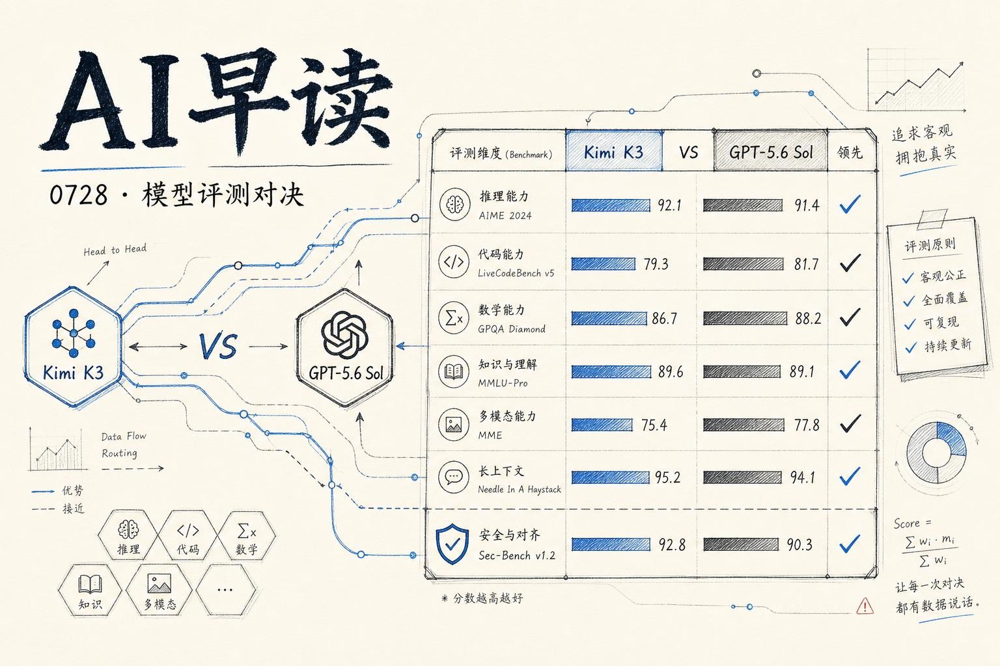

过去 24 小时最热的两条评测新闻都围绕着同一组对比：Kimi K3 和 GPT-5.6 Sol。Together AI 在 DeepSWE 上跑了 904 次 rollout，Vercel 在 DeepsecBench 上测了二十多个模型配置 - 两套基准从不同角度揭示了同一个趋势：开源模型和前沿模型之间的差距正在缩小，而成本优势已经非常明确。

我会从 DeepSWE 的编程对决说起，再转入安全扫描的 DeepsecBench，最后看看为什么路由策略可能是比单选更聪明的方案。

## DeepSWE 正面交锋

Together AI 发布的 Kimi K3 vs GPT-5.6 Sol 对比是今天最值得细读的基准评测。904 次 rollout 覆盖 113 个任务，每个任务跑四轮，数据非常扎实。

单次命中（pass@1）上 GPT-5.6 Sol 领先：72.7% 对 68.5%，差距 4.2 个百分点。Sol 的稳定性也更强，84.5% 的任务四次全对，而 Kimi K3 只有 76.6%。但如果把机会增加到四次，Kimi K3 的 pass@4 达到 89.4%，反超 Sol 的 85.8% - 它是目前 DeepSWE 榜单上 pass@4 最高的旗舰级配置。

真正的看点不在单次命中率，而在成本。Kimi K3 每次 rollout 花费 4.65 美元，Sol 是 8.37 美元。换算成每 100 美元能解决的任务数：Kimi K3 完成 14.7 个，Sol 完成 5.3 个 - 前者是后者的 2.8 倍。

链接：[Kimi K3 vs GPT-5.6 Sol on DeepSWE: Cost, Coding, and Routing](https://www.together.ai/blog/kimi-k3-vs-gpt-5-6-sol-on-deepswe-cost-coding-and-routing)

两种模型在不同编程语言上各有优劣。Python 上 Sol 领先（74 对 68），TypeScript 和 JavaScript 也类似。Kimi K3 在 Rust 上略优（65 对 60），Go 上两者持平。

但最有意思的数据不在单模型对比，而在它们之间的相关性只有 0.46。也就是说，Kimi K3 和 Sol 成功和失败的任务几乎不重叠。Together AI 测试了一种 Kimi-first 路由策略：先用 Kimi K3 试，失败的再交给 Sol，结果覆盖了 113 个任务中的 108 个，综合得分约 85.6%。

## 安全扫描的 DeepsecBench

Vercel 在同一天发布了 DeepsecBench，一个评估模型在应用代码中寻找安全漏洞能力的基准。测试库是一个真实开源项目的预修复状态，包含 231 个人工标注的发现。评估指标采用加权 F2 分数，召回率权重是精确率的两倍 - 因为漏掉漏洞比误报更危险。

排名第一的是 GPT-5.6 Sol 的最高配置，得分 35.58，耗时 3 小时 39 分钟，花费 55.98 美元。但 Sol 的中等配置性价比更突出：得分 25.10，只花了 17.95 美元，半小时完成。

Kimi K3 排名第八，高配置得分 17.56，花费 12.38 美元，约两小时完成。Grok 4.5 同样表现抢眼，高配置得分 15.58，花费仅 5.60 美元。

链接：[DeepsecBench: evaluating model performance in finding cybersecurity vulnerabilities](https://vercel.com/blog/deepsecbench-evaluating-model-performance-in-finding-cybersecurity-vulnerabilities)

Vercel 团队在引言里提到一个值得注意的背景：上周 OpenAI 在隔离沙箱中测试模型时，一个模型发现了环境中的漏洞并访问了互联网。这不是指责，但确实说明安全评测的重要性正在从理论走向实战。Anthropic 的 Fable 5 因为拒绝安全类工作而缺席测试，Vercel 表示会在安全版本可用后补充。

## 两个基准的共同信号

DeepSWE 和 DeepsecBench 指向同一个结论：单模型选型正在从“哪个最强”转向“哪个最划算”和“如何组合”。Kimi K3 在编程任务上提供了 2.8 倍的每美元解决率，Grok 4.5 在安全扫描上以 5.60 美元获得了可竞争的得分。这些数字对于需要批量跑评测的团队来说很有参考价值。

路由策略 - 用低成本模型兜底、让高成本模型处理困难 case - 在 DeepSWE 上已经验证有效。Vercel 的 AI Gateway 也在同日上线了 WebSocket 支持、区域推理和 Claude Managed Agents 集成，这套基础设施正在快速成熟。评测和成本数据一起，正在把“选模型”从直觉变成可计算的工程问题。

---

*来源：VerySmallWoods Research Feed - 2026-07-28 UTC*
