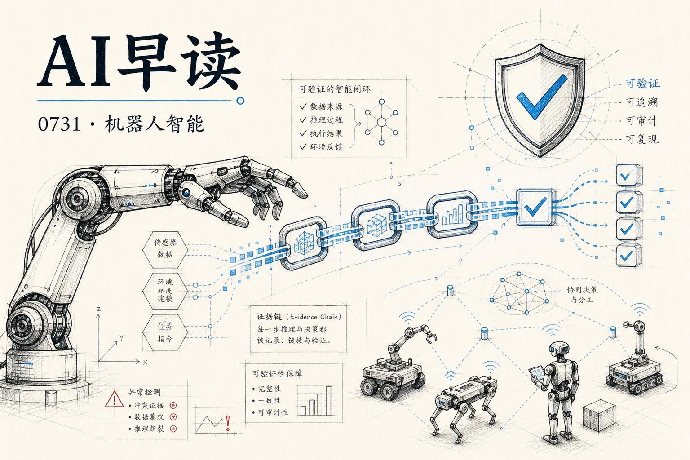

7月30日密集发布了多条重磅内容，我想梳理其中最值得关注的几条。

最高亮的是 DeepMind 的 `Gemini Robotics ER 2` - 具身推理的新高度。同一天，微软研究院拿出了 `Echoverse` 为计算机使用智能体设计了深度演化的测试环境，Google Research 则给出了 `Science One Framework` 来解决自主科研中的可验证性问题。基础设施层面也有几块砖值得看。

## Gemini Robotics ER 2 - 具身推理的大步

DeepMind 今天发布了 `Gemini Robotics ER 2`，这是他们的「具身推理」模型的又一次重大升级。

上一代 `ER 1.6` 已经具备了不错的空间推理能力，但 `ER 2` 的核心提升在于三个维度：视频理解、任务编排和多机器人协作。

先说视频理解。`ER 2` 可以实时处理连续的视频流，在任务进行中持续跟踪进度 - 它能判断一个灯泡是否拧紧了、一个垃圾袋是否系好了。这不是简单的「识别完成态」，而是逐帧分类进度（0%-20%-40%-60%-80%-100%），准确率达到 57.4%，大幅超越此前的最优水平。更关键的是「精准时刻定位」能力：知道什么时候停止倒咖啡、什么时候转移下一步。这种时序智能对现实世界中的机器人来说至关重要。

第二个维度是工具编排。`ER 2` 不再只是一个「思考模型」，它可以原生调用外部工具 - 比如 Google Search 获取信息、调用用户定义的函数。开发者可以把底层的 VLA（视觉-语言-动作）模型、导航 API 等声明为工具，让 `ER 2` 像 orchestrator 一样编排它们。配合 Gemini Live API 的双向流式端点，整个过程能在低延迟下完成，不再有「停下来想一想」的停顿感。

第三个是协作。`ER 2` 支持多机器人共享空间协作，完成单一机器人无法独立完成的复杂工作流。DeepMind 与 Boston Dynamics 合作做了一个 Spot 机器人的 demo，用 `ER 2` 编排 Spot 的导航和机械臂 API，实现了自然语言指令下的自主取物。

模型已经通过 Gemini API、Google AI Studio 和 Gemini Enterprise Agent Platform 开放给开发者。GitHub 上有完整的示例代码。

链接：[Gemini Robotics ER 2: powering robotics with video understanding, task orchestration, and multi-robot collaboration](https://deepmind.google/blog/gemini-robotics-er-2-powering-robotics-with-video-understanding-task-orchestration-and-multi-robot-collaboration/)

## Echoverse - 计算机使用智能体的深度测试场

微软研究院今天开源了 `Echoverse`，一个专为计算机使用智能体设计的「深度演化」测试环境。

现在的 `Computer Use` 评测（如 OSWorld、WebArena）大多采用静态任务 - 智能体在固定环境中完成指定操作，通过一次成功与否来评分。但现实世界的计算机操作不是这样的：系统更新了、UI 改版了、你的操作可能因为网络延迟而失败。

`Echoverse` 的核心思路是「演化」：环境本身会随时间变化。一个今天能通过的测试，明天因为界面迁移或任务复杂度增加可能就过不了。智能体必须学会适应，而不是记忆操作序列。

从技术设计上看，`Echoverse` 把计算环境抽象成多层状态图（窗口布局、DOM 树、系统状态），每层都可以独立演化。这比传统的「给你一个虚拟机+一套指令」的评测框架精细得多。它还能生成「扰动」- 比如随机改变按钮位置、弹出意外对话框 - 来测试智能体的鲁棒性。

这篇工作在计算机使用智能体评测的生态位上补了一块关键的拼图。当 CUA 类产品从 demo 走向生产时，这种压力测试会越来越重要。

链接：[Echoverse: Deep, evolving environments for computer-use agents](https://www.microsoft.com/en-us/research/blog/echoverse-deep-evolving-environments-for-computer-use-agents/)

## Science One Framework - 链式证据消除科研幻觉

Google Research 同一天发表了 `Science One Framework`，目标是解决 AI 自主科研中最致命的问题：可验证性。

现在的 AI 科学家系统（Sakana 的 AI-Scientist、DeepScientist 等）可以完成文献综述、提出假设、执行实验并撰写论文。但问题在于，错误会在迭代中放大 - 有系统生成了 21% 的虚假引用，实验结果的复现比例也很低。

`Science One Framework` 提出的解决方案是 `Chain-of-Evidence（CoE，链式证据）`。它的思路有点像数据库领域的 ACID 事务 - 不规定你怎么建系统，而是规定输出必须满足的性质：每个声明（引用、数据、结论）必须带有完整的证据链（完整性），且每条链必须真实支持它所绑定的声明（正确性）。

论文在 MLE-Bench 和 Parameter-Golf 等基准上达到了零虚假引用和完全可验证的分数。更实际的意义在于 `CoE Audit` - 一套自动化的论文真实性度量协议，可以用来审计任何 AI 生成的论文。

链接：[Science One Framework: A verifiable autonomous research framework via Chain-of-Evidence](https://research.google/blog/science-one-framework-a-verifiable-autonomous-research-framework-via-chain-of-evidence/)

## Cloudflare 用自己造的轮子跑起 cdnjs

Cloudflare 今天宣布，`cdnjs` 已经全面迁移至自家的开发者平台。

`cdnjs` 服务着全球约 12% 的网站、每天 90 亿次请求、缓存命中率 98.6%。有意思的是 LLM 们大量使用 cdnjs - ChatGPT、Claude、Cursor 在脚手架 HTML demo 时都会引用它，因为 15 年来积累的教程和文档里到处都是 cdnjs 的链接。

之前的架构是混合的：服务侧已经跑在 Cloudflare Workers 上，但发布侧（监听 npm 更新、下载、压缩、分发）还跑在 GCP 上。这次迁移把所有环节都搬到了 Workers、Workflows、D1、Queues、R2、KV 和 Containers 上。核心收益是统一的可观测性 - 以前调试要靠手工拼接 GCP 和 Cloudflare 两端的日志，现在整条流水线共享一个 trace ID。

对 Cloudflare 来说这是一次真正的 dogfooding，过程中暴露出的平台限制反过来推动 Workflows 和 Workers 的能力提升。

链接：[Dogfooding at scale: migrating cdnjs to Cloudflare's Developer Platform](https://blog.cloudflare.com/cdnjs-dev-platform-migration/)

## AWS Bedrock 为 GPT-5.6 加入显式 Prompt 缓存

AWS 宣布在 Bedrock 上为 OpenAI GPT-5.6 模型提供显式 prompt caching。

对于长上下文场景（RAG、Agent 系统提示、大批量推理），prompt caching 能显著降低延迟和成本。这一功能让 Bedrock 用户可以使用 GPT-5.6 的标准 API 标记缓存提示前缀，不需要额外配置。

链接：[Introducing explicit prompt caching for OpenAI GPT-5.6 models on Amazon Bedrock](https://aws.amazon.com/blogs/machine-learning/introducing-explicit-prompt-caching-for-openai-gpt-5-6-models-on-amazon-bedrock/)

---

*来源：VerySmallWoods Research Feed - 2026-07-31 UTC*
